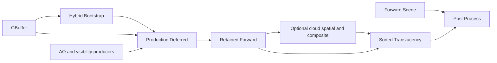

# RDG Access Declarations and Base Scene Decomposition Plan

Summary: Introduce instance-based RDG access and attachment declarations, expose Base Scene's real raster stages to the graph, and remove predecessor-dependent depth fields and hidden physical bindings from the migrated scene path.

Last reviewed: 2026-10-08

Status: Active
Completed:

## Current Status

Design recorded; implementation has not started. Stage 0 is the next stage.
This document authorizes no implementation or qualification by itself.

The source review includes the current `BaseSceneRendering`, `SceneColorRendering`,
RDG parameter lowering, RHI attachment contracts, and the locally installed UE
source described below. Existing commits `8fc5a9dde`, `8f39560d6`, `c4b063fa7`, and
`fe82280ee` simplify uploads, persistent reads, intermediate binding storage, and
recording prerequisites. They are prerequisites to preserve, not completion
evidence for this plan. In particular, `FProductionDeferredParameters` is still
a graph-owned payload containing physical bindings; moving that payload into
graph storage did not make its texture accesses visible to the compiler.

## Goal

A pass declares its own resource usage through parameter instances. The compiler
derives transitions from retained uses and actual pass boundaries. Base Scene
does not choose a field or access state based on whether an earlier GBuffer pass
ran. Each migrated GPU callback resolves every graph texture or buffer it uses
through its own declared parameters.

Completion means removing all four `SceneDepthGraphicsToGraphics`,
`SceneDepthGraphicsToDepth`, `SceneDepthDepthToGraphics`, and
`SceneDepthDepthToDepth` fields, their metadata, and their resolver fallback
chain. Replacing them with an enum, a variant, or one dynamic entry/exit pair
while keeping the multi-stage Base Scene callback is not the final architecture.

## Scope and Dependencies

- Owners: RenderCore parameter metadata/lowering, Renderer scene authoring and
  recording, RHI attachment execution, and the VulkanRHI/MetalRHI consumers of
  changed attachment contracts.
- Migrate Base Scene, its deferred-lighting bindings, GBuffer depth publication
  where needed, and downstream Scene Color/translucency attachment boundaries.
  Audit cloud, debug, and editor depth consumers for continuity.
- Provide a reusable dynamic texture/buffer access mechanism and runtime
  attachment bindings. Migrate affected users of any changed shared wrapper.
- Preserve declaration-order scheduling, value versus execution dependency
  semantics, full declaration validation, culling, async opt-in policy, pool
  retirement, single-use execution, and transactional final publication.
- General decomposition of GTAO/cloud internals, new render features, new async
  scheduling, transient aliasing, and raster-pass merging are outside this plan.
- The active [multi-queue plan](RdgRhiMultiQueueExecution.md) owns queue topology,
  split barriers, and aliasing. This plan must consume its existing contracts and
  preserve its gates; it does not accept or close that plan's outstanding stages.

Follow [build guidance](../Agents/BuildAndRun.md),
[test guidance](../Agents/Testing.md), and
[documentation guidance](../Agents/Documentation.md). Shared Engine API changes
require consumer searches in every project declared in `Durin.dworkspace` and an
`all` build before handoff. Preserve unrelated working-tree changes.

## Source Evidence and UE Design Reference

The local reference inspected on 2026-10-08 is
`E:\Programs\Epic Games\UE_5.8\Engine\Source\Runtime\RenderCore`.
These paths are local reference evidence, not portable repository dependencies.
No UE source is to be copied into Durin.

| Reference under that directory | Observed design | Selected adaptation |
| --- | --- | --- |
| `Public/ShaderParameterMacros.h`, `FRDGTextureAccess` near line 366 | Instance stores texture, subresource range, and one access mask | First-class instance access wrapper |
| Same file, `TRDGTextureAccess<Access>` near line 418 | Static access wrapper reuses the dynamic wrapper's representation | Static convenience declarations lower through the same use model |
| Same file, access macros near lines 1878-1885 | Static and dynamic texture access register as `UBMT_RDG_TEXTURE_ACCESS` | Metadata identifies category and location; instance supplies access |
| Same file, `FDepthStencilBinding` near line 558 | Instance stores depth/stencil access and load actions | Attachment binding expresses content and access intent |
| `Public/RenderGraphParameter.h`, `GetAsTextureAccess` near line 133 | Category-specific parameter decoding | Typed extraction, without arbitrary reflective field-name interpretation |
| `Private/RenderGraphBuilder.cpp`, texture enumeration near line 122 and depth enumeration near line 197 | Reads instance access and attachment semantics | Normalize submitted instances before compiling dependencies/barriers |
| Same file, `AddTextureTransition` near line 4298 | Compares tracked subresource states | Compiler owns inter-pass transition derivation |

UE's ordinary access wrapper has one usage mask, not a generic before/after
state pair. Durin's pass-managed entry/exit protocol is a separate existing
contract. Reusing the UE parameter architecture does not establish equivalence
between those protocols.

Current Durin evidence:

- [RDGParameters.h](../../Engine/Source/Runtime/RenderCore/Public/RDG/RDGParameters.h)
  stores access, discard, load/store, and managed result access in static member
  metadata. Resource wrappers primarily supply handles and ranges.
- [RDG.cpp](../../Engine/Source/Runtime/RenderCore/Private/RDG/RDG.cpp),
  `LowerParameterUse`, starts from `MakeParameterUse(Member, FieldPath)` and then
  supplies instance resource identity and range.
- [BaseSceneRendering.cpp](../../Engine/Source/Runtime/Renderer/Private/Renderers/BaseSceneRendering.cpp)
  selects four managed depth fields and hides bootstrap, production deferred,
  and retained-forward raster work inside one callback.
- [RenderTargetLayouts.cpp](../../Engine/Source/Runtime/Renderer/Private/Resources/RenderTargetLayouts.cpp)
  encodes shader-readable entry/exit states in hybrid depth layouts; several
  color layouts also publish shader-read state at native render-pass end.
- [SceneColorRendering.cpp](../../Engine/Source/Runtime/Renderer/Private/Renderers/SceneColorRendering.cpp)
  expects a managed graphics-read-to-depth handoff for translucency. Migrating
  Base Scene alone would leave this neighboring state assumption in place.

## Selected Architecture

### Instance declarations and immutable normalized uses

Introduce typed explicit-access wrappers for textures and buffers, carrying a
graph handle, exact range, an access mask, and logical read/write intent.
Existing static read/UAV/indirect convenience declarations remain available and
normalize into the same internal `FGraphUse` representation. Precise public
names and static-wrapper implementation are fixed in Stage 0.

Metadata describes field identity, wrapper category, offsets/array/optional
shape, shader decoration, and allowed semantics. It does not cache per-instance
access, ranges, or load/store choices. Resource access wrappers are decoded
explicitly; adding an arbitrary nested struct does not grant it access semantics.

Submission validates and copies each instance's declaration into immutable use
storage before authoring is sealed. Compile-time dependency, range, content
validity, barrier, queue, and capture processing consume those normalized uses.
Execution resolves resources through the original submitted parameter objects;
address-based authority and optional alias rules remain intact. Never cache a
pass's dynamic values in the shared parameter-layout cache.

Validate owner identity, legal kind/access combinations, pass-domain access,
exact normalized ranges, use versus access consistency, and content intent.
Malformed declarations on culled passes still fail compilation. Shader-binding
decoration must not widen graph access or turn explicit non-shader uses into
descriptor bindings. Capture must show the submitted runtime access and content
semantics, including absent optional fields.

### Attachment bindings and transition authority

Color/depth attachment instances carry handle/range and load/store intent.
Depth/stencil access intent is explicit. Stage 0 chooses whether the current
conservative `DepthStencilReadWrite` state is sufficient for this migration;
Durin currently has no separate read-only DSV access/layout. Introducing that
state is a separate shared RHI/backend change, never an alias for shader-read.

For the migrated path, RDG derives transitions into attachment or sampled use.
Native raster layouts express attachment-local load/store execution and agree
with the graph's boundary states. They must not independently restore a
shader-read state merely because the old layout did so. RHI/backend validation
and physical state commitment remain authoritative. Graph planning does not
mutate RHI state.

Select one shared binding-lowering boundary that derives the graph attachment
use and the corresponding native render-pass binding/layout. Pipeline creation
and caching use the same normalized layout compatibility rules. A mismatch
between declared usage and recorded attachment bindings is diagnosed rather
than repaired by an undeclared transition in the callback.

`Load` retains prior valid contents and their producer. `Clear`/`DontCare` can
start a new content version for the covered range; neither removes required WAR,
WAW, queue synchronization, or retirement. Store `DontCare` invalidates contents
for later reads. Preserve exact mip/layer/aspect behavior and the existing
first-use pool-reuse synchronization rules.

Keep explicitly marked pass-managed declarations for genuinely unmigrated
multi-operation callbacks. If an interim dynamic managed wrapper is needed,
isolate and validate its entry/exit contract, and remove its Base Scene use by
Stage 4. Do not expand that escape hatch into the normal attachment API.

### Base Scene graph and bindings

Author the route from the immutable per-view feature plan. Proposed pass names
below identify responsibilities; Stage 0 freezes their diagnostic names.

| Route/pass | Color usage | Depth usage | Result responsibility |
| --- | --- | --- | --- |
| Forward Scene | Clear/store attachment | Clear/store depth attachment | Existing forward result and geometry finalization |
| Hybrid Bootstrap | Clear/store attachment | Load/store depth attachment | Environment/bootstrap success |
| Production Deferred | Load/store attachment | Sampled depth; declared GBuffer, visibility, environment and fallback reads | Deferred execution success |
| Retained Forward | Load/store attachment | Load/store depth attachment | Existing opaque/masked retained work and final Base Scene result |
| Sorted Translucency, after cloud composition where selected | Load/store selected scene/composite attachment | Load/store depth attachment | Existing Scene Color publication and finalization |

The diagram summarizes routes; actual retained edges come from resource and
typed-result uses. Cloud setup/spatial/composite and debug routes retain their
existing ordering and selection. Do not add broad explicit ordering edges or
unconditional roots to conceal missing resource declarations.

Extract body recorders so each migrated raster callback owns one native render
pass. Keep viewport/scissor, sky handling, clear values, reverse-Z, draw filtering,
material bindings, and timing scopes equivalent. Forward mode retains its
existing clear policy even if GBuffer was requested for diagnostics.

Replace cross-pass physical `FProductionDeferredParameters` with an authored
bundle of graph handles, typed outcome handles, and immutable policy. Production
and isolated deferred callbacks construct their physical `FRenderParameters`
locally after resolving their own declared members. Share composition helpers
and resource parameter groups, not a mutable physical binding block.

Declare every graph texture/buffer sampled by production deferred, including
GBuffer/depth, GTAO, contact/cloud visibility, environment, default textures and
fallback candidates. Runtime producer outcomes may select among those declared
candidates. Handle shared physical fallback aliases without silently losing a
callback's resolver authority. Existing capability/readiness checks remain in
the preparation boundary.

Each fallible stage publishes an explicit result. Later stages read predecessor
results and skip work on failure; the final Base Scene result preserves the
original failure. GPU recording does not stop merely because a logical result
reports failure, so callbacks must propagate that result deliberately. Renderer
outcomes stay separate from RDG compile/preparation/recording errors.

Keep geometry finalization and telemetry ownership exact, with no duplicate
attempt/success counters after splitting callbacks. Only final Scene Color,
post-process/editor results publish transactional output. Earlier recorded work
is not rolled back on a later failure; extraction and view-state publication
retain their existing successful-execution gates.

## Implementation Stages

### Stage 0: Freeze contracts and comparison evidence

Depends on: current source and the four prerequisite simplification commits.
Outcome: an implementable API/boundary decision record and a reproducible baseline.

- [ ] Inventory all wrappers, metadata constructors, resolver methods, layout
  helpers, pipeline cache consumers, and graph uses affected across all workspace
  projects; distinguish ordinary and pass-managed transitions.
- [ ] Record the exact forward/hybrid/debug/qualification feature matrix and
  graph captures, rendered output, clear/load/store semantics, failure results,
  timing scopes, and geometry/telemetry finalization sites.
- [ ] Freeze explicit-access and attachment types, use/access validation, static
  convenience routing, shared lowering ownership, and read-only depth scope.
- [ ] Specify every migrated pass's actual color/depth states and remove any
  assumption that shader-readable depth also denotes depth attachment usage.
- [ ] Define numeric regression thresholds and a quiet-lane baseline using the
  [rendering baseline protocol](../Development/Build/RenderingPerformanceBaseline.md).
  Record selected registered GPU cases and supported backend environments.

Gate: decisions resolve the above choices, with baseline evidence and an exact
change inventory. Missing GPU evidence is recorded as outstanding, not inferred
from CPU tests or from the UE implementation.

### Stage 1: Add instance access normalization

Depends on: Stage 0 API and validation decisions.
Outcome: one metadata layout supports different legal per-instance accesses.

- [ ] Implement explicit texture/buffer access wrappers and typed metadata
  decoding; preserve static convenience declarations through common lowering.
- [ ] Freeze submitted values into normalized uses; adapt Capture, parameter
  validation, optional/array traversal, and shader authority checks.
- [ ] Test same-layout/different-instance access, exact ranges, nested arrays and
  optionals, invalid access on culled passes, and layout-cache isolation.
- [ ] Verify declaration immutability, copied/foreign resolver rejection, culling
  closure, discard versioning, and execution ordering remain intact.
- [ ] Migrate every affected shared API consumer and complete the required builds.

Gate: RenderContractTests and affected CPU contracts pass; static/dynamic forms
produce equivalent normalized uses where their intents are equal. The required
workspace `all` build passes for changed shared Engine APIs.

### Stage 2: Establish graph-owned attachment boundaries

Depends on: Stage 1 normalization and Stage 0 RHI decisions.
Outcome: attachment bindings, pipeline layouts, and recorded state agree.

- [ ] Implement runtime attachment load/store/access declarations and the shared
  native binding-lowering boundary, with exact depth/stencil range handling.
- [ ] Introduce migrated layout helpers that leave attachments in their declared
  access; update pipeline creation/cache consumers for the selected contract.
- [ ] Preserve legacy layout helpers for unmigrated paths without changing their
  behavior accidentally; name the distinction explicitly during migration.
- [ ] Validate binding/use mismatch, clear versus load, store invalidation,
  discarded pooled allocations, replay state, and downstream sampled access.
- [ ] Adapt RHI, VulkanRHI and MetalRHI consumers where contracts changed; test
  inline and threaded command replay and existing queue fallback behavior.

Gate: relevant RenderContractTests, RHIResourceTransitionValidationTests and
RHICommandListTests pass; selected VulkanRHIIntegrationTests demonstrate correct
attachment/sample handoffs with validation enabled. Changed backend semantics
have corresponding backend evidence or an explicitly outstanding acceptance gate.

### Stage 3: Make deferred inputs explicit graph resources

Depends on: Stages 1-2; retain current Base Scene execution until Stage 4.
Outcome: production bindings are resolved locally from declared resources.

- [ ] Replace `FProductionDeferredParameters` transport with graph input bundles
  and logical producer outcomes; update isolated/production consumers together.
- [ ] Declare all candidate sampled resources and fallback aliases, then build
  physical `FRenderParameters` inside the executing lighting callback.
- [ ] Preserve diagnostic versus production policy, optional producer failures,
  resource readiness checks, and the existing fallback selection.
- [ ] Test missing/failed optional producers, disabled production, isolated-only
  diagnostics, fallback aliasing, and consumer-driven culling.

Gate: RendererSceneContractTests and VolumetricCloudSceneContractTests pass;
capture proves production resources are explicitly declared. No cross-pass
binding payload carries physical graph texture/buffer pointers in this path.

### Stage 4: Decompose Base Scene and migrate depth continuity

Depends on: Stages 2-3.
Outcome: forward or bootstrap/deferred/retained raster stages are graph-visible.

- [ ] Extract single-raster-stage recorders and author route-specific passes from
  the feature plan, retaining the existing public Base Scene graph output shape
  where practical.
- [ ] Remove all four managed depth fields and the predecessor-based selection
  and resolver fallback chain. Do not replace them with a state-pair enum.
- [ ] Migrate Scene Color/translucency to ordinary attachment bindings and audit
  GBuffer, cloud, debug, and editor consumers for required depth transitions.
- [ ] Make resource uses and typed outcomes establish dependencies; verify dead
  optional stages can be culled without removing required external effects.
- [ ] Preserve failure propagation, final transactional publication, clear colors,
  reverse-Z, geometry finalization, telemetry, and feature timing query behavior.
- [ ] Update capture/budget expectations from measured route shapes, explaining
  the extra graph passes without increasing regression limits blindly.

Gate: route matrix CPU contracts pass; targeted GPU captures/readbacks match the
Stage 0 baseline and show graph-derived attachment/sample transitions. Base Scene
and migrated translucency contain no pass-managed depth state pairs.

### Stage 5: Qualify, document, and remove migration scaffolding

Depends on: Stages 1-4.
Outcome: accepted implementation with permanent contracts and measured costs.

- [ ] Remove temporary adapters and obsolete helpers/types in the migrated scope;
  retain only explicitly documented managed users outside that scope.
- [ ] Run affected CPU contracts, including RenderContractTests,
  RendererSceneContractTests, VolumetricCloudSceneContractTests and
  RendererRDGAllocatorTests; run changed regressions independently.
- [ ] Run selected VulkanRHIIntegrationTests, GBufferQualificationTests and scene
  GPU cases covering forward/debug, hybrid retained geometry, AO/visibility,
  clouds, translucency, offscreen/present and editor depth consumers.
- [ ] Exercise existing graphics-only fallback and explicitly enabled async
  resource handoffs. Preserve queue terminal joins, extraction, and pool reuse.
- [ ] Compare output correctness, CPU author/compile/record cost, GPU time,
  transition/submission counts, and retained memory against the Stage 0 baseline.
  Investigate any threshold breach; do not require unchanged pass counts.
- [ ] Complete the required `all` build and affected project validation. Record
  Metal compilation/runtime evidence on a supported host according to changed
  semantics; do not report Windows-only validation as Metal qualification.
- [ ] Update the permanent contracts listed below, validate documentation and
  plans, and record exact acceptance receipts before completing this plan.

Gate: required evidence is recorded with environment, selected cases and results.
Unavailable GPU/backend gates remain open until satisfied or explicitly changed
by the user; optional unrelated qualifications do not block intermediate stages.

## Risks and Acceptance Boundaries

- **Transition duplication or disagreement:** native layouts currently perform
  state changes. Migrate graph declarations and layout/pipeline consumers as one
  coherent boundary; test RHI replay state rather than capture text alone.
- **Content loss:** clear/discard decisions affect culling and producer retention.
  Test actual depth preservation and overwrite behavior, including diagnostic
  GBuffer followed by forward rendering and pooled allocation reuse.
- **Hidden reads:** graph-owned values do not declare their embedded RHI pointers.
  Require explicit lighting resource parameters before accepting decomposition.
- **Failure drift:** splitting a callback can accidentally render retained geometry
  after bootstrap/deferred failure or overwrite a failed result with success.
  Inject each stage failure and verify final publications and counters.
- **Cost drift:** more graph passes may increase submissions and CPU work. Measure
  before considering later batching/merging; do not recouple resource states to
  suppress a visible graph cost.
- **Backend divergence:** UE's depth/stencil capabilities exceed current Durin
  vocabulary. Do not assume support for read-only DSV or independent stencil
  semantics without updating and qualifying both backend contracts.

## Permanent Contract Owners

- [Render Graph](../Runtime/Rendering/RenderGraph.md): instance declaration,
  normalization, validation, dependency, content, and managed escape-hatch rules.
- [Renderer Frame Preparation](../Runtime/Rendering/RendererFramePreparation.md):
  route authoring, local binding construction, results, telemetry and publication.
- [RHI Command Execution](../Runtime/Rendering/RHICommandExecution.md): attachment
  recording/replay authority and any changed shared binding execution contracts.
- [Rendering Performance Baseline](../Development/Build/RenderingPerformanceBaseline.md):
  selection and comparison protocol; store new evidence in its prescribed form.

Implementation commits update this plan's status/checklists and use exact `Plan`
and `Stage` trailers under the repository handoff rules. Creation of this design
document does not mark Stage 0 or any implementation gate complete.
