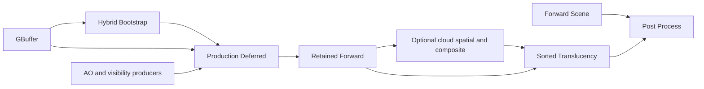

# RDG Access Declarations and Base Scene Decomposition Plan

Summary: Introduce instance-based RDG access and attachment declarations, expose Base Scene's real raster stages to the graph, and remove predecessor-dependent depth fields and hidden physical bindings from the migrated scene path.

Last reviewed: 2026-10-08

Status: Active
Completed:

## Current Status

Stage 0 is in progress under the user's 2026-10-08 execution request. The source
inventory, API decisions and pass boundary table below are frozen before runtime
migration. Baseline execution at reference
`4bc5d8c033920eaa5c2d77696403dea29ae9d29b` exposed an existing compute view lifetime
defect, now fixed with an independently reproduced regression. Full Vulkan
integration passes 114/114 and affected validation passes 8/8 targets; three
preserved Release GBuffer runs pass on GTX 1060.
The [diagnostic receipt](../Development/Build/RenderingPerformanceBaselineReceipt20261008.md)
records exact evidence and authority. Stage 0 remains open for complete route
captures and an accepted timing baseline; GTX 1060 observations do not replace
named RTX 3090 gates. Stage 1 is implemented: typed instance
texture/buffer access now normalizes at submission, uses the existing resolver
authority and shader composition, and preserves static declarations.
RenderContractTests passes 211/211, including eight new instance-access tests;
the eight also pass individually under serial isolation. Workspace `all` passes.
Affected validation passes 96/98 targets in its first batch; ContentBrowserWorkflowTests
passes on a subsequent direct whole-target run. The remaining
`FMaterialCompilerTests.MetalMaterialProgramCompilesAndCooks` failure reproduces
alone: unchanged `ShaderBuilder.cpp::IsActiveCompilerTarget` rejects Metal on
non-Apple hosts before compilation. This host-policy/test mismatch was corrected in the subsequent test-only
follow-up recorded under Stage 5; it does not satisfy the Metal runtime gate. Stage 2 now
implements frozen runtime attachment declarations, exact native view binding,
and graph-boundary layout helpers. Stage 2 is implemented and validated on
Windows/Vulkan, with Metal compilation/runtime acceptance explicitly outstanding.
Execution resumed on 2026-10-08 at the user's request. Stage 3 replaces the
physical production-binding value with authored input parameters, graph handles,
logical producer outcomes and immutable policy. Production and isolated callbacks
resolve their own original declared members, including deduplicated fallback aliases.
Stage 4 now authors the frozen Forward or HybridBootstrap/ProductionDeferred/
RetainedForward route and ordinary Scene Color attachments; all four predecessor-
dependent depth fields and their resolver chain are removed. Stage 5 validation
passed the required all build and 97/98 affected targets. The sole failure,
an unconditional Metal-success expectation on Windows, is now corrected; the
changed MaterialCompilerTests target and isolated rejection regression pass.
Two matched six-run Release cohorts preserve CPU/GPU cost, memory and
submission observations. Native submissions remain one per successful offscreen
frame; timing tails remain unstable and CPU authoring thresholds require further
attribution. No named hardware acceptance gate is closed. The user confirmed an
exclusive quiet GPU lane for measurements on 2026-10-08.

The source review includes the current `BaseSceneRendering`, `SceneColorRendering`,
RDG parameter lowering, RHI attachment contracts, and the locally installed UE
source described below. Existing commits `8fc5a9dde`, `8f39560d6`, `c4b063fa7`, and
`fe82280ee` simplify uploads, persistent reads, intermediate binding storage, and
recording prerequisites. They are prerequisites to preserve, not completion
evidence for this plan. At the initial review, `FProductionDeferredParameters`
was a graph-owned payload containing physical bindings; moving that payload into
graph storage had not made its texture accesses visible to the compiler. Stage 3
removes that transport.

## Goal

A pass declares its own resource usage through parameter instances. The compiler
derives transitions from retained uses and actual pass boundaries. Base Scene
does not choose a field or access state based on whether an earlier GBuffer pass
ran. Each migrated GPU callback resolves every graph texture or buffer it uses
through its own declared parameters.

Completion means removing all four `SceneDepthGraphicsToGraphics`,
`SceneDepthGraphicsToDepth`, `SceneDepthDepthToGraphics`, and
`SceneDepthDepthToDepth` fields, their metadata, and their resolver fallback
chain. Replacing them with an enum, a variant, or one dynamic entry/exit pair
while keeping the multi-stage Base Scene callback is not the final architecture.

## Scope and Dependencies

- Owners: RenderCore parameter metadata/lowering, Renderer scene authoring and
  recording, RHI attachment execution, and the VulkanRHI/MetalRHI consumers of
  changed attachment contracts.
- Migrate Base Scene, its deferred-lighting bindings, GBuffer depth publication
  where needed, and downstream Scene Color/translucency attachment boundaries.
  Audit cloud, debug, and editor depth consumers for continuity.
- Provide a reusable dynamic texture/buffer access mechanism and runtime
  attachment bindings. Migrate affected users of any changed shared wrapper.
- Preserve declaration-order scheduling, value versus execution dependency
  semantics, full declaration validation, culling, async opt-in policy, pool
  retirement, single-use execution, and transactional final publication.
- General decomposition of GTAO/cloud internals, new render features, new async
  scheduling, transient aliasing, and raster-pass merging are outside this plan.
- The active [multi-queue plan](RdgRhiMultiQueueExecution.md) owns queue topology,
  split barriers, and aliasing. This plan must consume its existing contracts and
  preserve its gates; it does not accept or close that plan's outstanding stages.

Follow [build guidance](../Agents/BuildAndRun.md),
[test guidance](../Agents/Testing.md), and
[documentation guidance](../Agents/Documentation.md). Shared Engine API changes
require consumer searches in every project declared in `Durin.dworkspace` and an
`all` build before handoff. Preserve unrelated working-tree changes.

## Source Evidence and UE Design Reference

The local reference inspected on 2026-10-08 is
`E:\Programs\Epic Games\UE_5.8\Engine\Source\Runtime\RenderCore`.
These paths are local reference evidence, not portable repository dependencies.
No UE source is to be copied into Durin.

| Reference under that directory | Observed design | Selected adaptation |
| --- | --- | --- |
| `Public/ShaderParameterMacros.h`, `FRDGTextureAccess` near line 366 | Instance stores texture, subresource range, and one access mask | First-class instance access wrapper |
| Same file, `TRDGTextureAccess<Access>` near line 418 | Static access wrapper reuses the dynamic wrapper's representation | Static convenience declarations lower through the same use model |
| Same file, access macros near lines 1878-1885 | Static and dynamic texture access register as `UBMT_RDG_TEXTURE_ACCESS` | Metadata identifies category and location; instance supplies access |
| Same file, `FDepthStencilBinding` near line 558 | Instance stores depth/stencil access and load actions | Attachment binding expresses content and access intent |
| `Public/RenderGraphParameter.h`, `GetAsTextureAccess` near line 133 | Category-specific parameter decoding | Typed extraction, without arbitrary reflective field-name interpretation |
| `Private/RenderGraphBuilder.cpp`, texture enumeration near line 122 and depth enumeration near line 197 | Reads instance access and attachment semantics | Normalize submitted instances before compiling dependencies/barriers |
| Same file, `AddTextureTransition` near line 4298 | Compares tracked subresource states | Compiler owns inter-pass transition derivation |

UE's ordinary access wrapper has one usage mask, not a generic before/after
state pair. Durin's pass-managed entry/exit protocol is a separate existing
contract. Reusing the UE parameter architecture does not establish equivalence
between those protocols.

Current Durin evidence:

- [RDGParameters.h](../../Engine/Source/Runtime/RenderCore/Public/RDG/RDGParameters.h)
  stores access, discard, load/store, and managed result access in static member
  metadata. Resource wrappers primarily supply handles and ranges.
- [RDG.cpp](../../Engine/Source/Runtime/RenderCore/Private/RDG/RDG.cpp),
  `LowerParameterUse`, starts from `MakeParameterUse(Member, FieldPath)` and then
  supplies instance resource identity and range.
- [BaseSceneRendering.cpp](../../Engine/Source/Runtime/Renderer/Private/Renderers/BaseSceneRendering.cpp)
  selects four managed depth fields and hides bootstrap, production deferred,
  and retained-forward raster work inside one callback.
- [RenderTargetLayouts.cpp](../../Engine/Source/Runtime/Renderer/Private/Resources/RenderTargetLayouts.cpp)
  encodes shader-readable entry/exit states in hybrid depth layouts; several
  color layouts also publish shader-read state at native render-pass end.
- [SceneColorRendering.cpp](../../Engine/Source/Runtime/Renderer/Private/Renderers/SceneColorRendering.cpp)
  expects a managed graphics-read-to-depth handoff for translucency. Migrating
  Base Scene alone would leave this neighboring state assumption in place.

## Selected Architecture

### Instance declarations and immutable normalized uses

Introduce typed explicit-access wrappers for textures and buffers, carrying a
graph handle, exact range, an access mask, and logical read/write intent.
Existing static read/UAV/indirect convenience declarations remain available and
normalize into the same internal `FGraphUse` representation. Precise public
names and static-wrapper implementation are fixed in Stage 0.

Metadata describes field identity, wrapper category, offsets/array/optional
shape, shader decoration, and allowed semantics. It does not cache per-instance
access, ranges, or load/store choices. Resource access wrappers are decoded
explicitly; adding an arbitrary nested struct does not grant it access semantics.

Submission validates and copies each instance's declaration into immutable use
storage before authoring is sealed. Compile-time dependency, range, content
validity, barrier, queue, and capture processing consume those normalized uses.
Execution resolves resources through the original submitted parameter objects;
address-based authority and optional alias rules remain intact. Never cache a
pass's dynamic values in the shared parameter-layout cache.

Validate owner identity, legal kind/access combinations, pass-domain access,
exact normalized ranges, use versus access consistency, and content intent.
Malformed declarations on culled passes still fail compilation. Shader-binding
decoration must not widen graph access or turn explicit non-shader uses into
descriptor bindings. Capture must show the submitted runtime access and content
semantics, including absent optional fields.

### Attachment bindings and transition authority

Color/depth attachment instances carry handle/range and load/store intent.
Depth/stencil access intent is explicit. Stage 0 chooses whether the current
conservative `DepthStencilReadWrite` state is sufficient for this migration;
Durin currently has no separate read-only DSV access/layout. Introducing that
state is a separate shared RHI/backend change, never an alias for shader-read.

For the migrated path, RDG derives transitions into attachment or sampled use.
Native raster layouts express attachment-local load/store execution and agree
with the graph's boundary states. They must not independently restore a
shader-read state merely because the old layout did so. RHI/backend validation
and physical state commitment remain authoritative. Graph planning does not
mutate RHI state.

Select one shared binding-lowering boundary that derives the graph attachment
use and the corresponding native render-pass binding/layout. Pipeline creation
and caching use the same normalized layout compatibility rules. A mismatch
between declared usage and recorded attachment bindings is diagnosed rather
than repaired by an undeclared transition in the callback.

`Load` retains prior valid contents and their producer. `Clear`/`DontCare` can
start a new content version for the covered range; neither removes required WAR,
WAW, queue synchronization, or retirement. Store `DontCare` invalidates contents
for later reads. Preserve exact mip/layer/aspect behavior and the existing
first-use pool-reuse synchronization rules.

Keep explicitly marked pass-managed declarations for genuinely unmigrated
multi-operation callbacks. If an interim dynamic managed wrapper is needed,
isolate and validate its entry/exit contract, and remove its Base Scene use by
Stage 4. Do not expand that escape hatch into the normal attachment API.

### Base Scene graph and bindings

Author the route from the immutable per-view feature plan. Proposed pass names
below identify responsibilities; Stage 0 freezes their diagnostic names.

| Route/pass | Color usage | Depth usage | Result responsibility |
| --- | --- | --- | --- |
| Forward Scene | Clear/store attachment | Clear/store depth attachment | Existing forward result and geometry finalization |
| Hybrid Bootstrap | Clear/store attachment | Load/store depth attachment | Environment/bootstrap success |
| Production Deferred | Load/store attachment | Sampled depth; declared GBuffer, visibility, environment and fallback reads | Deferred execution success |
| Retained Forward | Load/store attachment | Load/store depth attachment | Existing opaque/masked retained work and final Base Scene result |
| Sorted Translucency, after cloud composition where selected | Load/store selected scene/composite attachment | Load/store depth attachment | Existing Scene Color publication and finalization |

The diagram summarizes routes; actual retained edges come from resource and
typed-result uses. Cloud setup/spatial/composite and debug routes retain their
existing ordering and selection. Do not add broad explicit ordering edges or
unconditional roots to conceal missing resource declarations.

Extract body recorders so each migrated raster callback owns one native render
pass. Keep viewport/scissor, sky handling, clear values, reverse-Z, draw filtering,
material bindings, and timing scopes equivalent. Forward mode retains its
existing clear policy even if GBuffer was requested for diagnostics.

Replace cross-pass physical `FProductionDeferredParameters` with an authored
bundle of graph handles, typed outcome handles, and immutable policy. Production
and isolated deferred callbacks construct their physical `FRenderParameters`
locally after resolving their own declared members. Share composition helpers
and resource parameter groups, not a mutable physical binding block.

Declare every graph texture/buffer sampled by production deferred, including
GBuffer/depth, GTAO, contact/cloud visibility, environment, default textures and
fallback candidates. Runtime producer outcomes may select among those declared
candidates. Handle shared physical fallback aliases without silently losing a
callback's resolver authority. Existing capability/readiness checks remain in
the preparation boundary.

Each fallible stage publishes an explicit result. Later stages read predecessor
results and skip work on failure; the final Base Scene result preserves the
original failure. GPU recording does not stop merely because a logical result
reports failure, so callbacks must propagate that result deliberately. Renderer
outcomes stay separate from RDG compile/preparation/recording errors.

Keep geometry finalization and telemetry ownership exact, with no duplicate
attempt/success counters after splitting callbacks. Only final Scene Color,
post-process/editor results publish transactional output. Earlier recorded work
is not rolled back on a later failure; extraction and view-state publication
retain their existing successful-execution gates.

## Stage 0 Decision Record (2026-10-08)

#### Change inventory and ownership

The workspace declares `Engine`, `Sandbox`, and `RoadWeaver`. A symbol search of
their source/test roots finds direct parameter wrapper consumers in Engine only;
the two game projects remain shared API build consumers. The inventory is scoped
by the symbols below, rather than by every file using an RHI layout.

| Owner/source under `Engine/Source/Runtime` | Symbols and required migration |
| --- | --- |
| `RenderCore/Public/RDG/RDGDefinitions.h`, `RDGParameters.h` | `ERDGParameterMemberKind`, texture/buffer wrappers, attachment wrappers, `FRDGParameterMemberMetadata`, `FRDGAttachmentView`, `FRDGParameterResolver`, resource/read/UAV/indirect/attachment metadata factories and shader decoration |
| `RenderCore/Private/RDG/RDGParameters.cpp` | Wrapper size/shape validation, flattened optional/array layout, shader authority and address-based resolver extraction |
| `RenderCore/Private/RDG/RDG.cpp` | `LowerParameterUse`, submission snapshot and buffer upload declarations; normalize instance semantics before authoring is sealed |
| `RenderCore/Private/RDG/RDGInternal.h`, `RDGCompile.cpp`, `RDGDiagnostics.cpp`, `RDGExecution.cpp` | Canonical `FGraphUse`, content validity, retained dependencies, barriers, captures and recording; consume normalized uses without reading mutable parameter values |
| `RenderCore/Private/Shader/ShaderParameters.cpp` | Reflected binding composition and descriptor authority for newly supported categories |
| `Renderer/Private/Renderers/BaseSceneRendering.h/.cpp`, `SceneColorRendering.h/.cpp` | Four managed depth alternatives, native raster recorders, typed results, translucency and finalization |
| `Renderer/Private/Renderers/DeferredDirectionalLightingRendering.h/.cpp`, `SceneTextureGroupParameters.h` | `FProductionDeferredParameters`, producer outcomes, resource groups and persistent fallback alias authority |
| `Renderer/Private/Renderers/DeferredDirectionalLightingRenderer.cpp`, `StaticMeshRenderer.cpp`, `SkyBoxRenderer.cpp` | Production/deferred, retained/translucent and sky pipeline initialization must use the same attachment layout as recording |
| `Renderer/Private/Resources/RenderTargetLayouts.h/.cpp` | Scene, GBuffer, isolated deferred, hybrid bootstrap/deferred/retained/translucency layouts; add explicit graph-boundary helpers while preserving unmigrated helpers |
| `RHI/Public/RHIResources.h`, `RHI/Private/RHIResources.cpp` | `FRHIRenderPassInfo` texture views, layout validation/equality/hash and graphics pipeline keys; preserve exact compatibility including load/store and entry/exit state |
| `VulkanRHI/Private/VulkanRenderPass.cpp`, `VulkanFramebuffer.cpp`, `VulkanResourceState.cpp`, `VulkanPipeline.cpp`; `MetalRHI` attachment execution | Native render-pass/framebuffer views, state validation and commitment, pipeline layouts; qualify any semantic changes on each supported backend |

Other parameter consumers that must continue to compile and preserve behavior:
`EnvironmentLightingResources`, `DirectionalShadowRendering`, `GBufferRendering`,
`AmbientOcclusionRendering`, `ContactShadowVisibilityRendering`,
`VolumetricCloudRendering`, `PostProcessRendering`, and
`EditorAssistanceRendering`. `HitProxyRenderer` uses the legacy scene layout and
must not acquire a new boundary implicitly. Ordinary static reads/UAV/indirect
uses remain ordinary. AO/cloud multi-operation managed declarations, legacy
attachment result access, and other unmigrated managed users retain their
explicit entry/exit contracts. The new ordinary wrappers expose no result access.

Test owners are `RenderCoreTests/Private/RDGTests.cpp`,
`EngineTests/Private/RendererSceneContractTests.cpp`,
`RendererRenderTargetLayoutTests.cpp`, `VolumetricCloudSceneContractTests.cpp`,
`GBufferQualificationTests.cpp`, and RHI/Vulkan/Metal transition and replay tests
under `Engine/Tests/Native`. Test target selection uses the registry, not these
filenames. Shared API stages require an `all` build including both game projects.

#### Frozen instance API and lowering boundary

- Add `FRDGTextureAccess` and `FRDGBufferAccess`, with handle, exact range,
  `ERDGUse Use`, `ERHIAccess Access`, and `bool bDiscard`. Texture ranges use
  `FRHITextureSubresourceRange`; buffers use byte offset and size. New explicit
  member categories and typed metadata constructors validate these concrete
  wrappers, including optional and fixed-array forms. Arbitrary nested types
  remain nested metadata, not resource declarations.
- Preserve the source-compatible static metadata constructors and existing
  wrappers. Both static and dynamic forms supply one canonical use initializer
  before normal submission validation. Static metadata owns its static access;
  dynamic metadata owns category/shape only. Never store instance values in
  `FRDGParameterLayout` or its shared cache.
- A read cannot contain write access or discard. A write/read-write requires a
  legal write access for its resource and pass domain. Reject `None`, invalid
  access combinations, foreign handles, invalid ranges and illegal content
  intent before culling. Reuse the existing legal-access vocabulary and reject
  unsupported combinations rather than inventing implicit conversions.
- Add `FRDGColorAttachmentBinding` and `FRDGDepthStencilAttachmentBinding` as
  distinct runtime declarations. They contain handle/range and load/store
  actions; depth/stencil intent is explicit. Preserve the old attachment wrappers
  and their managed metadata factories for unmigrated paths. Stage 4 removes all
  Base Scene and Scene Color uses of those managed contracts.
- Keep conservative `DepthStencilReadWrite` for depth attachments in this plan,
  even when a draw disables depth writes. Do not add read-only DSV state or map
  sampled depth to attachment access. The migrated scene uses D32 depth only;
  reject unsupported stencil intent instead of claiming independent stencil
  support. Preserve aspect-specific content rules for supported formats.
- RenderCore owns a single attachment lowering helper used by submission and
  native binding construction. It derives use/discard from load intent and
  native layout entry/exit from attachment access. `Load` reads and writes prior
  content; `Clear`/`DontCare` starts new content without dropping execution
  hazards; store `DontCare` invalidates only the covered aspect/range.
- Resolver overloads accept the original submitted members and return normalized
  attachment views; native pass construction verifies declared handle/range,
  load/store and state. Exact non-default mip/layer ranges bind RHI texture views
  through the existing `FRHIRenderPassInfo` view fields. No silent whole-texture
  binding is allowed. Reject unrepresentable views explicitly.
- Use that same lowering policy for pipeline layouts. Existing layout hashing
  includes load/store and initial/final access, so changing only recording is
  insufficient. Preserve legacy helpers; migrate both pipeline and recording
  consumers to the graph helper together. RHI validates and commits physical
  states during replay; normalization itself never mutates them.
- Capture includes normalized runtime values and absent optional fields.
  Shader decoration is opt-in and cannot widen access. Copied/foreign parameter
  addresses remain unauthorized; fallback alias deduplication must preserve each
  declared field's resolver authority.

#### Frozen route and attachment boundaries

Diagnostic names are `Scene.Forward`, `Scene.HybridBootstrap`,
`Scene.ProductionDeferred`, `Scene.RetainedForward`, and `Scene.Color` (existing
Scene Color completion/publication boundary). Preserve `Scene.BaseValue` as the
public final Base Scene result. Each hybrid stage writes a typed result; a later
stage reads and preserves a predecessor failure before recording GPU work.

| Route/stage | Color load/store and boundary access | Depth load/store and boundary access |
| --- | --- | --- |
| Forward: non-Lit or non-Solid | Clear/Store, ColorAttachmentReadWrite in/out | Clear/Store, DepthStencilReadWrite in/out, even after diagnostic GBuffer |
| GBuffer feeding hybrid | Existing GBuffer color Clear/Store; sampled consumers transition through RDG | Clear/Store depth attachment; RDG transitions into later sampled or attachment uses |
| Hybrid bootstrap: Lit + Solid | Clear/Store, ColorAttachmentReadWrite in/out | Load/Store, DepthStencilReadWrite in/out |
| Production deferred | Load/Store, ColorAttachmentReadWrite in/out | Sampled GraphicsShaderRead; no DSV binding |
| Retained forward | Load/Store, ColorAttachmentReadWrite in/out | Load/Store, DepthStencilReadWrite in/out |
| Sorted translucency | Load/Store on selected scene/cloud-composite color, ColorAttachmentReadWrite in/out | Load/Store, DepthStencilReadWrite in/out |
| Postprocess/cloud/debug/editor consumers | Declare actual sampled/attachment usage; RDG owns intervening transitions | Declare actual sampled/attachment usage; preserve editor/hit-proxy legacy boundaries until migrated |

The exact feature selection remains `BuildSceneFrameFeaturePlan` in
`SceneRenderPreparation.cpp`: production deferred is Lit + Solid; debug or
qualification can independently request isolated deferred; AO is requested by
production settings, debug, or qualification; GBuffer is requested by its own
debug/qualification or by `RequiresDeferredInputs()`. Contact visibility requires
production deferred, enabled contact shadows and an enabled selected shadow.
Cloud shadow additionally requires a prepared cloud and directional light;
cloud spatial requires production deferred plus prepared base/detail density.
Route selection continues through the existing capability/readiness policy.
Postprocess remains production. Debug/qualification does not force production.

Record these combinations independently: forward; forward with diagnostic
GBuffer; hybrid opaque/masked plus retained non-GBuffer/unlit geometry; isolated
deferred only; production plus isolated deferred; full/half AO and disabled AO;
compute/fragment contact and cloud visibility; cloud spatial/composite disabled
and enabled; sorted translucency; offscreen/present; editor sampled depth.
Captures/readbacks for this matrix are still an open evidence task.

Preserve view clear color, viewport/scissor and reverse-Z clear (0 versus 1).
Forward sky failure returns `RequiredEnvironmentUnavailable` before finalization.
Hybrid missing/failed deferred increments `HybridDeferredUnavailableViews` once;
bootstrap sky failure returns its environment failure. Retained work must not
execute after either failure. Forward finalizes geometry in
`RenderForwardScene_RenderThread`; hybrid finalizes after sorted translucency in
`RenderSceneTranslucency_RenderThread`, which also increments
`HybridDeferredEnabledViews`. `ReduceStaticMeshTelemetry` stays at successful
Scene Color completion. Keep Base Scene timing spanning the equivalent forward
or complete hybrid interval, and deferred/retained/sorted timing sinks exactly
once each. No extra attempts, successes or transactional publications are added.

#### Baseline selection and comparison gates

Reference: `4bc5d8c033920eaa5c2d77696403dea29ae9d29b`, Windows x64 MSVC
14.44.35207, `Win64-Release-DurinEditor`, Tracy explicitly off and verified
`DURIN_WITH_TRACY=0`. The user confirmed an exclusive quiet GPU lane. Use the
registered `GBufferQualificationTests` case
`FGBufferQualificationTests.StaticAndSplinePassMeetsFrozenRTX3090TimingAndMemoryGates`
for three consecutive runs with distinct reports, preserving its 1920x1080,
30 warm-up and 120 measured frames. Hardware identity, runtime options, raw logs,
XML reports and actual outcomes must be recorded before baseline acceptance.
The fixture's named RTX 3090/Vulkan 1.4.325 gates remain device-qualified;
another adapter does not inherit them.

For identical reference/candidate environments, investigate median CPU
author/compile/record or total GPU cost above +5%, and p95 above +10%, across
three runs; no acceptance from unstable samples. Preserve existing stricter
fixture correctness/memory gates. Require no added queue submissions and no
unexplained transition or retained-memory increase; explain graph pass growth
from decomposition explicitly. These relative investigation thresholds are
selected for this migration, not new cross-adapter fixture budgets. CPU timing,
submission/transition counts and memory not emitted by the selected fixture
require additional capture evidence before closing their gates.

Windows Vulkan is the available qualification environment. Metal compilation
and runtime qualification require a supported macOS host and remain outstanding
until receipts exist. Correctness validation-on replay and graphics-only/async
handoff selections run separately from validation-off timing acceptance.

Baseline execution exposed an existing blocker before runtime migration:
`FRHIResource::AddRef` rejects a deleted `BufferView` in both Release and Debug.
A Debug debugger stack locates the call in
`FVulkanPendingComputeState::SetShaderParameters`: clearing `PendingOwners`
before rebuilding owners from partially updated `PendingResources` can drop the
last strong reference to an unchanged view. Stage 0 includes a prerequisite
lifetime fix and an independent regression before attempting baseline acceptance.
This repairs the comparison environment; it does not implement any Stage 1-4 API.
Original failed reference receipts remain preserved. Debugger runs also load OBS
and NVIDIA capture hooks; all current runs are diagnostic, pending removal of
capture instrumentation and successful qualification.

## Implementation Stages

### Stage 0: Freeze contracts and comparison evidence

Depends on: current source and the four prerequisite simplification commits.
Outcome: an implementable API/boundary decision record and a reproducible baseline.

- [x] Inventory all wrappers, metadata constructors, resolver methods, layout
  helpers, pipeline cache consumers, and graph uses affected across all workspace
  projects; distinguish ordinary and pass-managed transitions.
- [ ] Record the exact forward/hybrid/debug/qualification feature matrix and
  graph captures, rendered output, clear/load/store semantics, failure results,
  timing scopes, and geometry/telemetry finalization sites.
- [x] Freeze explicit-access and attachment types, use/access validation, static
  convenience routing, shared lowering ownership, and read-only depth scope.
- [x] Specify every migrated pass's actual color/depth states and remove any
  assumption that shader-readable depth also denotes depth attachment usage.
- [ ] Define numeric regression thresholds and a quiet-lane baseline using the
  [rendering baseline protocol](../Development/Build/RenderingPerformanceBaseline.md).
  Record selected registered GPU cases and supported backend environments.

Gate: decisions resolve the above choices, with baseline evidence and an exact
change inventory. Missing GPU evidence is recorded as outstanding, not inferred
from CPU tests or from the UE implementation.

### Stage 1: Add instance access normalization

Depends on: Stage 0 API and validation decisions.
Outcome: one metadata layout supports different legal per-instance accesses.

- [x] Implement explicit texture/buffer access wrappers and typed metadata
  decoding; preserve static convenience declarations through common lowering.
- [x] Freeze submitted values into normalized uses; adapt Capture, parameter
  validation, optional/array traversal, and shader authority checks.
- [x] Test same-layout/different-instance access, exact ranges, nested arrays and
  optionals, invalid access on culled passes, and layout-cache isolation.
- [x] Verify declaration immutability, copied/foreign resolver rejection, culling
  closure, discard versioning, and execution ordering remain intact.
- [x] Migrate every affected shared API consumer and complete the required builds.

Gate: RenderContractTests and affected CPU contracts pass; static/dynamic forms
produce equivalent normalized uses where their intents are equal. The required
workspace `all` build passes for changed shared Engine APIs.

Evidence (Win64-Debug-DurinEditor, 2026-10-08): full contracts
`Build/.agent-state/logs/20261008-184315-776933-43816-RenderContractTests.log`,
serial instance isolation `20261008-184424-301057-40664-ctest.log`, affected batch
`20261008-184025-068049-24284-ctest.log`, Content Browser direct retry
`20261008-184327-223218-15128-ContentBrowserWorkflowTests.log`, isolated Metal
failure `20261008-184336-683439-11292-MaterialCompilerTests.log`, and workspace
`all` `20261008-184352-199339-24192-cmake.log` (latter filenames under the same
log directory). No shared-wrapper consumers require migration in Sandbox or
RoadWeaver; both retain the workspace shared API build gate.

### Stage 2: Establish graph-owned attachment boundaries

Depends on: Stage 1 normalization and Stage 0 RHI decisions.
Outcome: attachment bindings, pipeline layouts, and recorded state agree.

Implementation decision (2026-10-08): introduce the graph layout family here and
verify existing full-layout pipeline/cache compatibility. Production scene
pipeline selection and native recording switch together in Stage 4, when their
managed multi-stage callbacks are replaced. Switching just the pipeline here
would disagree with existing legacy recording. This preserves the frozen paired
migration rule; no production Base Scene decomposition is claimed in Stage 2.

- [x] Implement runtime attachment load/store/access declarations and the shared
  native binding-lowering boundary, with exact depth/stencil range handling.
- [x] Introduce migrated layout helpers that leave attachments in their declared
  access; verify full-layout pipeline/cache compatibility. Production pipeline
  and recording selection migrate together in Stage 4 as explained above.
- [x] Preserve legacy layout helpers for unmigrated paths without changing their
  behavior accidentally; name the distinction explicitly during migration.
- [x] Validate binding/use mismatch, clear versus load, store invalidation,
  discarded pooled allocations, replay state, and downstream sampled access.
- [x] Adapt RHI, VulkanRHI and MetalRHI consumers where contracts changed; test
  inline and threaded command replay and existing queue fallback behavior.

Gate: relevant RenderContractTests, RHIResourceTransitionValidationTests and
RHICommandListTests pass; selected VulkanRHIIntegrationTests demonstrate correct
attachment/sample handoffs with validation enabled. Changed backend semantics
have corresponding backend evidence or an explicitly outstanding acceptance gate.

Stage 2 evidence (2026-10-08, Win64-Debug-DurinEditor, GTX 1060):

- RenderContractTests: 215/215; four runtime attachment tests cover frozen
  optional declarations, exact mip/array-layer views, native layout mismatch,
  load/clear, store invalidation and rejected ranges/stencil intent. All four
  also pass individually under serial isolation.
- RHIResourceViewValidationTests: 6/6; EditorRenderingTests: 85/85, including
  graph/legacy layout and full pipeline-key separation.
- RHIResourceTransitionValidationTests: 8/8; RHICommandListTests: 118/118;
  RendererSceneContractTests: 60/60. Existing queue fallback/replay contracts
  remain covered by these suites and full Vulkan integration.
- VulkanRHIIntegrationTests: 115/115. The new attachment test runs inline and
  threaded, clears/loads exact color and D32 mip views, declares subsequent
  sampled access and
  checks physical states plus repeated-backing red/green readback. Its diagnostic
  error counter is zero; the complete integration log contains no VUID errors.
  Initial testing exposed whole-texture framebuffer sizing for a selected mip;
  the shared view extent helper and Vulkan framebuffer fix close that regression.
- Workspace `all` builds after shared Engine API consumer searches in Engine,
  Sandbox and RoadWeaver. No downstream wrapper migrations were required in the
  latter two projects. Affected analysis selects `all` because of shared RHI
  inputs; the bounded Stage 2 suites above supplement Stage 1's broad receipt.
  The previously reproduced Windows Metal compiler-policy exception remains.
- Metal source now selects exact attachment mip/slice and view extent. This
  Windows host cannot compile or execute Metal: macOS compilation and equivalent
  attachment/replay validation remain an outstanding backend acceptance gate.
  These results do not close Stage 0 timing/route evidence or named GPU gates.

Logs under `Build/.agent-state/logs/`: final RenderContractTests
`20261008-190800-181971-21204-RenderContractTests.log`, view validation
`20261008-190440-445886-24268-RHIResourceViewValidationTests.log`, layout/editor
`20261008-190617-633054-15252-EditorRenderingTests.log`, Vulkan integration
`20261008-190622-449870-32780-VulkanRHIIntegrationTests.log`, transition validation
`20261008-190814-088170-22008-RHIResourceTransitionValidationTests.log`, command
replay `20261008-190821-799673-34220-RHICommandListTests.log`, and workspace build
`20261008-190852-786032-11340-cmake.log`. Serial attachment isolation is recorded
in `20261008-190918-853942-13008-ctest.log`; scene contracts in
`20261008-190849-897378-30372-RendererSceneContractTests.log`.

### Stage 3: Make deferred inputs explicit graph resources

Depends on: Stages 1-2; retain current Base Scene execution until Stage 4.
Outcome: production bindings are resolved locally from declared resources.

- [x] Replace `FProductionDeferredParameters` transport with graph input bundles
  and logical producer outcomes; update isolated/production consumers together.
- [x] Declare all candidate sampled resources and fallback aliases, then build
  physical `FRenderParameters` inside the executing lighting callback.
- [x] Preserve diagnostic versus production policy, optional producer failures,
  resource readiness checks, and the existing fallback selection.
- [x] Test missing/failed optional producers, disabled production, isolated-only
  diagnostics, fallback aliasing, and consumer-driven culling.

Gate: RendererSceneContractTests and VolumetricCloudSceneContractTests pass;
capture proves production resources are explicitly declared. No cross-pass
binding payload carries physical graph texture/buffer pointers in this path.

Stage 3 implementation evidence (2026-10-08): the production graph no longer
contains `Scene.ProductionDeferredParameters`; unrequested isolated lighting
creates no pass or completion value. Postprocess reads an optional isolated result.
`DeferredLightingResolvesDeclaredAliasesAndFailedOptionalProducersLocally` passes
independently in `Build/.agent-state/logs/20261008-200425-300330-59044-RendererSceneContractTests.log`.
It exercises absent/failed optional producers, failed directional shadows, shared
irradiance/prefiltered fallbacks, diagnostic versus production readiness, and
consumer-driven culling. The physical resource composition helper accepts only
original declared texture members and logical outcome snapshots. Typed-value
identity and metadata stay in the same binary module in this regression.

### Stage 4: Decompose Base Scene and migrate depth continuity

Depends on: Stages 2-3.
Outcome: forward or bootstrap/deferred/retained raster stages are graph-visible.

- [x] Extract single-raster-stage recorders and author route-specific passes from
  the feature plan, retaining the existing public Base Scene graph output shape
  where practical.
- [x] Remove all four managed depth fields and the predecessor-based selection
  and resolver fallback chain. Do not replace them with a state-pair enum.
- [x] Migrate Scene Color/translucency to ordinary attachment bindings and audit
  GBuffer, cloud, debug, and editor consumers for required depth transitions.
- [x] Make resource uses and typed outcomes establish dependencies; verify dead
  optional stages can be culled without removing required external effects.
- [x] Preserve failure propagation, final transactional publication, clear colors,
  reverse-Z, geometry finalization, telemetry, and feature timing query behavior.
- [x] Update capture/budget expectations from measured route shapes, explaining
  the extra graph passes without increasing regression limits blindly.

Gate: route matrix CPU contracts pass; targeted GPU captures/readbacks match the
Stage 0 baseline and show graph-derived attachment/sample transitions. Base Scene
and migrated translucency contain no pass-managed depth state pairs.

Stage 4 diagnostic observations (2026-10-08): Vulkan offscreen/present cloud
routes render successfully before updated graph-count assertions. Measured
production-only shapes are 11 passes/20 dependencies without clouds and
14 passes/30 dependencies with clouds, versus 10/19 and 13/29 previously.
The obsolete production preparation pass disappears while Base Scene gains two
raster boundaries. Executable texture barriers change from 15 to 22 without clouds,
32 to 39 for compute clouds, and 18 to 27 for fragment clouds. These expose native
handoffs and two extra depth handoffs in the fragment route. Capture assertions
now require declared GBuffer/depth reads and reject managed boundaries in all
four migrated callbacks. Geometry pipeline layouts switch with recording.

Before the scope extension, the executor assigned one logical submission batch
per non-upload pass. The net pass growth increased planned batches by one; this
was not a native `vkQueueSubmit` measurement, because Vulkan can coalesce payloads.
Submission batching
belongs to the multi-queue execution contract. On 2026-10-08 the user explicitly
expanded this execution's scope to implement and validate submission batch
coalescing so decomposition does not increase submissions. Preserve distinct
graph/raster passes, declaration order, async opt-in, split barriers, terminal
joins and allocation retirement. This extends submission grouping only; it does
not accept or close the multi-queue plan's independent hardware gates.
The implementation now groups at most eight consecutive ordinary passes on one
logical queue, preserves cross-queue producer/consumer frontiers and keeps upload
groups separate. The first ordinary batch remains a single pass to preserve
early RHI dispatch; its native replay regression passes independently. RenderContractTests passes 218/218; the three new callback-order,
fork/late-join and exact consumer-barrier regressions also pass independently
under isolation. Same-queue split coverage crosses the bounded group boundary.
Vulkan scene captures retain 11/14 graph passes but compile to four batches;
the successful offscreen routes each measure one native submit before readback.
The Vulkan scene regression now injects failures into Forward, HybridBootstrap,
ProductionDeferred, RetainedForward and SortedTranslucency, checks the original
failure result and transactional publication, and avoids reading failed output.
Optional-producer culling and fallback composition have independent CPU coverage.
The matched output assertions, memory and native-submission comparison pass.
Stable timing and hardware/backend acceptance remain open; observation budgets
do not waive those acceptance conditions.

### Stage 5: Qualify, document, and remove migration scaffolding

Depends on: Stages 1-4.
Outcome: accepted implementation with permanent contracts and measured costs.

- [x] Remove temporary adapters and obsolete helpers/types in the migrated scope;
  retain only explicitly documented managed users outside that scope.
- [x] Run affected CPU contracts, including RenderContractTests,
  RendererSceneContractTests, VolumetricCloudSceneContractTests and
  RendererRDGAllocatorTests; run changed regressions independently.
- [x] Run selected VulkanRHIIntegrationTests, GBufferQualificationTests and scene
  GPU cases covering forward/debug, hybrid retained geometry, AO/visibility,
  clouds, translucency, offscreen/present and editor depth consumers.
- [x] Exercise existing graphics-only fallback and explicitly enabled async
  resource handoffs. Preserve queue terminal joins, extraction, and pool reuse.
- [x] Compare output correctness, CPU author/compile/record cost, GPU time,
  transition/submission counts, and retained memory against the Stage 0 baseline.
  Investigate any threshold breach; do not require unchanged pass counts.
- [x] Complete the required `all` build and affected project validation, retaining
  the independently reproduced Windows Metal target-policy exception.
- [ ] Record Metal compilation/runtime evidence on a supported host according to
  changed semantics; do not report Windows-only validation as Metal qualification.
- [x] Update the permanent contracts listed below and validate documentation and plans.
- [ ] Record stable performance and required backend/hardware acceptance receipts
  before completing this plan.

Gate: required evidence is recorded with environment, selected cases and results.
Unavailable GPU/backend gates remain open until satisfied or explicitly changed
by the user; optional unrelated qualifications do not block intermediate stages.

Local qualification receipt (2026-10-08):

The [matched receipt](../Development/Build/RenderingPerformanceBaselineReceipt20261008.md#resumed-execution-matched-rtx-3090-observations)
records candidate `92366a6cc9e14cb85e3ac98e2d8882e1874dafb4`, reference
`32bbb237222e3fc3c1d60904d59ae779d0611e1a` and the identical diagnostic probe.
Six alternating pairs pass correctness/memory; CPU author median/p95 investigation
thresholds are exceeded and GPU p95 remains unstable in both cohorts. No timing
gate is closed. The named Vulkan 1.4.325 and supported Metal receipts remain
unavailable; the user confirmed that no macOS environment is currently available.

- The final required `all` build succeeds; raw log:
  `Build/.agent-state/logs/20261008-210756-286263-24752-cmake.log`.
- Final affected validation passes 97/98 targets, including editor layout/depth,
  RendererSceneContractTests, cloud contracts, allocator and Vulkan scene cases;
  report `Build/NativeTestResults/Win64-Debug-DurinEditor/RdgAccessBatchingVerified.xml`,
  raw log `Build/.agent-state/logs/20261008-210846-022736-46680-ctest.log`.
  The sole failure is the previously isolated Windows Metal target-policy mismatch
  in `FMaterialCompilerTests.MetalMaterialProgramCompilesAndCooks`.
- RenderContractTests passes 218/218, RHIResourceTransitionValidationTests 8/8,
  RHICommandListTests 118/118 and VulkanRHIIntegrationTests 115/115;
  report `Build/NativeTestResults/Win64-Debug-DurinEditor/RdgAccessBatchingVerified.xml`.
  The Vulkan raw log contains no validation errors or VUID diagnostics.
- The declared-alias/optional-producer regression passes independently; the real
  Vulkan scene failure regression passes independently in
  `Build/.agent-state/logs/20261008-201247-109332-22888-VolumetricCloudSceneVulkanTests.log`
  and again in final affected validation.
- Obsolete hybrid layout helpers and physical-binding transport are deleted.
  Legacy managed layouts remain only for unmigrated GBuffer, cloud/AO and editor
  paths, as specified by the permanent contracts.
- Release qualification initially exposed GBuffer observation being culled after
  removal of the old preparation pass. GBuffer now explicitly roots an installed
  capture/timing observer. Three consecutive candidate GBuffer qualifications
  pass after this fix; the failure log is
  `Build/.agent-state/logs/20261008-202210-138465-15296-ctest.log`.
  Current hardware reports RTX 3090 / Vulkan 1.4.351, differing from the original
  GTX 1060 receipt. The named fixture remains in `observation` mode because its
  frozen Vulkan patch is 325; no cross-device performance comparison is claimed.

Test-only host-policy follow-up (2026-10-08):

- `MetalMaterialProgramCompilesAndCooks` is registered only on Apple hosts,
  matching `ShaderBuilder::IsActiveCompilerTarget`. Non-Apple hosts instead run
  `MetalMaterialProgramIsRejectedOnUnsupportedHosts`, asserting compile-stage
  rejection, the provider's invalid-request diagnostic and no compiled shaders.
- The new case passes independently under serial isolation in
  `Build/NativeTestResults/Win64-Debug-DurinEditor/MetalHostPolicyIsolated.xml`;
  raw log `Build/.agent-state/logs/20261008-232237-100759-15560-ctest.log`.
- The entire affected MaterialCompilerTests target passes in
  `Build/NativeTestResults/Win64-Debug-DurinEditor/MetalHostPolicyAffected.xml`;
  raw log `Build/.agent-state/logs/20261008-232305-644850-24220-ctest.log`.
  This is the bounded follow-up to the earlier 97/98 run, not a rerun of all 98.
  Compiler behavior is unchanged. Supported-host Metal compilation/runtime
  acceptance remains outstanding.

## Risks and Acceptance Boundaries

- **Transition duplication or disagreement:** native layouts currently perform
  state changes. Migrate graph declarations and layout/pipeline consumers as one
  coherent boundary; test RHI replay state rather than capture text alone.
- **Content loss:** clear/discard decisions affect culling and producer retention.
  Test actual depth preservation and overwrite behavior, including diagnostic
  GBuffer followed by forward rendering and pooled allocation reuse.
- **Hidden reads:** graph-owned values do not declare their embedded RHI pointers.
  Require explicit lighting resource parameters before accepting decomposition.
- **Failure drift:** splitting a callback can accidentally render retained geometry
  after bootstrap/deferred failure or overwrite a failed result with success.
  Inject each stage failure and verify final publications and counters.
- **Cost drift:** more graph passes may increase submissions and CPU work. Measure
  before considering later batching/merging; do not recouple resource states to
  suppress a visible graph cost.
- **Backend divergence:** UE's depth/stencil capabilities exceed current Durin
  vocabulary. Do not assume support for read-only DSV or independent stencil
  semantics without updating and qualifying both backend contracts.

## Permanent Contract Owners

- [Render Graph](../Runtime/Rendering/RenderGraph.md): instance declaration,
  normalization, validation, dependency, content, and managed escape-hatch rules.
- [Renderer Frame Preparation](../Runtime/Rendering/RendererFramePreparation.md):
  route authoring, local binding construction, results, telemetry and publication.
- [RHI Command Execution](../Runtime/Rendering/RHICommandExecution.md): attachment
  recording/replay authority and any changed shared binding execution contracts.
- [Rendering Performance Baseline](../Development/Build/RenderingPerformanceBaseline.md):
  selection and comparison protocol; store new evidence in its prescribed form.

Implementation commits update this plan's status/checklists and use exact `Plan`
and `Stage` trailers under the repository handoff rules. Creation of this design
document does not mark Stage 0 or any implementation gate complete.
