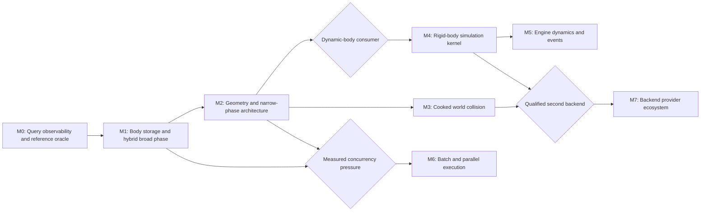

# Aether Physics Evolution Roadmap

Summary: Evolve Aether from a deterministic query-only reference scene into a scalable collision and physics foundation without changing Engine-facing World, component, or asset ownership.

Last reviewed: 2026-08-11

Status: Active
Completed:

## Current Status

The completed
[Physics Scene And Character Collision Plan](../Plans/Archive/2026-08/PhysicsSceneAndCharacterCollision.md)
established the correct first-slice ownership chain: `Core -> AetherCore ->
Aether -> Engine`. `AetherCore` owns Engine-independent shape, filter, handle,
hit, validation, and reference geometry values; `Aether` owns one synchronous
`FPhysicsScene`; Engine owns `DBodySetup`, `FBodyInstance`, component
synchronization, collision profiles, and the `DWorld` query facade. Sandbox
movement now uses capsule sweeps against authored geometry rather than a fixed
ground plane.

The current scene now separates a retained flat Reference oracle from the
default staged Production pipeline. Production still draws candidates from the
same body vector, so lookup, update, removal, and every query remain linear.
Line traces support Box targets, while sweeps and overlaps support the
Capsule/Box pair. Optional geometry counters expose the bounded nested searches:
one sparse sweep miss costs 3,422 distance evaluations and 1,652 search
iterations per tested pair.

This roadmap treats that implementation as the semantic oracle rather than as
the storage layout to extend. M0-M3 are the required query-scalability program.
Rigid-body simulation, parallel execution, and alternate backends are
conditional tracks activated by concrete consumers and measurements; they are
not prerequisites for fixing current collision-query cost.

M0 completed through the
[Aether Physics Query Observability Plan](../Plans/AetherPhysicsQueryObservability.md).
Reference, Production, and Compare preserve complete query semantics; bounded
query/mutation diagnostics reconcile; fixed-seed and 0/32/1,000/10,000 parity
qualification has zero mismatch; and real Sandbox movement plus controlled
Release baselines separate traversal from pair cost. M1 is now selected through
the
[Aether Scene Query Acceleration Plan](../Plans/AetherSceneQueryAcceleration.md).
It accepts the M0 proposals as initial hard gates: at most 32/100 sparse
candidates at 1,000/10,000 bodies, no more than 64 bytes of M1-added retained
state per body plus 64 KiB fixed, bounded mutation/small-scene regression, and
at least 4x 10,000-body sparse LineTrace/Sweep improvement. Stage 0 freezes the
exact generation slot map, deterministic static BVH, moving fat-AABB tree,
compact bounds, quality, scratch, and failure layouts against those gates
before implementation.

## Outcome

Aether provides a stable physics-scene boundary whose implementation can
scale from deterministic synchronous collision queries to cooked world
geometry and, when activated, rigid-body simulation. Engine gameplay continues
to use `DWorld`, components, body setups, body instances, collision profiles,
and stable value results without knowing which broad phase, narrow phase,
solver, thread policy, or backend produced them.

The required program delivers:

- an instrumented brute-force reference oracle and accelerated comparison
  policy;
- constant-time generational body lookup with independently owned static and
  moving broad-phase structures;
- conservative query bounds, deterministic candidate traversal, and exact
  result parity independent of index order;
- an extensible geometry and shape-pair dispatch model with fast paths for
  common primitive pairs;
- immutable shared cooked collision geometry with asset-level acceleration;
  and
- explicit memory, mutation, candidate, narrow-phase, and timing budgets.

Rigid-body simulation, asynchronous or parallel stepping, and a second
backend are conditional outcomes. Their seams are preserved by the required
work, but their abstractions are introduced only when the corresponding
consumer and validation matrix exist.

## Scope

- Low-level AetherCore collision values, geometry bounds, distance, overlap,
  raycast, shape-cast, contact, and validation contracts.
- Aether body identity and storage, scene mutation, static and moving broad
  phases, filtering, query dispatch, scratch memory, diagnostics, and reference
  comparison.
- Engine publication of motion type, shared `DBodySetup` geometry,
  `FBodyInstance` lifetime, World query compatibility, and debug/profiling
  presentation.
- Primitive, compound convex, and cooked triangle-mesh collision geometry.
- Deterministic closest-hit and multi-hit ordering across reference and
  accelerated implementations.
- Representative sparse, dense, adversarial, mutation-heavy, and gameplay
  query fixtures.
- Conditional fixed-step rigid-body simulation, contact generation, solver,
  sleeping, continuous collision detection, state exchange, and events.
- Conditional batch queries, physics-worker scheduling, and backend/provider
  selection.

## Non-Goals

- Merging physics collision, renderer visibility, navigation, or editor
  picking into one global scene. They may share a proven Core-level math or
  spatial primitive later, but retain distinct identities, lifetimes, filters,
  and result semantics.
- Exposing broad-phase nodes, narrow-phase caches, solver islands, backend
  pointers, or thread-owned mutable data through `DWorld`, `DPrimitiveComponent`,
  or `FBodyInstance`.
- Replacing existing World trace/sweep/overlap APIs merely to optimize their
  implementation.
- Treating collision object channel or response profile as body motion type.
- Copying triangle data or compound geometry into every component instance.
- Making a third-party SDK, job system, asynchronous physics, networking,
  prediction, destruction, cloth, fluids, vehicles, or skeletal ragdolls a
  prerequisite for scalable scene queries.
- Promising bitwise cross-platform simulation determinism before a networking
  or replay consumer freezes the numerical contract.
- Keeping the brute-force implementation as a production fallback for
  unbounded scenes after accelerated parity has been qualified. It remains a
  bounded test and diagnostic oracle.

## Program Decisions and Invariants

### Public ownership remains stable

- The module direction remains `Core -> AetherCore -> Aether -> Engine`.
  Scaling the scene does not create an `AetherEngine` reverse dependency or
  move DObjects, assets, Actors, components, or collision profiles below
  Engine.
- `DWorld` remains the gameplay query facade and owns one `FPhysicsScene`.
  `FPhysicsScene` remains the complete-name Aether facade and does not expose
  the concrete body store, spatial index, geometry cache, solver, or backend.
- `DBodySetup` owns authored and cooked collision intent. `FBodyInstance` owns
  one component instance's filter, motion, scene identity, and transient
  state. Aether sees immutable values, handles, geometry references, and opaque
  user tokens, never Engine object pointers.
- Existing trace, sweep, overlap, filter, ignored-body, hit-field, initial
  penetration, and stable equal-time ordering behavior is compatibility input
  to every milestone. Performance work cannot silently redefine a contact.

### Query execution is an explicit pipeline

- Scene queries are decomposed into input validation, conservative query-bound
  construction, broad-phase candidate enumeration, two-sided filtering,
  narrow-phase dispatch, winner or result accumulation, and deterministic
  final ordering. No stage reaches into another stage's private storage.
- A test/development execution policy supports `Reference`, `Production`, and
  `Compare`. Production is the slot M1 accelerates. Compare executes both paths
  against the same immutable query input and records semantic mismatches; it is
  not a shipping per-query default.
- Closest-hit traversal may prune nodes using the current best time, but final
  winner selection always uses `(Time, stable body handle)` and never tree
  insertion or traversal order. Multi-hit results have one documented stable
  ordering.
- Query scratch storage is bounded and reusable. Ordinary traces and sweeps do
  not allocate a vector proportional to total scene bodies. Overflow has an
  explicit fallback or failure policy with a counter; it never returns a
  silently incomplete result.

### Body storage and spatial acceleration are separate

- Handles become generation-checked slot identities. A dense store may move
  records internally, but a stale handle never resolves to a reused body.
  Add, lookup, update, and removal target amortized constant-time storage work,
  excluding spatial-index maintenance.
- Body motion classification is explicit: Static, Kinematic, and Dynamic are
  distinct from object channel and collision enabled mode. The first
  accelerated plan may publish only Static and Kinematic behavior, but it
  freezes values that a later solver can extend without component migration.
- Static bodies use an immutable or rebuildable static index optimized for
  query quality. Kinematic and Dynamic bodies use an incrementally updated
  structure with fat bounds and bounded reinsertion/refit work. A query visits
  both partitions behind one scene contract.
- A body record owns its exact world AABB and broad-phase proxy identity.
  Updating filter-only data does not reinsert geometry; updating a transform or
  geometry revision updates bounds and only the affected partition.
- Broad-phase bounds are conservative for rotation, positive scale, compound
  local offsets, and swept motion. Acceleration may produce false positives but
  never false negatives relative to the reference path.

### Geometry is immutable, shared, and dispatched by capability

- `FCollisionShape` remains the compact value for simple query shapes.
  Production body geometry evolves into an immutable Aether-owned geometry
  resource referenced by body descriptions; component instances do not own or
  duplicate cooked mesh payloads.
- A compound is a stable array of shape instances with local transforms and
  optional material/filter metadata. Asset-level triangle meshes and convex
  hulls own their own acceleration and cook version independently from the
  scene broad phase.
- Narrow phase dispatches on query operation and geometry pair. Common pairs
  such as Ray/Box, Capsule/Box, Sphere/Box, and primitive overlaps retain
  analytic fast paths. Generic convex support uses one proven support-mapping
  distance/penetration/cast path; it does not replace faster qualified common
  paths merely for uniformity.
- The current nested iterative Capsule/Box implementation remains reference
  evidence until an exact or demonstrably bounded fast path has parity. Once
  replaced in production, iteration counts and non-convergence remain visible
  diagnostics rather than hidden cost.
- Render LOD data is not runtime collision data. Collision cook inputs may
  originate from mesh source geometry, but the resulting versioned payload,
  bounds, BVH, memory budget, and failure policy belong to BodySetup/Aether.

### Simulation and concurrency do not distort the query foundation

- Efficient synchronous queries remain available while simulation is paused
  or disabled. Query acceleration does not wait for rigid-body simulation.
- If rigid-body simulation is activated, Aether owns a fixed-step accumulator,
  body-state authority, broad-phase pair generation, contact cache, island
  building, solver, sleeping, and continuous-collision policy. Engine owns tick
  integration, component publication/application, gameplay events, and object
  resolution.
- A later worker-thread mode uses commands and immutable committed query state;
  it does not permit Engine objects to cross threads. The child plan must freeze
  whether a synchronous World query observes the latest committed step, a
  flushed mutation set, or an explicit scene snapshot before implementation.
- No public `IPhysicsBackend` hierarchy is added during M0-M3. A provider seam
  becomes justified only by an activated second backend or by a demonstrated
  need to swap the built-in implementation in tests. Until then,
  `FPhysicsScene` encapsulation is the backend seam.

### Measurement is part of correctness

- Scene diagnostics distinguish body count, partition counts, handle/storage
  work, index nodes and retained bytes, builds/refits/reinsertions, query bounds
  tests, candidates, filter rejections, narrow-phase pair tests and iterations,
  scratch high-water marks, hits, and elapsed time.
- Representative fixtures include small scenes where acceleration overhead may
  dominate, sparse and dense 10,000-body scenes, clustered/adversarial bounds,
  transform churn, add/remove churn, and the Sandbox capsule-movement query
  sequence. Exact scales and budgets are frozen by the selected child plan from
  recorded baselines.
- Required acceptance is primarily structural and comparative: zero semantic
  mismatch, candidates proportional to local occupancy rather than total body
  count, no full static rebuild from an ordinary moving-body update, bounded
  retained/scratch memory, and measured improvement over reference at the
  qualified scale. Hardware-specific absolute time thresholds are added only
  with a controlled benchmark environment.

## Current Foundations and Gaps

| Area | Existing foundation | Gap | Owning milestone |
| --- | --- | --- | --- |
| Public scene boundary | One `FPhysicsScene` per World; unchanged World queries; private staged pipeline; value-only diagnostics | Production candidate source remains a flat body walk | M0 complete; M1 |
| Correctness oracle | Retained flat Reference, Production/Compare policy, complete-output comparator, fixed-seed and scale parity | Future accelerated traversal must qualify against the oracle | M0 complete; M1-M3 |
| Body storage | Opaque monotonically assigned handles and one body vector | Lookup/update/removal are linear; generation is not reused through a slot map | M1 |
| Broad phase | None; every valid body reaches filtering and pair dispatch | No world AABB, static/moving partition, candidate pruning, early-out, or update diagnostics | M1 |
| Narrow phase | Ray/Box and Capsule/Box reference math, including penetration and rotated positive-scale boxes | Pair support is hard-coded; Sphere is not a complete query target; Capsule/Box sweep has high bounded iterative cost | M2 |
| Geometry ownership | Shared `DBodySetup` with one simple shape and local offset | No compound, convex hull, immutable Aether geometry reference, cooked payload, or asset BVH | M2-M3 |
| Static world collision | Qualified Box assets and authored graybox collision | Arbitrary meshes need deliberate simple/complex collision and cook/version policy | M3 |
| Simulation | World already distinguishes query availability from simulation enable/pause state | No dynamic state, fixed step, mass/inertia, contacts, solver, sleeping, or CCD | Conditional M4 |
| Engine dynamics | Component lifecycle publication and opaque user-token resolution exist | No dynamic transform authority, physics material, contact/overlap events, or legacy `DPhysicsComponent` migration | Conditional M5 |
| Concurrency | Game-thread ownership rejects off-thread mutation/query safely | No batch queries, committed snapshot, command buffer, worker schedule, or latency contract | Conditional M6 |
| Backend ecosystem | AetherCore/Aether boundary prevents Engine coupling | No second backend, provider capability model, conformance suite, or migration evidence | Conditional M7 |

## Milestone Map

| Milestone | Requirement | Proposed child plan | Dependencies | Deliverable | Entry gate | Exit gate |
| --- | --- | --- | --- | --- | --- | --- |
| M0: Query observability and reference oracle | Required; completed 2026-08-11 | [Aether Physics Query Observability](../Plans/AetherPhysicsQueryObservability.md) | Completed first-slice collision plan and current focused fixtures | Explicit query pipeline seam, Reference/Production/Compare policy, diagnostics snapshot, representative fixtures, randomized/adversarial parity corpus, and recorded baselines | Frozen World semantics, result tolerances, ordering, counter equations, scene scales, Sandbox mixes, and measurement method | Zero qualified mismatch; reconciled structural/geometry/mutation work; bounded diagnostic overhead; controlled small, sparse, dense, churn, and Sandbox evidence plus M1 budget proposals |
| M1: Body storage and hybrid broad phase | Required; active | [Aether Scene Query Acceleration](../Plans/AetherSceneQueryAcceleration.md) | Completed M0 oracle, counters, fixtures, and accepted entry budgets | Generation-checked dense body storage; explicit motion type; conservative AABBs; selected static/moving broad phases; incremental mutation; closest-hit pruning; bounded scratch | Met: the child plan accepts M0's candidate, memory, mutation, small-scene, and 4x large-scene proposals; Stage 0 qualifies exact layouts before implementation | Zero reference mismatches; stale handles reject; ordinary moving updates never rebuild the static partition; broad-phase candidates track local occupancy; memory/update/query targets beat recorded flat-scan baselines at qualified scale without regressing accepted small-scene bounds |
| M2: Geometry and narrow-phase architecture | Required | `AetherGeometryAndNarrowphase` | M1 body/index ownership and query pipeline | Immutable shared geometry references, compound simple shapes, operation/pair dispatch, complete primitive query matrix, analytic common fast paths, generic convex fallback, bounded penetration and shape casts, and pair/iteration diagnostics | Shape transform/scale semantics, tolerance policy, contact fields, non-convergence behavior, and geometry-resource lifetime are frozen against the reference oracle | Qualified primitive and compound pairs match reference/goldens; Capsule movement removes pathological nested search from the production path; pair dispatch adds a new geometry type without editing scene traversal; shared geometry is not copied per body |
| M3: Cooked world collision | Required | `AetherCookedCollisionGeometry` | M2 immutable geometry and dispatch; AssetCore derived-data contracts | Versioned BodySetup cook input/output, convex and triangle-mesh payloads, asset-level BVH, simple-versus-complex query policy, bounded cook/runtime memory, serialization/DDC integration, and collision inspection | Representative imported assets, cook ownership, source-change invalidation, precision, degenerate/oversized failure, platform versioning, and editor authoring scope are selected | Instances share one cooked payload; ray/sweep/overlap parity and nearest-feature ordering pass against reference fixtures; asset and scene acceleration counters reconcile; reimport/cook/load/PIE/standalone preserve collision without render-data dependency |
| M4: Rigid-body simulation kernel | Conditional; deferred | `AetherRigidBodySimulation` | M1-M2; concrete Dynamic-body gameplay requirement and accepted stability budget | Fixed-step scene state, mass/inertia, forces/impulses, broad-phase pair generation, persistent manifolds, islands, iterative constraint solver, sleeping, kinematic targets, and bounded CCD policy | Not met: no selected dynamic-body consumer, stack/joint scale, timestep, determinism, CCD, failure, or performance budget | Selected dynamic scenarios remain stable within frozen tolerances; query and simulation body identity agree; pause/step/restart/teardown are deterministic; solver/island/contact work and energy/error bounds are observable |
| M5: Engine dynamics and events | Conditional; deferred | `AetherEngineDynamicsIntegration` | M4 and selected Engine/gameplay consumers | Engine motion publication and state application, physics materials, hit/overlap event queues, safe object resolution, transaction/PIE lifecycle, and migration or retirement of legacy `DPhysicsComponent` | Not met until M4 exists and event ordering, transform authority, teleports, ownership, and gameplay consumers are frozen | Exactly one transform authority per body mode; stale events cannot resolve retired objects; PIE/standalone lifecycle, moving bodies/platforms, material responses, and event ordering pass focused and full integration gates |
| M6: Batch and parallel execution | Conditional; deferred | `AetherParallelPhysicsExecution` | M0-M2 diagnostics; accepted CPU task-system integration; measured query or step pressure | Batch query API, bounded scratch arenas, mutation commands, committed query snapshot, worker scheduling, cancellation/teardown, and latency/freshness diagnostics | Not met: single-thread query cost must first be reduced; activate only when profiles show remaining parallel work and freeze synchronous-query visibility semantics | Supported batch/worker results match synchronous reference semantics; no DObject crosses threads; buffers and in-flight work are bounded; shutdown, cancellation, World replacement, and fallback complete without races or hidden waits |
| M7: Backend provider ecosystem | Conditional; deferred | `AetherPhysicsBackendProviders` | M3 and, for simulation backends, M4-M5; one qualified second implementation | Capability-described provider selection behind `FPhysicsScene`, conformance tests, versioned geometry/state exchange, deterministic fallback, diagnostics, and packaging boundaries | Not met: name the second backend, supported feature matrix, licensing/build/runtime constraints, migration path, and measurable benefit before introducing the interface | Built-in and alternate providers pass the shared supported conformance corpus; unsupported features reject or fall back explicitly; Engine code and serialized assets contain no provider-native types |

M0-M3 are required. M4-M7 are conditional and may remain deferred when their
entry evidence is absent. Completing the roadmap requires passing M0-M3 and
recording a deliberate disposition for every conditional milestone; it does
not require speculative simulation, threading, or backend work.

## Child Plan Boundaries

### [Aether Physics Query Observability](../Plans/AetherPhysicsQueryObservability.md)

This plan owns instrumentation, fixtures, reference preservation, execution
policy, and the internal query-pipeline seam. It may move existing flat query
loops behind a reference implementation but does not add a spatial index,
change geometry math, alter World APIs, or claim performance improvement. Its
main output is trustworthy evidence for M1 and M2.

### [Aether Scene Query Acceleration](../Plans/AetherSceneQueryAcceleration.md)

This plan owns generational body storage, body motion classification, world
AABB publication, static/moving partitioning, broad-phase data structures,
mutation/refit/rebuild rules, traversal, scratch capacity, and accelerated
parity. It does not add triangle meshes, generic convex algorithms, rigid-body
state, Engine events, or task scheduling.

The child plan should evaluate the existing editor picking AABB tree as
evidence, not copy it as a subsystem. Physics requires segment/swept-volume/
overlap traversal, moving-body mutation, collision filtering, stable physics
handles, and World lifetime. Only a genuinely consumer-neutral math or
container primitive proven by both systems may move to Core; the two scene
indexes retain separate ownership.

### `AetherGeometryAndNarrowphase`

This plan owns geometry-resource identity and lifetime, compound layout,
shape-pair dispatch, analytic and generic convex algorithms, contact semantics,
iteration budgets, and narrow-phase diagnostics. It does not serialize Engine
assets, cook render/source meshes, schedule simulation, or add editor UI. M1's
scene traversal consumes its interface without knowing the selected pair
algorithm.

### `AetherCookedCollisionGeometry`

This plan owns the Engine/AssetCore-to-Aether cook boundary, BodySetup cook
settings and version, immutable convex/triangle payloads, asset BVH, derived
data, serialization, import invalidation, runtime memory, and inspection. It
does not reuse render BVHs as collision truth, add dynamic mesh deformation,
or introduce rigid-body simulation. Heightfields require a concrete terrain
consumer and may become a separate child plan rather than expanding this one.

### `AetherRigidBodySimulation`

This conditional plan owns Aether's simulation state and numerical kernel. It
does not expose Engine objects or gameplay callbacks, choose editor workflows,
or introduce networking prediction. It must start with representative dynamic
scenarios and stability budgets, not with a generic constraint class hierarchy.

### `AetherEngineDynamicsIntegration`

This conditional plan owns Engine body-mode properties, World stepping,
component state exchange, physical materials, object-safe event delivery,
PIE/standalone behavior, and the legacy `DPhysicsComponent` disposition. A
generic character movement component, moving-platform policy, ragdoll, vehicle,
or gameplay-specific force system should remain separate consumer plans unless
one is selected as the bounded acceptance slice.

### `AetherParallelPhysicsExecution`

This conditional plan owns the task, command, snapshot, batch, scratch,
cancellation, and teardown protocol. It may parallelize already-correct broad
phase, narrow phase, or simulation islands only after profiles identify the
work. It does not make ordinary synchronous queries silently stale or convert
Engine object pointers into cross-thread payloads.

### `AetherPhysicsBackendProviders`

This conditional plan owns a provider capability and conformance boundary for
one named second implementation. It does not redesign Engine APIs around the
vendor, serialize vendor handles, or keep two implementations feature-identical
without a selected product need. Backend-specific modules are named after the
selected backend and remain below Engine.

## Program Validation Matrix

| Contract | Required milestones | Validation outcome |
| --- | --- | --- |
| Semantic parity | M0-M3; M4-M7 when activated | Reference and production paths agree on hit/no-hit, initial penetration, time, distance, point, normal, response, body identity, and stable ordering within frozen tolerances across randomized and adversarial fixtures |
| Body identity and lifetime | M1-M7 | Add/update/remove, slot reuse, stale generation, filter-only update, geometry/transform update, component unregister, Level/World replacement, PIE restart, and teardown never resolve or query a retired body |
| Broad phase | M1-M7 | Exact and swept AABBs are conservative; static/moving partitions both participate; false positives are measured; false negatives are zero; update/rebuild behavior and candidate counts meet selected budgets |
| Narrow phase | M2-M7 | Every supported operation/pair has explicit dispatch, tolerances, convergence/failure behavior, transform/scale coverage, degeneracy handling, diagnostics, and fast-path/generic parity where both apply |
| Geometry sharing and cook | M2-M3; M7 | Compound/convex/mesh payloads are immutable, bounded, versioned, shared across instances, invalidated by source/settings changes, independent of render resources, and rejected transactionally when invalid |
| Query resource use | M0-M3; M6 | Body/index/geometry retained bytes, temporary scratch, candidate buffers, query batches, and debug captures are bounded; disabled diagnostics perform no proportional scene walk |
| Determinism | M0-M7 | Results and events use stable semantic ordering independent of vector layout, tree construction/traversal, worker completion, provider native order, or component registration accidents |
| Simulation | M4-M5 when activated | Fixed-step accumulation, forces, kinematic targets, contacts, islands, solver, sleeping, CCD, pause/step/restart, and state authority satisfy frozen stability and lifecycle fixtures |
| Concurrency | M6 when activated | Query freshness, command ordering, snapshot publication, cancellation, World retirement, scratch ownership, and worker completion are race-free and bounded under stress/sanitizer-equivalent coverage available to the repository |
| Backend conformance | M7 when activated | Capabilities are explicit; common supported behavior passes one corpus; unavailable features fail or fall back deliberately; no backend-native type leaks into Engine or persisted assets |
| Performance | M0-M7 | Controlled baselines record time and structural work; qualified scale reduces candidates and exact tests from total-body work to local occupancy, removes pathological common-pair iterations, and prevents mutation or memory regressions |
| Handoff qualification | Every implementation plan | Follow root focused/full native test and full-build rules according to the selected plan's affected targets and user-visible editor/gameplay scope |

## Risks and Control Gates

| Risk | Control gate |
| --- | --- |
| A BVH makes benchmarks faster but changes edge contacts or equal-time winners. | M0 freezes the oracle and Compare policy; M1 exits only with zero semantic mismatches and stable-handle ordering independent of traversal. |
| Broad-phase acceleration hides an expensive Capsule/Box narrow phase, so dense contact regions remain slow. | Diagnostics split candidates from pair tests and iterations; M2 separately removes pathological common-pair work before performance is declared complete. |
| One dynamic tree is used for everything and static query quality or moving-update cost degrades. | M1 requires explicit static/moving classification and reports each partition's build, refit, reinsertion, node, memory, and candidate work. |
| Object channel is reused as motion type and later dynamic bodies require asset/profile migration. | Motion type is a separate low-level and Engine publication contract before the first index partitions bodies. |
| Compound or triangle geometry is copied into every body instance. | M2-M3 require immutable reference-counted or handle-owned geometry and verify retained bytes across many instances of one asset. |
| A generic convex algorithm replaces all analytic paths and slows the common Sandbox case. | Pair dispatch preserves measured analytic fast paths and compares overlapping supported algorithms; generic convex is a fallback capability, not mandatory dispatch for every pair. |
| Physics reuses the LevelEditor picking tree and inherits editor visibility, mutation, or identity semantics. | Only neutral Core primitives may be shared after two-consumer proof; Aether owns its index, handles, filters, query volumes, and lifetime. |
| Async physics is added before single-thread algorithms are efficient and creates stale-query complexity without benefit. | M6 activates only after M1-M3 measurements isolate remaining parallel work and a query-freshness contract is accepted. |
| A speculative backend interface calcifies around no real backend. | `FPhysicsScene` encapsulation is sufficient through M0-M6; M7 requires a named provider, feature matrix, constraints, conformance corpus, and benefit. |
| Rigid-body simulation becomes one monolithic plan spanning math, threading, Engine events, editor UI, and gameplay. | M4 owns the Engine-free numerical kernel; M5 owns Engine integration; M6 owns concurrency; gameplay consumers and editor tools remain separate plans. |
| Microbenchmarks optimize synthetic rays but not actual character movement. | Every performance milestone includes the recorded Sandbox capsule-movement sequence plus sparse, dense, and churn fixtures, and reports structural work as well as elapsed time. |

## Completion Criteria

- M0-M3 pass through independently reviewable child plans and their lasting
  contracts move to Runtime Physics, Assets, and module documentation.
- `FPhysicsScene` retains the stable World-facing facade while storage, broad
  phase, narrow phase, and cooked geometry are independently testable and not
  observable through Engine APIs.
- Reference and accelerated query results have zero unexplained mismatch;
  closest and multi-hit ordering does not depend on tree or container order.
- Body lifecycle uses generation-checked constant-time storage, static and
  moving bodies have appropriate acceleration/update behavior, and queries
  perform exact tests against local candidates rather than the complete body
  set at qualified scale.
- Common primitive queries avoid pathological iterative work; adding a new
  geometry type extends geometry/dispatch code rather than scene traversal or
  World/component APIs.
- Cooked convex and triangle geometry is immutable, versioned, bounded,
  shared, accelerated at asset level, and independent of render resources.
- Diagnostics explain retained memory, mutation work, candidate reduction,
  pair/iteration work, overflow/fallback, and measured time with negligible
  disabled cost.
- Conditional M4-M7 are completed or explicitly deferred after their entry
  evidence, consumer, budgets, and current measurements are reviewed.

## Related Documentation

- [Runtime Collision](../Runtime/Physics/Collision.md)
- [Code Modules](../Workspace/CodeModules.md)
- [Level System](../Runtime/World/LevelSystem.md)
- [Static Mesh Rendering](../Runtime/Rendering/StaticMeshRendering.md)
- [CPU Task System](../Runtime/Core/TaskSystem.md)
- [Viewport Picking Roadmap](Archive/2026-08/ViewportPicking.md)
- [Physics Scene And Character Collision Plan](../Plans/Archive/2026-08/PhysicsSceneAndCharacterCollision.md)

## Related Code

- [`Engine/Source/Runtime/AetherCore`](../../Engine/Source/Runtime/AetherCore)
- [`Engine/Source/Runtime/Aether`](../../Engine/Source/Runtime/Aether)
- [`Engine/Source/Runtime/Engine/Public/Physics`](../../Engine/Source/Runtime/Engine/Public/Physics)
- [`Engine/Source/Runtime/Engine/Public/Collision`](../../Engine/Source/Runtime/Engine/Public/Collision)
- [`Engine/Source/Runtime/Engine/Public/Engine/World.h`](../../Engine/Source/Runtime/Engine/Public/Engine/World.h)
- [`Engine/Tests/Native/EngineTests/Private/Physics/PhysicsSceneTests.cpp`](../../Engine/Tests/Native/EngineTests/Private/Physics/PhysicsSceneTests.cpp)
- [`Sandbox/Source/Runtime/Sandbox/Private/SimpleGroundMovementComponent.cpp`](../../Sandbox/Source/Runtime/Sandbox/Private/SimpleGroundMovementComponent.cpp)
