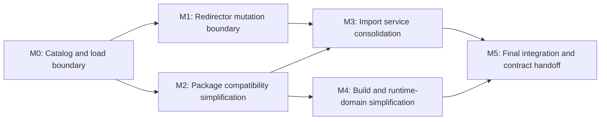

# Asset Architecture Simplification Roadmap

Summary: Simplify asset runtime and authoring architecture while retaining explicit, bounded redirectors as the durable relocation compatibility mechanism.

Last reviewed: 2026-08-15

Status: Archived
Completed: 2026-08-16

## Current Status

The completed
[Asset Redirectors Refactor Plan](../../../Plans/Archive/2026-08/AssetRedirectors.md)
established the correct relocation semantics: moving an asset publishes a real
package at the destination and an authored redirector at the old path without
requiring every referencer to be loaded, writable, or indexed. Explicit Fix Up
later rewrites proven-complete package and external references, and Cook emits
only canonical real paths. Those semantics remain requirements of this
roadmap.

M0 is complete. The catalog is authoritative, resolution is pure, ordinary
load performs no registry-miss probing or publication, manager state is
private, and focused headers replace the former
`AssetSystem.h` umbrella. M1 is complete: package residency uses explicit
`NewlyCreated`/`Published` state, and relocation, deletion, and strict Fix Up
use opaque transaction boundaries owned by AssetCore. Production callers cannot
sequence mutation phases, and contribution registrations are lifetime-gated.
M2 separated ordinary one-pass decode from explicit canonical audit, removed
the dormant migration/upgrader and partial compatibility machinery, and made
schema incompatibility fail before residency.

The completed M3 child plan is
[Asset Import Service Consolidation](../../../Plans/Archive/2026-08/AssetImportServiceConsolidation.md).
M2 separated ordinary current-format decode from explicit canonical audit and
removed migration/upgrader machinery that had no proven repository consumer.
M3 consolidates the overlapping import registration and orchestration surfaces.
The completed M4 child plan is
[Asset Build And Runtime Domain Simplification](../../../Plans/Archive/2026-08/AssetBuildAndRuntimeDomainSimplification.md).
It removes the unused Build executor design and replaces mutable package-load
mode with immutable authored/cooked runtime construction and payload policy.
The completed M5 child plan is
[Asset Architecture Final Integration](../../../Plans/Archive/2026-08/AssetArchitectureFinalIntegration.md).

## Outcome

Durin has a small asset architecture in which each state and operation has one
owner:

- an authoritative catalog represents every persistent real asset and
  redirector at its exact authored path;
- a pure resolver follows explicit redirector metadata and returns one
  structured final result without loading packages;
- one resident-package store holds both loaded persistent packages and newly
  created packages, with explicit `NewlyCreated`/`Published` and dirty state;
  the persistent catalog remains a separate truth boundary;
- an authoring service owns create, save, relocation, deletion, Fix Up, and
  their journaled transactions;
- one import service owns provider discovery, planning, execution, reimport,
  multi-output reconciliation, and asynchronous admission;
- AssetBuildCore exposes only cache and build-host behavior justified by
  production consumers; and
- authored and cooked execution domains are fixed at runtime construction
  rather than selected through mutable global state.

Redirectors remain durable authored compatibility records. They are not a
general missing-file fallback, a runtime object returned to callers, an excuse
to accept incomplete registry state, or a second asset-loading path.

## Scope

- AssetCore public API, internal ownership, catalog refresh, exact lookup,
  redirect resolution, package loading, residency, save, relocation, deletion,
  Fix Up, compatibility, cooking, and test seams.
- Redirector registry metadata, chain compression, corruption diagnostics,
  external reference stores, editor visibility, Undo/Redo, and cooked-output
  canonicalization.
- AssetImportCore and StandardAssetImport provider, handler, record,
  publication, asynchronous request, and reimport boundaries.
- AssetBuildCore cache, host, build-request, definition, policy, and unused
  executor surfaces.
- Engine asset `PostLoad` behavior and runtime services that still depend on
  mutable package-load mode.
- Focused native tests, integration tests, editor workflow qualification, and
  lasting asset/editor architecture documentation affected by each child plan.

## Non-Goals

- Removing authored redirectors or returning to eager move-time rewriting of
  every referencer.
- Replacing path identity with GUIDs, content hashes, database identities, or
  a second identity system.
- Adding Core Redirects for native types or reflected class, property, enum,
  function, or schema names.
- Shipping redirector packages or a mutable redirect table in normal cooked
  runtime output.
- Adding asynchronous streaming, bundles, remote assets, source-control
  automation, or asset consolidation merely as part of simplification.
- Changing the DAST v4 wire format unless a child plan proves that a format
  change is necessary for its own bounded outcome.
- Preserving source compatibility for redundant public APIs, dead extension
  points, or test-only controls.

## Program Decisions and Invariants

### Redirectors are explicit compatibility records

- A redirector remains a persistent `.dasset` entry, participates in registry
  snapshots, source control, editor inspection, Undo/Redo, and recovery, and
  retains the current validated v4 representation unless a later format plan
  explicitly replaces it.
- Only AssetCore relocation may create or retarget a redirector. Ordinary save,
  import, registry refresh, load, and error recovery cannot synthesize one.
- A successful `A -> B` move leaves `A -> B`. A later `B -> C` move rewrites
  same-object upstream aliases directly to `C`, so normal authoring commits do
  not leave chains. Resolution remains bounded and detects cycles, missing
  targets, type mismatches, and depth overflow for corrupt, externally edited,
  or merged content.
- Redirectors preserve old authored paths; they never silently mutate the
  serialized identity, equality, or hash of a soft reference.

### Exact lookup and resolution are different operations

- Exact lookup reports the entry physically occupying a path, including a
  redirector. Collision checks, mutation, deletion, registry inspection, and
  Content Browser tooling use exact lookup.
- Resolution is a pure catalog operation returning requested path, final path,
  chain, final metadata, and a structured terminal state. It performs no file
  I/O, package construction, reference rewrite, registry mutation, or implicit
  refresh.
- Ordinary load resolves once, validates the final class, and loads only the
  final real package. A redirector object may be constructed only through an
  internal exact inspection seam and never escapes an ordinary typed load.
- A catalog miss is `NotFound`. Physical-path guessing and direct load are not
  compatibility behavior. Explicit editor recovery or import tools may inspect
  an unindexed file, validate it, and publish it to the catalog before normal
  loading.

### The catalog is persistent truth; residency state is explicit

- Every persistent load begins from one published catalog revision. A load
  does not discover or add catalog entries as a side effect.
- Catalog refresh publishes one complete replacement or an explicit incomplete
  result. It never returns success while hiding parse or reference-index
  failures only in mutable side-channel arrays.
- Newly created unsaved packages live in the same resident-package store as
  packages loaded from persistent content. A resident entry explicitly records
  whether it is `NewlyCreated` or `Published`; dirty state independently records
  whether its current contents need saving. There is no parallel draft store.
- Resident lookup may return either publication state to editor authoring code.
  Persistent catalog lookup, redirect resolution, and ordinary disk-backed load
  remain catalog-authoritative and never publish an entry as a side effect.
- Unload rejects newly created or dirty packages by default. Explicit discard
  policy is required to end residency while losing unsaved state; there is no
  separate public discard-draft operation.
- Catalog query results and snapshots have revision-safe value semantics; raw
  pointers into mutable registry containers do not cross the catalog boundary.

### Move and Fix Up remain separate transactions

- Relocation cost is independent of arbitrary referencer count and
  writability. It moves the selected real assets and owned payloads, creates or
  compresses redirectors, and publishes one atomic catalog revision without
  visiting referencers.
- An incomplete reference index does not block relocation. It does block any
  Fix Up mode that claims a redirector is safe to delete.
- Fix Up is the only bulk path canonicalization operation. Redirector deletion
  requires a complete reference index, every required external reference
  store, writable and fingerprint-matching inputs, successful atomic rewrite,
  and proof of zero remaining incoming persistent references.
- Owned payload relocation, persistent external reference rewriting, and
  transient editor observation remain different contribution contracts.
  Callbacks cannot participate in a transaction whose failure semantics they
  do not own.

### Authoring aliases do not enter cooked runtime

- Cook resolves roots and package references through the shared catalog
  resolver and writes final real identities to staged output without modifying
  authored packages.
- Redirector packages are excluded from normal cooked manifests. An unresolved
  alias, cycle, missing target, type mismatch, or redirector remaining in
  produced bytes fails before manifest publication.
- Cooked execution has no mutable redirect table and never constructs a
  redirector object.

### One operation has one public entry and one owner

- Public APIs use one calling style. Stateful manager implementations,
  registries, package stores, journals, registries of callbacks, and failure
  injection remain private to their owning module or focused test support.
- Previewable mutations may expose an immutable summary/token, but callers do
  not manually sequence internal prepare, revalidate, commit, and rollback
  phases. Commit owns final revalidation and compensation.
- Extension points exist only when at least one production consumer requires
  substitution or contribution. No-op contributors, unconsumed upgrader
  registries, and hypothetical local/remote build executors are removed rather
  than retained for possible future use.
- Normal failure is explicit and local. Unknown schema, corrupt content,
  incomplete scans, unavailable reference stores, stale transaction inputs,
  and cooked-domain payload absence do not fall through to a weaker path.

### Compatibility work is temporary and evidence-driven

- The current production codec remains v4. Canonical encoding is guaranteed by
  the writer and verified by tests or offline audit, not by reserializing every
  ordinary load.
- Runtime does not retain a general migration graph, structure-upgrader
  registry, partial compatibility objects, or data-loss save escape hatch when
  there is no production migration edge.
- A future format transition introduces the smallest explicit offline
  converter required by real source content. After the tracked corpus is
  migrated and qualified, that converter is removed according to the versioning
  contract.

## Current Foundations and Gaps

| Area | Foundation to preserve | Gap to remove | Owning milestone |
| --- | --- | --- | --- |
| Redirectors | Exact registry metadata, bounded resolution, direct aliases, atomic relocation, explicit Fix Up, editor and Cook integration | Redirector behavior shares a monolithic manager and load fallback path with unrelated responsibilities | M0-M1 |
| Catalog | Incremental/full reconciliation, persistent snapshots, revisions, exact and resolved queries | Mutable-pointer results, success with side-channel errors, and load-time discovery; M1 supersedes the temporary M0 split draft store with explicit resident publication state | M0-M1 |
| Package loading | Typed load, dependency handling, resident-package cache, authored/cooked policies | Public singleton manager, duplicate facades, registry-miss disk probing, repeated file reads, and redirector construction seams mixed with normal load | M0-M2 |
| Mutation | Journaled relocation, deletion and Fix Up with Undo/Redo | Public phase orchestration, duplicated revalidation, broad callback/test surface, and all operations co-located in `AssetSystem` | M1 |
| Compatibility | Deterministic v4 codec, bounded one-pass live reader, strict schema preflight, offline audit/resave tools | Completed in M2: the empty migration graph, unused structure upgraders, partial compatibility packages, and load-time canonical re-encoding were removed | M2 |
| Import | Format-neutral planning, publication transactions, source records, reimport, and scene multi-output support | Completed in M3: one descriptor registration and one service replaced the overlapping provider, single-asset, and record-handler registries | M3 |
| Build and domains | DDC client, build host, authored rebuild, cooked hard-failure behavior | Unused executor/definition abstractions and mutable global package-load mode leak into Engine asset types | M4 |
| Public surface | Most production users already call free AssetCore facades | `FAssetManager`, large shared headers, duplicate member/free APIs, and production failure injection remain public | M0-M4 |

## Milestone Map

| Milestone | Requirement | Proposed child plan | Dependencies | Deliverable | Entry gate | Exit gate |
| --- | --- | --- | --- | --- | --- | --- |
| M0: Catalog and load boundary | Required; completed | [Asset Catalog and Load Boundary](../../../Plans/Archive/2026-08/AssetCatalogAndLoadBoundary.md) | Current v4, registry, redirector and load tests | One authoritative exact catalog, pure resolution, one-read final-package load, explicit resident authoring state, private manager state, and split public headers | Existing exact/resolved/redirected behavior and production callers are inventoried | Passed: registry miss cannot load implicitly; redirect behavior is unchanged; no public manager or duplicate load path remains |
| M1: Redirector mutation boundary | Required; completed | [Asset Redirector Mutation Boundary](../../../Plans/Archive/2026-08/AssetRedirectorMutationBoundary.md) | M0 | One stateful resident-package model plus one authoring service and transaction abstraction for create/save/move/delete/Fix Up, preserving direct aliases and strict deletion proof | Passed: all mutation callers use M0 catalog values and load surface | Passed: no parallel draft store or discard-draft API remains; callers cannot sequence internal transaction phases; relocation, deletion, and Fix Up retain the completed failure matrix |
| M2: Package compatibility simplification | Required; completed | [Asset Package Compatibility Simplification](../../../Plans/Archive/2026-08/AssetPackageCompatibilitySimplification.md) | M0 | Validated decode separated from offline canonical audit; dead migration/upgrader and partial compatibility state removed; current-format failure policy made strict | Passed: catalog/load reports have stable structured format/schema errors | Passed: ordinary load performs no canonical re-encode and no production type branches on migration-load mode |
| M3: Import service consolidation | Required; completed | [Asset Import Service Consolidation](../../../Plans/Archive/2026-08/AssetImportServiceConsolidation.md) | M1-M2 | One importer descriptor, request, plan, execution, publication, reimport, record, and async ownership model | Passed: authoring publication and compatibility failures have one owner | Passed: production importers register once and initial import/reimport/multi-output share one service |
| M4: Build and runtime-domain simplification | Required; completed | [Asset Build And Runtime Domain Simplification](../../../Plans/Archive/2026-08/AssetBuildAndRuntimeDomainSimplification.md) | M2 | Cache/host-only AssetBuildCore surface and immutable Authored/Cooked service construction with explicit payload policy | Passed: package decode and post-load responsibilities are separated | Passed: no unused build executor abstraction or mutable package-load mode remains in production APIs |
| M5: Final integration and contract handoff | Required; completed | [Asset Architecture Final Integration](../../../Plans/Archive/2026-08/AssetArchitectureFinalIntegration.md) | M3-M4 | Repository-wide legacy API removal, performance/behavior qualification, and final Runtime/Editor contracts | Passed: all owning child plans completed with focused evidence | Passed: one public entry per operation, no obsolete compatibility surface, all program validation passes, and lasting contracts own final behavior |

## Child Plan Boundaries

| Child plan | Status | Owns | Must not absorb |
| --- | --- | --- | --- |
| [Asset Catalog and Load Boundary](../../../Plans/Archive/2026-08/AssetCatalogAndLoadBoundary.md) | Completed | Catalog value/query boundary, resolution, package-store load path, drafts, public runtime header split | Mutation transaction redesign, format migration removal, importer consolidation |
| [Asset Redirector Mutation Boundary](../../../Plans/Archive/2026-08/AssetRedirectorMutationBoundary.md) | Completed | Unified resident-package publication state, unload/discard policy, authoring service, relocation/deletion/Fix Up transaction facade, callback ownership, Undo/Redo integration | Removing redirectors, eager referencer rewriting, package-format redesign |
| [Asset Package Compatibility Simplification](../../../Plans/Archive/2026-08/AssetPackageCompatibilitySimplification.md) | Completed | Decode/audit split, schema failure policy, migration/upgrader removal, affected Engine load branches | Importer redesign, new asset format, cooked alias tables |
| [Asset Import Service Consolidation](../../../Plans/Archive/2026-08/AssetImportServiceConsolidation.md) | Completed | Provider registration, planning/execution, single/multi-output reimport, async ownership and publication | General job system or remote import execution |
| [Asset Build And Runtime Domain Simplification](../../../Plans/Archive/2026-08/AssetBuildAndRuntimeDomainSimplification.md) | Completed | DDC/build host surface, removal of unused build execution design, immutable authored/cooked domain and payload policy | Remote build protocol without a production consumer |
| [Asset Architecture Final Integration](../../../Plans/Archive/2026-08/AssetArchitectureFinalIntegration.md) | Completed | Cross-module legacy search, final benchmarks/smoke tests, lasting contract reconciliation | New asset capabilities unrelated to simplification |

M0-M5 are complete. Every implementation checklist and evidence record lives in
its completed child plan rather than this roadmap.

## Program Validation Matrix

| Area | Required program evidence |
| --- | --- |
| Catalog truth | Cold/full/incremental refresh converge; incomplete refresh is explicit; exact results remain revision-safe; no load-time discovery occurs |
| Resolution | Direct alias, repeated move compression, move-back, missing target, cycle, depth limit, type mismatch, and no-I/O resolution behave deterministically |
| Ordinary load | Real, redirected, loaded, unloaded, dependency, draft, missing, corrupt, and wrong-class cases use one path and never return a redirector object |
| Mutation | Single/folder/batch relocation, deletion, stale plans, publication failure, compensation, Undo/Redo, and registry revision atomicity preserve authored content |
| Fix Up | Complete and incomplete reference indexes, package fields, external stores, read-only/dirty/stale inputs, rewrite-only, rewrite-and-delete, and zero-incoming proof remain fail-closed |
| Cook | Redirected roots and hard/soft references canonicalize; redirectors, unresolved aliases, cycles, and missing providers cannot enter a published manifest |
| Compatibility | Current v4 fixtures load deterministically; unknown/corrupt/incompatible content fails without partial package residency; canonical audit remains available offline |
| Import | Every production format registers once; create, reimport, repair, record reconciliation, multi-output, cancellation, and shutdown share one service boundary |
| Build/domain | Authored rebuild and cooked hard failure are explicit; DDC failure policies remain qualified; no mutable domain or unused executor path remains |
| API and ownership | Repository search proves one public entry per operation, no public `FAssetManager`, no retired headers/types, and no unowned async or mutation callback |
| Qualification | Focused native suites, full affected targets, full native tests, hidden-window editor smoke, documentation validation, and measured load/refresh baselines pass under the repository workflows |

Build and test selection, process-conflict checks, target invocation, and result
reporting follow the repository agent workflows rather than commands copied
into this roadmap.

## Risks and Control Gates

| Risk | Control gate |
| --- | --- |
| Simplification accidentally turns redirectors back into eager rewrite | M0-M1 tests require relocation to succeed with unloaded, read-only, malformed, or incompletely indexed referencers while old paths continue resolving |
| Exact and resolved identities become interchangeable | Separate value types/results, exact collision tests, and Content Browser mutation tests reject final-target substitution at an occupied alias path |
| Removing disk fallback breaks a real recovery flow | M0 inventories every production caller and introduces an explicit validate-and-publish recovery/import operation before deleting fallback behavior |
| Catalog refresh publishes partial truth | Refresh result carries completeness and one atomic revision; mutation and strict Fix Up gate on the required completeness level |
| Redirector corruption becomes an unbounded runtime cost | Resolution has fixed depth, visited-path detection, no package I/O, stable diagnostics, and Cook failure before publication |
| Large API moves obscure behavioral regressions | Each child plan preserves a characterization suite, migrates one ownership boundary at a time, and deletes legacy paths only after caller search and parity gates pass |
| Removing compatibility scaffolding loses real content | M2 inventories tracked and project fixtures, runs construct-free audit, and migrates any actual non-current content before deleting a required converter |
| Import or build cleanup removes an undocumented consumer | M3-M4 require production registration/execution inventories and delete only surfaces with named destinations or proven absence |

## Completion Criteria

- All required milestones pass their exit gates and every conditional or
  deferred proposal is explicitly dispositioned.
- Redirectors remain durable authored aliases, moves remain independent of
  referencer availability, and strict Fix Up remains the only operation that
  rewrites and deletes them.
- Persistent loads use one catalog revision, one resolver, and one final-package
  read path; missing catalog entries cannot load by physical-path inference.
- Newly created and published packages share one resident store with explicit
  publication and dirty state, and unsaved state is discarded only by policy.
- Runtime and editor call sites expose no stateful asset manager, duplicate
  member/free operation, manual mutation phase protocol, or production
  failure-injection control.
- Ordinary load performs no canonical re-encode and creates no partial
  compatibility package; migration support exists only while a real transition
  requires it.
- Importers register once and all import modes use one plan/execution/publication
  service.
- AssetBuildCore contains only production-used cache and host abstractions, and
  authored/cooked execution domains are immutable after startup.
- Lasting behavior is transferred to the owning Runtime and Editor architecture
  documents, all documentation lifecycle validators pass, and required build,
  native-test, editor-smoke, and performance evidence is recorded.

## Related Documentation

- [Asset Packages](../../../Runtime/Assets/AssetPackages.md)
- [Asset Data Lifecycle](../../../Runtime/Assets/AssetDataLifecycle.md)
- [Asset Versioning](../../../Runtime/Assets/Versioning.md)
- [Asset Import Framework](../../../Editor/Architecture/AssetImportFramework.md)
- [Content Browser](../../../Editor/Architecture/ContentBrowser.md)
- [Asset Redirectors Refactor Plan](../../../Plans/Archive/2026-08/AssetRedirectors.md)
- [Agent Build and Run Workflow](../../../Agents/BuildAndRun.md)
- [Agent Testing Workflow](../../../Agents/Testing.md)

## Related Code

- [`AssetPackage.h`](../../../../Engine/Source/Runtime/AssetCore/Public/AssetPackage.h)
- [`AssetLoad.h`](../../../../Engine/Source/Runtime/AssetCore/Public/AssetLoad.h)
- [`AssetMutation.h`](../../../../Engine/Source/Runtime/AssetCore/Public/AssetMutation.h)
- [`AssetSystem.cpp`](../../../../Engine/Source/Runtime/AssetCore/Private/AssetSystem.cpp)
- [`AssetPackageV4Reader.cpp`](../../../../Engine/Source/Runtime/AssetCore/Private/AssetPackageV4Reader.cpp)
- [`AssetImportCore.h`](../../../../Engine/Source/Editor/AssetImportCore/Public/AssetImportCore.h)
- [`MultiOutputImport.h`](../../../../Engine/Source/Editor/AssetImportCore/Public/MultiOutputImport.h)
- [`BuildCache.h`](../../../../Engine/Source/Developer/AssetBuildCore/Public/AssetBuild/BuildCache.h)
- [`BuildHost.h`](../../../../Engine/Source/Developer/AssetBuildCore/Public/AssetBuild/BuildHost.h)
- [`EditorAssetMoveCoordinator.cpp`](../../../../Engine/Source/Editor/LevelEditor/Private/Assets/EditorAssetMoveCoordinator.cpp)
