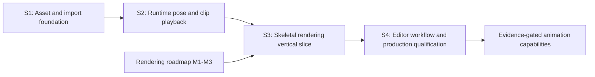

# Skeletal Mesh and Animation Roadmap

Summary: Establish skeletal assets, deterministic source ingestion, runtime pose evaluation, GPU skinning, and production editor workflows through just-in-time implementation plans.

Last reviewed: 2026-08-11

Status: Archived
Completed: 2026-08-11

## Current Status

The first child completed on 2026-08-08 through the
[Skeletal Asset and Import Foundation Plan](../../../Plans/Archive/2026-08/SkeletalAssetAndImportFoundation.md).
Durin now has bounded `DSkeleton`, `DSkeletalMesh`, and `DAnimationClip` assets;
deterministic glTF/GLB skeletal normalization; stable provider peer outputs;
mesh palettes and inverse binds; versioned DDC/cooked payloads; runtime-only
loading; and failure-atomic import/reimport coverage. StaticMesh source behavior
remains unchanged.

S2 completed on 2026-08-10 through
[Skeletal Runtime Pose and Playback](../../../Plans/Archive/2026-08/SkeletalRuntimePoseAndPlayback.md).
`DSkeletalMeshComponent` is now the long-lived owner of a detached value-only
animation instance. It samples Step/Linear clips, evaluates parent-before-child
poses, controls deterministic loop/clamp playback, and atomically publishes
bounded immutable mesh palettes. Cooked runtime-only assets produce the same
finite glTF/GLB pose goldens without source, import modules, or DDC fallback.
S3 completed on 2026-08-11 through the shared
[Skeletal Mesh Rendering Plan](../../../Plans/Archive/2026-08/SkeletalMeshRendering.md).
`DSkeletalMeshComponent` now creates a detached production scene proxy from a
complete pose, publishes coherent palette/revision/conservative-bound updates,
and renders GPU-skinned geometry through typed visibility and the shared
material, pass, viewport, invalidation, and resource-lifecycle contracts.
This opened the S4 editor workflow and production-qualification entry gate.
S4 completed on 2026-08-11 through the
[Skeletal Editor Workflow and Production Qualification Plan](../../../Plans/Archive/2026-08/SkeletalEditorWorkflowAndProductionQualification.md).
The existing Scene Source and record graph now expose first-class skeletal
Content Browser identity, bounded read-only documents, same-record compatible
preview/playback through the production component, reference-pose SkeletalMesh
thumbnails, and Debug Editor/Shipping Game qualification.

Skeletal rendering is also the default second production primitive in the
[Rendering Capability Expansion Roadmap](../../RenderingCapabilityExpansion.md).
That roadmap owns the shared scene, pass, visibility, material, and shadow
contracts. This roadmap owns skeletal data, pose, playback, and product
behavior. The completed skeletal-rendering plan is one shared child of both
roadmaps rather than two competing implementations.

## Outcome

Durin can import a supported glTF skeletal scene into independent runtime
assets, cook and load those assets without editor/import dependencies, evaluate
animation clips deterministically, publish immutable skinning state to the
rendering thread, and render the animated mesh through the ordinary scene,
material, pass, visibility, viewport, invalidation, and shadow contracts.

The required program delivers:

- stable Skeleton, SkeletalMesh, and AnimationClip asset identities;
- deterministic glTF joint, bind-pose, influence, and animation normalization;
- transactional editor import, reimport, DDC, cook, and runtime load behavior;
- a bounded runtime pose and clip-playback contract;
- GPU linear-blend skinning through the shared renderer architecture; and
- editor inspection, preview, diagnostics, and end-to-end qualification.

Advanced animation authoring and character-control systems remain conditional.
They are activated by a named gameplay or production requirement after the
import, playback, and rendering baseline is measured.

## Scope

- Runtime asset schemas and compatibility identities for skeletons, skeletal
  meshes, and animation clips.
- glTF 2.0 nodes, skins, inverse-bind matrices, vertex influences, and
  translation/rotation/scale animation channels for the selected initial
  subset.
- Provider-neutral planning, multi-output Scene import, reimport
  reconciliation, typed candidate exchange, diagnostics, and cancellation.
- Deterministic derived-data and cooked-payload codecs for large skeletal mesh
  and animation data.
- Pose representation, clip sampling, local-to-component transform evaluation,
  and immutable game-to-render publication.
- A skinning vertex factory, bone-palette resources, skeletal SceneProxy and
  SceneInfo participation, dynamic/conservative bounds, materials, passes, and
  shadows.
- Content Browser and inspector identity, source/reimport status, skeleton and
  clip inspection, animation preview, and failure diagnostics.

## Non-Goals

- Replacing Assimp or changing accepted StaticMesh outputs as a prerequisite.
- Supporting every glTF extension or arbitrary DCC-specific FBX behavior in the
  first source contract.
- CPU skinning as a permanent second production rendering path.
- Animation graphs, blend trees, state machines, inverse kinematics, motion
  matching, control rigs, or in-editor keyframe authoring in the required
  baseline.
- General cross-skeleton retargeting, humanoid semantics, root motion, or
  gameplay notifies before a concrete consumer defines their contracts.
- Compute skinning, mesh shaders, GPU-driven animation, animation streaming, or
  crowd-specific palette sharing before profiling justifies them.
- A skeletal-only renderer, viewport, material system, resource coordinator,
  or scene-mutation path.

## Program Decisions and Invariants

### Domain ownership

| Concern | Owner | Lasting rule |
| --- | --- | --- |
| Source capture, generic planning, cancellation, candidates, records, and publication | `AssetImportCore` | Skeletal import uses the existing provider-neutral transaction; no skeletal transaction framework is introduced. |
| glTF skeletal parsing, normalized source values, output policy, and diagnostics | `StandardAssetImport` | Source schema and third-party types remain editor-only. |
| Skeleton, SkeletalMesh, AnimationClip, payload codecs, cook contributions, and runtime validation | `Engine` | Runtime assets contain no Assimp, provider, import-record, source-reader, or physical DDC dependency. |
| Pose evaluation and playback | `Engine` | Game/runtime code owns mutable playback state; assets remain immutable inputs. |
| SceneInfo, skinning shaders, palette resources, pass participation, and draw submission | `Renderer` | Skeletal rendering reuses shared renderer contracts and reads no reflected object on the rendering thread. |
| Backend buffer, descriptor, pipeline, and synchronization mechanics | `RHI` and `VulkanRHI` | Backend expansion occurs only for a capability the selected skinning path proves is missing. |

### Asset graph and compatibility

- Skeleton is an independent runtime asset containing the canonical parent-
  before-child reference hierarchy and stable compatibility identity.
- SkeletalMesh references one Skeleton and owns mesh-specific inverse-bind data
  aligned with its skin palette. It does not make the Skeleton own geometry or
  material state.
- AnimationClip references one compatible Skeleton and owns tracks aligned by
  stable skeletal identity rather than by an unchecked source-node name.
- Scene import outputs are peer assets managed by one editor-only import record.
  Runtime references such as SkeletalMesh-to-Skeleton and
  AnimationClip-to-Skeleton are genuine runtime dependencies; the import record
  is not.
- Compatibility is structural and deterministic. Name coincidence alone never
  permits a clip to drive an unrelated skeleton.
- Reimport preserves authored output identities through provider reconciliation
  and reports removed outputs as orphans. It never silently deletes, adopts, or
  redirects an occupied output.

### Source and transform semantics

- The initial production source is a bounded glTF 2.0 subset. FBX skeletal
  import is a later compatibility milestone and does not weaken the glTF
  contract.
- Skeletal glTF accessors, nodes, skins, weights, and animation channels are
  decoded through a format-owned normalized path. Joint/weight correspondence
  does not rely on Assimp geometry reordering or the static path's baked-node
  transforms.
- Joint local reference transforms, mesh bind space, inverse-bind matrices,
  and animation local transforms use one documented Durin-space convention.
  Source-to-engine conversion is applied coherently to the full relationship;
  it is not applied independently to vertices while leaving joints or tracks in
  source space.
- Parent indices precede children. Every matrix, transform, time, weight, and
  bound is finite before a candidate can be published.
- The initial runtime path uses at most four normalized influences per vertex.
  Zero-weight removal, duplicate-joint merging, normalization, and tie-breaking
  are deterministic and diagnosed where lossy normalization occurs.

### Runtime and thread ownership

- Authored assets and decoded runtime payloads are immutable playback inputs.
  A component or future animation instance owns time, looping, blend state, and
  the mutable current pose.
- Source capture, parsing, normalization, payload construction, hashing, and
  validation may run on workers using value-only state. `DObject`, package,
  registry, render-resource, and RHI mutation remains on its owning thread.
- Pose evaluation publishes a complete immutable palette candidate. The
  rendering thread never traverses Skeleton, AnimationClip, component, actor,
  or other reflected state.
- Each complete immutable palette carries a producer-lifetime monotonic revision
  for identity and diagnostics. Ordinary evaluation remains synchronous and
  ordered; the revision is not stale-work cancellation or worker scheduling.
- Asset decode, import, reimport, pose publication, render-resource creation,
  and device invalidation are complete-or-null transitions. Failure retains the
  previous valid authored or runtime state.

### Just-in-time planning

- Only the plan for the current milestone is authored in advance. A future
  milestone row defines outcome and gates, not its implementation stages.
- Before a future child plan is written, its entry gate is revalidated against
  current code, active-plan handoffs, payload schemas, RHI capabilities, and
  renderer ownership.
- If a milestone's product requirement changes, update this roadmap before
  selecting its plan. Do not preserve a speculative child-plan design merely
  because it appeared in an earlier roadmap revision.

## Current Foundations and Gaps

| Area | Reusable foundation | Gap owned by this program |
| --- | --- | --- |
| Import framework | Immutable snapshots, provider discovery, async CPU preparation, candidates, records, reconciliation, atomic publication, and stable skeletal peer graphs | Runtime playback consumes detached peer assets; editor inspection/preview remains S4 work |
| Source adapters | Direct bounded glTF/GLB skeletal decoding plus the unchanged Assimp-backed static Scene workflow | FBX skeletal import remains evidence-gated; S2 consumes runtime assets and does not extend source formats |
| Assets and storage | Validated Skeleton, SkeletalMesh, and AnimationClip packages, hard compatibility relationships, DSKM/DANM DDC objects, DBLK cook, runtime-only load, detached playback binding, and fenced render resources | Editor inspection remains S4 work |
| Math | Frozen glTF-to-Durin basis conversion, canonical reference transforms, compatibility encoding, deterministic Step/Linear sampling, hierarchy composition, mesh-palette goldens, shader matrix transport, and CPU/GPU deformation agreement | Advanced blending/retargeting remain evidence-gated |
| Components and scene | `DSkeletalMeshComponent`, deterministic single-clip instance, atomic coherent palette/bound publication, detached skeletal proxy, typed scene membership, and FIFO lifecycle | Editor inspection and preview remain S4 work |
| Rendering | Static and skeletal vertex factories, PBR material slots, all surface modes, bounded palette transport, shared visibility/passes/viewports, and explicit future caster facts | Directional shadow execution remains Rendering M6 work |
| Validation | Repository-authored skeletal `.gltf`/`.glb` corpus, pose/deformation/bounds goldens, asset/DDC/cook/runtime-only paths, Debug/Shipping Vulkan skinning, multi-view, failure/reload/shutdown, full build, and editor smoke | Editor import/preview workflow qualification remains S4 work |

## Milestone Map

| Milestone | Requirement | Child-plan policy | Entry gate | Exit gate |
| --- | --- | --- | --- | --- |
| S1: Asset and import foundation | Completed 2026-08-08 | [Skeletal Asset and Import Foundation](../../../Plans/Archive/2026-08/SkeletalAssetAndImportFoundation.md) | Existing import, package, DDC, cook, math, and static-model behavior was recorded; the selected glTF fixture corpus did not change StaticMesh outputs. | Met: stable peer assets, deterministic bounded authored/DDC/cooked paths, runtime-only loading, and transactional structured failures are implemented and qualified below. |
| S2: Runtime pose and clip playback | Completed 2026-08-10 | [Skeletal Runtime Pose and Playback](../../../Plans/Archive/2026-08/SkeletalRuntimePoseAndPlayback.md) | Met on 2026-08-10: S1 schemas, compatibility, detached payload access, transform convention, fixture corpus, component lifecycle, and runtime ownership seams were re-inspected. | Met: one component/runtime owner samples supported clips deterministically, evaluates local-to-component poses, handles time/looping, rejects incompatible clips, and atomically publishes bounded immutable palette candidates without rendering-thread object reads. |
| S3: Skeletal rendering vertical slice | Completed 2026-08-11; shared with Rendering M4 | [Skeletal Mesh Rendering](../../../Plans/Archive/2026-08/SkeletalMeshRendering.md) | Met on 2026-08-10: S1-S2, Rendering M1-M3, RHI bindings, fixtures, limits, and validation gaps were stable and frozen. | Passed: GPU-skinned SkeletalMesh shares scene mutation, materials, passes, visibility, viewport, invalidation, and caster facts with StaticMesh; coherent palette/bounds updates, Vulkan images, runtime-only paths, full build, and editor smoke pass. |
| S4: Editor workflow and production qualification | Completed 2026-08-11 | [Skeletal Editor Workflow and Production Qualification](../../../Plans/Archive/2026-08/SkeletalEditorWorkflowAndProductionQualification.md) | Met and activated on 2026-08-11: S3 renders representative animated assets; the existing Scene Source/record workflow and Content Browser/workspace/preview/thumbnail seams were re-inspected against `651b3f84`. | Passed: users can import/reimport, identify, inspect, preview, diagnose, cook, and run supported skeletal assets; focused Debug/Shipping tests, a full Editor build, document validation, and hidden-window smoke passed. |

S3 is intentionally represented once through the completed
[Skeletal Mesh Rendering Plan](../../../Plans/Archive/2026-08/SkeletalMeshRendering.md), linked from
both this roadmap and Rendering Capability Expansion M4 with one plan status
and one set of acceptance gates.

## S1-S3 Completion Evidence and S4 Entry Handoff

S1 completed through the six staged commits recorded by the
[foundation plan](../../../Plans/Archive/2026-08/SkeletalAssetAndImportFoundation.md). The shipped
boundary consists of `DSkeleton`, `DSkeletalMesh`, `DAnimationClip`, structural
compatibility encoding version 1, direct bounded glTF normalization, stable
Scene-provider peer outputs, DSKM/DANM version-1 codecs and DDC keys, asset-level
cook publication, and transactional runtime-only loading. Repository-authored
data-URI `.gltf`, external-buffer `.gltf`, `.glb`, static-projection, and
malformed fixtures supply reproducible source evidence. Lasting contracts now
live in [Asset Data Lifecycle and Storage](../../../Runtime/Assets/AssetDataLifecycle.md)
and [Asset Import Framework](../../../Editor/Architecture/AssetImportFramework.md).

The S2 entry gate was re-inspected on 2026-08-10. Current world ticking
traverses actor-owned components, Core provides checked transform decomposition,
and render publication requires detached candidates without render-thread reads
of reflected objects. S2 then froze and implemented `DSkeletalMeshComponent`,
`FSkeletalAnimationInstance`, detached binding construction, exact sampling and
clock edge behavior, matrix/palette order, failure-atomic state changes, and
atomic immutable candidate publication. The lasting behavior is recorded in
[Skeletal Animation Playback](../../../Runtime/Animation/SkeletalAnimationPlayback.md).

Final S1 qualification passed `CoreObjectTests`, AssetCore package/DDC/cook,
`AssetImportCoreTests`, the complete StandardAssetImport fixture corpus,
SkeletalAsset payload/cook/runtime tests in Debug Editor and Shipping Game,
StaticMesh regressions, Scene/editor workflow tests, and a full
`Win64-Debug-DurinEditor-Tests` `all` build. The Scene regression performs one
import and two unchanged reimports for both data-URI `.gltf` and `.glb`, while
comparing exact Skeleton, SkeletalMesh payload, AnimationClip payload, object,
record, and DDC-key stability. A separate lifecycle test performs two
byte-identical clean cooks of both imported graphs, deletes authored Engine/Game
content and DDC, then loads every skeletal mesh and clip through cooked-runtime
ownership.

Final S2 qualification used `Win64-Debug-DurinEditor-Tests`. Focused evaluator,
instance, asset, component, and world lifecycle coverage passed in
`SkeletalAssetTests`; cooked source-free playback and glTF/GLB pose equivalence
passed in `SkeletalSceneLifecycleTests`; complete `AssetImportTests` and
`StaticMeshTests` regressions passed; and the Debug Editor `all` build completed
successfully. A plan-gated focused `Win64-Shipping-DurinGame-Tests`
`SkeletalAssetTests` run also passed, proving the playback/component path without
editor or import modules. The verified editor executable is
`Engine/Binaries/Win64/Debug/Runtime/DurinEditor/DurinEditor.exe`.

Final S3 qualification passed the focused skeletal asset, scene lifecycle,
material, renderer reload, viewport, thumbnail, StaticMesh preparation, scene
contract, editor rendering, and Vulkan render-resource targets. The same Vulkan
skeletal target passed in Shipping Game. A full `Win64-Debug-DurinEditor` `all`
build and 30-tick hidden-window Sandbox editor smoke completed on 2026-08-11.
The lasting rendering rules are recorded in
[Skeletal Mesh Rendering](../../../Runtime/Rendering/SkeletalMeshRendering.md); S4 may
now plan the editor-facing workflow without reopening the GPU rendering
contract.

## Evidence-Gated Follow-Ups

| Capability | Activation evidence | Required boundary |
| --- | --- | --- |
| FBX skeletal import | A named production source cannot use glTF and representative exporter fixtures define acceptable bind/animation semantics | A source-compatibility plan that preserves the normalized runtime contract and isolates DCC-specific diagnostics |
| Clip blending, layering, and state machines | A gameplay consumer requires transitions or simultaneous clips beyond single-clip playback | Runtime animation-instance ownership, deterministic blend semantics, update order, and debugging observability |
| Root motion and animation events | Character movement or gameplay event delivery names exact authority and frame-order requirements | Transform authority, extraction interval, looping, rollback/replay, and event delivery guarantees |
| Skeleton retargeting | Two named incompatible skeleton families must share authored motion | Explicit source/target rigs, semantic mapping, reference poses, scale policy, diagnostics, and offline/runtime ownership |
| IK or control rigs | A named gameplay/editor feature cannot be authored or evaluated through clip playback | Solver ownership, constraint ordering, iteration/error budgets, determinism, and editor/runtime split |
| Compute or cached skinning | Profiling shows vertex-shader skinning or repeated palette evaluation is a material bottleneck | Reuse the Compute Shader Pipeline roadmap and preserve an explicit fallback and synchronization contract |
| Animation streaming/compression | Measured clip memory, load latency, or install size exceeds a recorded budget | Independent codec, chunking, residency, cache, corruption, fallback, and platform-quality policies |

## Risks and Control Gates

| Risk | Control gate |
| --- | --- |
| Static and skeletal imports silently disagree about coordinates or geometry identity. | S1 freezes golden source-to-engine transforms and keeps skeletal decoding format-owned; existing StaticMesh fixtures remain unchanged. |
| Assimp mesh or node rewriting breaks joint/weight correspondence. | The initial glTF skeletal path decodes correspondence directly and never joins weights to geometry through count or declaration-order coincidence. |
| One plan absorbs import, playback, rendering, editor tooling, and advanced animation. | Each required milestone gets a child plan only at its entry gate; S1 contains no evaluator or renderer implementation. |
| Skeleton names are treated as compatibility. | Structural compatibility identity and explicit Skeleton references gate every mesh/clip relationship. |
| Large untrusted source counts cause overflow or excessive allocation. | Every source, normalized, payload, and runtime reader has explicit limits, checked arithmetic, complete consumption, and transactional publication. |
| The render thread reads assets or components to obtain the current pose. | S2 must publish a complete immutable palette candidate before S3 begins. |
| Skeletal rendering duplicates the frame renderer or bypasses pass/visibility work. | S3 cannot enter before Rendering M1-M3 and must be the shared Rendering M4 child. |
| Early schema choices prevent future compression or retargeting. | Authored schema, payload schema, builder version, compatibility identity, and target profile remain independent version axes. |
| Dynamic bounds either clip animation or disable useful culling. | S3 records the initial conservative/dynamic policy and validates representative extrema before enabling production culling. |

## Completion Criteria

- S1 through S4 have completed their independently reviewable child plans and
  all required gates.
- A supported glTF skeletal scene imports and reimports into stable independent
  assets with deterministic diagnostics and no silent StaticMesh behavior
  change.
- Authored, DDC, cooked package, and cooked bulk paths round-trip through their
  intended ownership, and a runtime-only target loads without source,
  `AssetImportCore`, `StandardAssetImport`, Assimp, or DDC fallback.
- A compatible AnimationClip produces deterministic poses and visible GPU
  deformation across looping, pause, rate, component transform, viewport, and
  resource-invalidation cases.
- SkeletalMesh reuses shared material, pass, visibility, scene, viewport,
  invalidation, and applicable shadow contracts without a parallel renderer.
- Import, playback, payload, palette, bounds, and rendering failures retain the
  previous valid state and expose asset-qualified diagnostics.
- Lasting implemented contracts have moved to their owning Runtime or Editor
  documentation, future conditional capabilities remain evidence-gated, and
  this roadmap no longer serves as the only specification of shipped behavior.

## Related Documentation

- [Skeletal Asset and Import Foundation Plan](../../../Plans/Archive/2026-08/SkeletalAssetAndImportFoundation.md)
- [Skeletal Mesh Rendering Plan](../../../Plans/Archive/2026-08/SkeletalMeshRendering.md)
- [Skeletal Editor Workflow and Production Qualification Plan](../../../Plans/Archive/2026-08/SkeletalEditorWorkflowAndProductionQualification.md)
- [Rendering Capability Expansion Roadmap](../../RenderingCapabilityExpansion.md)
- [Asset Import Framework](../../../Editor/Architecture/AssetImportFramework.md)
- [Asset Data Lifecycle and Storage](../../../Runtime/Assets/AssetDataLifecycle.md)
- [Asset Packages](../../../Runtime/Assets/AssetPackages.md)
- [Core Math](../../../Runtime/Core/Math.md)
- [Static Mesh Rendering](../../../Runtime/Rendering/StaticMeshRendering.md)
- [Viewport Rendering](../../../Runtime/Rendering/ViewportRendering.md)
- [Build and Run](../../../Development/Build/BuildAndRun.md)

## Related Code

- `Engine/Source/Editor/StandardAssetImport/Public/ImportedScene.h`
- `Engine/Source/Editor/StandardAssetImport/Private/GltfSceneAdapter.cpp`
- `Engine/Source/Editor/StandardAssetImport/Private/AssimpSceneGeometry.cpp`
- `Engine/Source/Editor/StandardAssetImport/Private/SceneImport.cpp`
- `Engine/Source/Runtime/Engine/Public/StaticMesh/StaticMesh.h`
- `Engine/Source/Runtime/Engine/Public/StaticMesh/StaticMeshResources.h`
- `Engine/Source/Runtime/Engine/Public/Engine/PrimitiveSceneProxy.h`
- `Engine/Source/Runtime/Renderer/Private/Renderers/StaticMeshRenderer.cpp`
