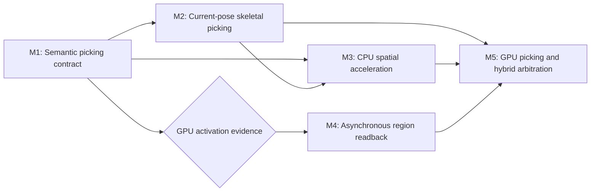

# Viewport Picking Roadmap

Summary: Establish correct, extensible editor viewport picking that scales from deterministic CPU queries to spatial acceleration and evidence-gated GPU selection.

Last reviewed: 2026-08-11

Status: Archived
Completed: 2026-08-11

## Current Status

The Level Editor already has the upper half of a viewport editing architecture.
`FLevelEditorContext` owns Actor, component, and typed sub-element selection;
per-viewport edit-mode managers arbitrate Select and contextual tools; component
visualizers preserve Actor/component/element identity; and the transform gizmo
owns its interaction before ordinary selection runs.

M1 through M3 are complete. Each viewport client now owns a ticketed semantic picking
service; Select and contextual modes consume exact Actor/component/element
results without backend knowledge; and deterministic StaticMesh plus
current-pose SkeletalMesh LOD0 CPU oracles live behind the service boundary. Request-local primitive identity,
registration generations, cancellation, supersession, stale completion
rejection, prepared-visualization arbitration, and deferred fake-backend
coverage are established. Skeletal picking snapshots the immutable current pose,
uses pose bounds, palette-mapped weighted deformation, exact double-sided
triangles, world-distance ordering, and deterministic request-wide work caps.

The runtime now has the required scalable CPU path. Every live
`DPrimitiveComponent` owns a stable process-local `FPrimitiveSceneId`; the
Renderer owns typed primitive scene entries with authoritative transform,
visibility, and bounds; StaticMesh and SkeletalMesh have detached CPU geometry;
and skeletal pose evaluation publishes complete palette-aligned matrices.
`FLevelEditorContext` shares one ordered game-thread scene index, StaticMesh LOD
data owns immutable triangle BVHs, and private reference/accelerated/compare
policies report parity, work, memory, and fallback counters. The RHI supports
`R32_UINT`, texture copies, CPU-readback allocations, and Vulkan completion
tracking. There is still no GPU selection pass or non-blocking region-readback abstraction. The current public
texture readback is synchronous and reads a complete subresource, so it is not
an acceptable viewport-interaction path.

M1 completed through the
[Viewport Picking Contract Plan](../../../Plans/Archive/2026-08/ViewportPickingContract.md). Its
public request/result shape, private per-viewport service boundary,
request-local identity snapshot, coordinate convention, winner ordering, and
immediate/deferred ticket lifecycle remain the backend contract. M2 completed
through [Skeletal Viewport Picking](../../../Plans/Archive/2026-08/SkeletalViewportPicking.md).
M3 completed through the
[Viewport Picking Spatial Acceleration Plan](../../../Plans/Archive/2026-08/ViewportPickingSpatialAcceleration.md).
Its generated 10,000-primitive fixture reduced a sparse ray to one candidate;
the 1,000,000-triangle fixture reduced exact tests to 16, retained 22,874,384
bytes, and measured 44.4 microseconds accelerated versus 665.6 milliseconds
reference with zero compare mismatches. Current-pose skeletal triangle grouping
was measured and deferred; scene bounds feed the unchanged exact M2 provider.
These CPU results do not activate M4-M5, so asynchronous readback and GPU
picking are explicitly deferred pending a concrete unsupported-geometry,
latency, or visible-surface consumer.

## Outcome

Editor viewports resolve one semantic picking request into one ordered hit
result without exposing whether candidates came from brute-force CPU
intersection, a spatial index, or GPU rasterization. Static and animated
skeletal geometry, component visualizations, contextual elements, and gizmos
participate through explicit layers and priority rules while preserving exact
Actor/component/element identity.

The required program delivers:

- a backend-independent per-viewport request, result, lifetime, and arbitration
  contract;
- correct StaticMesh and current-pose SkeletalMesh picking with deterministic
  CPU reference behavior;
- component-level identities and stale-result rejection across world,
  component, view, and request lifetime changes;
- a scene-level CPU broad phase and asset-level geometry acceleration with
  correctness parity against the reference path; and
- diagnostics and validation seams that can justify or reject a later GPU
  backend.

GPU ID rendering and asynchronous region readback are conditional milestones.
They become required only when measured CPU cost, deformed or generated
geometry, instance counts, or visible-surface correctness proves the CPU path
insufficient. The common picking contract must accommodate them from M1
without requiring GPU infrastructure to restore skeletal selection.

## Scope

- Level Editor picking requests, results, layers, precision, arbitration,
  cancellation, and application to shared selection.
- Stable runtime primitive identity resolution to weak game-thread Actor and
  component identities without retaining reflected objects on the render
  thread.
- StaticMesh local-space ray queries and SkeletalMesh current-pose queries.
- Scene-level broad-phase acceleration and asset-level triangle acceleration.
- Animated bounds, component transforms, hidden state, fitted viewport rects,
  camera/view snapshots, and multi-viewport independence.
- Component visualizer and gizmo ordering relative to ordinary scene geometry.
- Optional Renderer-owned integer-ID picking with the same vertex deformation,
  depth, masking, and viewport fitting as the visible scene.
- Optional RHI/Vulkan non-blocking readback for a bounded texture region.
- Deterministic CPU/headless fallback, diagnostics, focused tests, and
  CPU-versus-accelerated/GPU parity validation.

## Non-Goals

- Replacing `FLevelEditorContext`, edit modes, Details targeting, transaction
  ownership, or transform-gizmo targets.
- Treating render picking as physics collision, navigation, or gameplay
  raycasting. Those systems may later share a proven low-level acceleration
  primitive, but this roadmap does not merge their semantics or ownership.
- Serializing `FPrimitiveSceneId` or using it as persistent authored identity.
- Building a universal scene-query framework before a second non-editor
  consumer has concrete requirements.
- Selecting bones, animation tracks, vertices, UVs, materials, or arbitrary
  mesh topology in the first skeletal Actor/component selection slice.
- Adding hardware ray tracing, BLAS/TLAS RHI APIs, compute picking, meshlets,
  GPU-driven visibility, or a Render Graph as prerequisites.
- Making every editor overlay GPU-rendered for hit testing. Screen-space
  visualizers and gizmos retain their appropriate CPU interaction paths.
- Guaranteeing synchronous GPU click results or blocking the game/render
  thread until a GPU result is available.

## Program Decisions and Invariants

### Selection authority remains above picking

- `FLevelEditorContext` remains the only authority for Actor, component, and
  sub-element selection. A picking backend returns facts; it never mutates
  selection, starts a transaction, or activates an edit mode.
- Every Scene Viewport owns its request state and pending results. No global
  mutable hovered or selected primitive is introduced.
- Select and contextual modes decide which layers and precision they request
  and whether Ctrl toggles, replaces, or extends selection.
- A click is resolved against the view and fitted content rect visible when the
  request was created, not whichever camera happens to be current when an
  asynchronous result completes.

### One semantic contract covers every backend

- `FViewportPickRequest` identifies the viewport/view generation, world or
  scene generation, request sequence, viewport position or ray, requested
  layers, required precision, and relevant visibility policy.
- `FViewportHitResult` preserves primitive, Actor, component, optional typed
  sub-element, hit kind, distance/depth, and optional world position/normal.
  Triangle, section, instance, or bone data is added only when an activated
  consumer requires it.
- Backend state is not observable through Select mode. CPU reference, CPU
  accelerated, GPU, and hybrid execution must return the same semantic result
  for their shared supported policy.
- `FLevelEditorViewportClient` builds the view and delegates picking; it does
  not regain per-component mesh-type casts as new primitive families arrive.

### Runtime and GPU identities are distinct

- `FPrimitiveSceneId` is the stable process-local bridge between a registered
  primitive and detached scene state. Game-thread ownership maintains an
  authoritative `FPrimitiveSceneId` to weak component/Actor resolver that is
  updated on registration and retirement.
- Render-thread structures and asynchronous result payloads never retain or
  dereference `DObject`, component, Actor, or Level pointers.
- A GPU attachment stores a dense non-zero 32-bit pick token, not the 64-bit
  `FPrimitiveSceneId` and not a pointer. Each submitted GPU request retains an
  immutable token table mapping the token to semantic identity and generation;
  zero always means no hit.
- Destroyed components, replaced worlds, retired viewports, superseded hover
  requests, and generation mismatches invalidate results before selection is
  mutated.

### CPU acceleration remains two-level and verifiable

- The scene broad phase indexes finite current world bounds and stable
  primitive identity. It supports incremental add, remove, transform, bounds,
  and visibility changes without rebuilding on every click.
- StaticMesh triangle acceleration is immutable asset/LOD-derived data in mesh
  local space. Component instances reuse it by transforming the query ray.
- The brute-force triangle path remains available in tests and diagnostics as
  a correctness oracle. An accelerated query may change traversal cost, never
  hit ordering or selection semantics.
- Skeletal bounds use the current complete pose. A bind-pose triangle BVH is
  not treated as conservative for arbitrary deformation. The first correct
  CPU path may skin candidate triangles on demand; later bone/section influence
  bounds or BVH refitting require measured need and parity coverage.
- Broad-phase storage is owned by the smallest runtime/editor boundary that
  has authoritative mutation inputs. It is not placed on the render thread
  merely because Renderer already owns a separate visibility representation.

### GPU picking is asynchronous and view-correct

- GPU picking reuses the visible renderer's primitive preparation, selected
  LOD, vertex factory, current skeletal palette, fitted view, culling, masked
  discard, and depth convention. It must not build a parallel component scan
  or read reflected objects.
- The default candidate is an on-demand, tightly scissored integer-ID pass.
  A persistent per-viewport ID attachment requires profiling evidence that
  readback latency or repeated hover requests justify its steady bandwidth and
  memory cost.
- Readback copies only the selected bounded region into a reusable staging
  allocation and returns a pollable handle or completion token. Ordinary
  interaction never calls the synchronous full-subresource `ReadTexture2D`
  path.
- Multiple readbacks use bounded ring capacity and explicit overflow policy.
  Click requests are retained until completion or invalidation; hover requests
  may be coalesced so only the newest meaningful request survives.
- Opaque and Masked GPU semantics match the visible depth result. Translucent
  selection policy must be selected explicitly before the GPU child plan is
  activated; it may not emerge accidentally from draw order or depth-write
  defaults.

### Interaction arbitration is explicit

- Camera navigation and viewport focus retain first ownership of pointer input.
- An active or hovered transform gizmo consumes its interaction before
  component visualizations or scene geometry.
- Component visualizer hits and geometry hits enter one resolver exactly once.
  Depth-independent overlays use an explicit priority/layer rule; depth-tested
  overlays compare against geometry using the same view-space convention.
- A pixel tolerance region has a deterministic winner rule: layer priority,
  visibility/depth, distance to the requested pixel, semantic priority, then a
  stable identity tie-break. Backend container or draw order is never the final
  tie-break.
- Hover may tolerate asynchronous delay; pointer-down manipulation cannot wait
  for a GPU result. Modes that require immediate drag ownership use CPU
  screen-space or CPU geometry confirmation before starting mutation.

## Current Foundations and Gaps

| Area | Existing foundation | Gap | Owning milestone |
| --- | --- | --- | --- |
| Selection and modes | Shared Actor/component/sub-element selection, per-viewport mode manager, Select safe default, contextual mode validation, generic gizmo targets, and one semantic completion path for StaticMesh and current-pose SkeletalMesh | Required CPU milestones complete; future backend work remains private | Complete |
| CPU geometry picking | Viewport ray construction, shared Level broad phase, StaticMesh LOD0 BVH, and exact current-pose skeletal provider | GPU visible-surface policy remains conditional | Complete |
| Primitive identity | Stable process-local `FPrimitiveSceneId`, request-local weak resolver, registration generation, ordered mutation sequence, and viewport/Level request generation | Dense GPU token tables remain conditional | Complete |
| Skeletal geometry | LOD0 current-pose CPU reference picking plus scene-bound acceleration, exact budgets, and compare parity | Triangle grouping deferred by the measured activation formula | Complete |
| Scene bounds | Renderer keeps render-thread SceneInfo; Engine separately publishes editor-only game-thread mutation snapshots | No required gap | Complete |
| Spatial acceleration | Deterministic scene AABB tree, immutable per-LOD StaticMesh BVH, memory/build/query counters, fallback, and compare mode | Persisted BVHs and GPU work require separate consumers | Complete |
| GPU identity rendering | Renderer has typed prepared StaticMesh/SkeletalMesh draws and stable primitive IDs; RHI/Vulkan support `R32_UINT` | No ID pass, dense token table, scissored request, masking/depth contract, or result queue | Conditional M5 |
| GPU readback | Texture/buffer copies, CPU-readback allocations, transfer arenas, and completion tracking exist | Public texture readback is synchronous and full-subresource; no pollable bounded-region handle | Conditional M4 |
| Validation | Static/skeletal reference and accelerated parity, animation displacement, transforms, mutation/lifetime, memory, candidate, timing, and selection coverage | Async/GPU coverage activates only with M4-M5 | Complete / conditional |

## Milestone Map

| Milestone | Requirement | Proposed child plan | Dependencies | Deliverable | Entry gate | Exit gate |
| --- | --- | --- | --- | --- | --- | --- |
| M1: Semantic picking contract | Required; completed | [Viewport Picking Contract](../../../Plans/Archive/2026-08/ViewportPickingContract.md) | Current viewport editing and StaticMesh picking behavior | Per-viewport request/result/service boundary, exact primitive/component identity, generation and cancellation rules, explicit hit arbitration, and a CPU reference backend preserving current StaticMesh behavior | Actor/component/visualizer/gizmo selection semantics, fitted-view coordinates, layer priorities, and immediate-versus-pending API shape are recorded before implementation | Passed: semantic mode integration, single arbitration, transformed closest-triangle behavior, and deterministic lifecycle/multi-viewport tests |
| M2: Current-pose skeletal picking | Required; completed | [Skeletal Viewport Picking](../../../Plans/Archive/2026-08/SkeletalViewportPicking.md) | M1 contract; skeletal render data and pose publication | Correct CPU reference picking for `DSkeletalMeshComponent` using current pose bounds and deformation, with Actor/component results and deterministic request failure | Passed: LOD0/current-pose-only, double-sided, invalid-component skip, world-distance, 250,000 vertex/500,000 triangle request limits, and private diagnostics are frozen | Passed: exact semantic identity, animation in/out sequence, non-contiguous palette, mixed influences, Static/Skeletal distance and stable ties, transforms, bounds rejection, and atomic over-budget failure |
| M3: CPU spatial acceleration | Required; completed | [Viewport Picking Spatial Acceleration](../../../Plans/Archive/2026-08/ViewportPickingSpatialAcceleration.md) | M1-M2 reference behavior and representative scene/mesh fixtures | Incremental scene bounds index, immutable per-LOD StaticMesh triangle acceleration, measured skeletal disposition, diagnostics, and selectable brute-force comparison | Passed | Passed: zero compare mismatches; ordered mutation coverage; 1/10,000 scene candidates; 16/1,000,000 triangle candidates; bounded memory and measured speedup |
| M4: Asynchronous bounded-region readback | Conditional; deferred | `AsynchronousTextureRegionReadback` | M1 request lifetime; selected GPU consumer and accepted latency/buffer budgets | Backend-independent RHI region-copy/readback handle, bounded staging ring, polling/completion, cancellation/retirement, diagnostics, and Vulkan implementation | Not met: qualified CPU picking does not require readback; activate only when a consumer freezes format, region, concurrency, latency, ownership, and fallback budgets | Subresource regions round-trip correctly without full-texture copy or caller-visible GPU wait; multiple in-flight requests, resize/invalidation, overflow, shutdown, and device/resource failure pass RHI and Vulkan coverage |
| M5: GPU picking and hybrid arbitration | Conditional; deferred | `GPUViewportPicking` | M1-M3; M4; Renderer prepared-view and skeletal paths | On-demand scissored integer-ID pass, immutable dense token table, current-pose StaticMesh/SkeletalMesh output, asynchronous result integration, and backend policy/fallback | Not met: CPU measurements pass; reconsider for unsupported generated/deformed/instanced geometry or a visible-surface requirement after M4 has an accepted contract | Opaque/Masked visible-surface results match CPU/reference expectations and rendered pose across main and auxiliary viewports; no reflected object reaches the render thread; no interaction path uses synchronous full readback; stale requests are rejected; headless/unsupported RHI falls back deterministically |

M1 through M3 are the required correctness and CPU-scalability program. M4
and M5 remain explicitly conditional: completing the roadmap does not require a
GPU backend when the activation evidence is absent, but it does require the
condition to be reviewed and dispositioned with recorded measurements or
product constraints.

## Child Plan Boundaries

### [Viewport Picking Contract](../../../Plans/Archive/2026-08/ViewportPickingContract.md)

This plan owns the LevelEditor-facing request/result/service seam, per-viewport
pending state, identity resolution, invalidation generations, hit layers,
winner ordering, and migration of Select mode from `AActor*` to semantic hits.
It moves mesh-type-specific intersection out of
`FLevelEditorViewportClient`. It retains a deliberately simple CPU reference
backend so behavior can be validated before acceleration changes traversal.

It does not build a BVH, add skeletal deformation queries, change shared
selection ownership, or introduce RHI resources. It must decide whether the
service is synchronous-with-optional-pending-result or always request-based;
either form must permit a later GPU result without changing mode APIs.

### [Skeletal Viewport Picking](../../../Plans/Archive/2026-08/SkeletalViewportPicking.md)

This plan owns the first correct current-pose CPU query for skeletal components
and its bounded fallback policy. It may share value-only skinning math with the
existing animation/render preparation contracts, but it does not read
render-thread state or duplicate an animation instance. It selects the first
precision and cost target based on Actor/component selection rather than future
bone or vertex editing.

It does not introduce a general animation editor, GPU pass, hardware ray
tracing, or a bind-pose BVH presented as a conservative deformed query. Any
bone/section influence-bound optimization whose correctness is non-trivial
belongs to M3 after the reference path is green.

### [Viewport Picking Spatial Acceleration](../../../Plans/Archive/2026-08/ViewportPickingSpatialAcceleration.md)

This plan owns CPU query scalability and nothing about selection UX. It defines
the scene broad-phase owner and mutation protocol, per-asset StaticMesh BVH
data and lifetime, deterministic traversal/tie-break behavior, diagnostics,
and brute-force parity testing. It may add bounded skeletal candidate
structures only when M2 profiling identifies them as material.

It does not merge viewport selection with collision/physics or make the
Renderer's render-thread visibility collection directly queryable from the
game thread. A shared low-level AABB/BVH utility is acceptable when ownership
and a second concrete consumer justify it; a universal world-query service is
not an M3 deliverable.

### `AsynchronousTextureRegionReadback`

This conditional RHI plan owns a portable non-blocking copy/readback lifecycle,
format/region validation, bounded staging reuse, completion polling,
retirement, failure behavior, diagnostics, and Vulkan mapping. It should be
coordinated with the RHI and Vulkan Backend Evolution roadmap when activated.

It does not render pick IDs, interpret pixels, retain viewport state, or expose
Vulkan allocation/token types through the public RHI. It must serve an accepted
consumer contract rather than becoming a speculative general transfer API.

### `GPUViewportPicking`

This conditional plan owns Renderer integration for the ID target/pass,
prepared primitive token assignment, shaders and PSOs, scissor/depth/mask
parity, token-table lifetime, readback request integration, and CPU/GPU/hybrid
backend policy. Static and skeletal paths reuse their production vertex
factories and current prepared draw facts.

It does not move LevelEditor selection state onto the render thread, encode
pointers or 64-bit runtime IDs directly into `R32_UINT`, block on results, or
make a persistent full-size attachment the default without profiling. Support
for triangle, instance, bone, or material-section identity is a separately
gated extension of the semantic token payload.

## Program Validation Matrix

| Contract | Required milestones | Validation outcome |
| --- | --- | --- |
| Selection semantics | M1-M3; M5 if activated | Actor/component/sub-element identity, Ctrl behavior, blank click, visualizer priority, gizmo consumption, Details targeting, and contextual mode restrictions remain deterministic and backend-independent |
| View correctness | M1-M5 | Perspective/orthographic views, fitted aspect bars, resize, DPI/viewport coordinates, main/auxiliary viewports, camera motion, and request-time view snapshots resolve the intended pixel/ray |
| Static geometry | M1, M3, M5 | Bounds rejection, nearest triangle, multiple components, mirrored/non-uniform transforms, hidden state, LOD policy, degenerates, and stable equal-distance ties agree across supported backends |
| Skeletal geometry | M2-M3, M5 | Reference pose, animated displacement, current bounds, palette completeness, multiple influences, invalid pose, component transform, and animation updates select the visible/current surface rather than bind-pose geometry |
| Lifetime and identity | M1-M5 | Component destruction, unregister/re-register, world replacement, viewport close, request supersession, scene/view generation changes, and delayed completion cannot resolve to a reused or retired object |
| CPU acceleration | M3 | Brute-force and accelerated randomized/adversarial results are identical; add/remove/update/refit behavior, memory bounds, build time, query counters, and representative workload timings are recorded |
| GPU rendering | M5 | Integer token output, zero background, depth/mask/cull parity, skeletal deformation, scissor edges, multisample policy, token overflow, and stable token-table lookup pass focused and Vulkan image/readback tests |
| Async readback | M4-M5 | Region layout, row pitch, in-flight ordering, completion polling, bounded ring overflow, resize/resource loss, shutdown, and failure fallback complete without full-subresource transfer or synchronous wait in interaction code |
| Backend parity | M1-M5 | Shared supported policies return the same semantic winner; known GPU-only or CPU-only precision is explicit and does not silently change selection behavior |
| Handoff qualification | Every user-visible milestone | Follow repository build/test guidance; complete focused coverage and, for editor-visible changes, the required successful full `all` build and verified editor executable before handoff |

## Risks and Control Gates

| Risk | Control gate |
| --- | --- |
| A skeletal special case is added to the viewport client and the next primitive family breaks selection again. | M1 exits only after mesh-family dispatch is behind the picking service/backend boundary and Select mode consumes semantic hits. |
| One plan mixes UX migration, skeletal math, BVH ownership, RHI transfers, shaders, and asynchronous lifetime. | Each milestone has an independently executable child plan; conditional GPU work cannot enter M1-M3 acceptance gates. |
| GPU selection appears fast but stalls on full texture readback. | M5 depends on M4; synchronous `ReadTexture2D` is forbidden in the interaction path and region bytes/waits are diagnostic counters. |
| A 64-bit primitive ID is truncated or a GPU pixel becomes a dangling object pointer. | GPU stores a dense 32-bit token whose immutable request table resolves through generation-checked runtime identity on the game thread. |
| CPU and GPU choose different objects at edges or equal depths. | M1 freezes winner ordering; M3 and M5 maintain parity fixtures and stable identity tie-breaks independent of traversal/draw order. |
| Bind-pose acceleration misses animated geometry. | M2 provides current-pose reference truth; M3 accepts only conservative animated bounds/candidate structures proven against it. |
| Renderer visibility state is reused across thread boundaries through unsafe pointers. | CPU broad phase has game-thread/editor-owned mutation inputs; GPU preparation consumes detached SceneInfo/Proxy data and returns value identities only. |
| Hover flooding exhausts readback allocations or applies old results. | M1 defines supersession; M4 bounds in-flight capacity; M5 coalesces hover and generation-checks completion. |
| Transparent and depth-independent objects are selected by accidental pass order. | Layer/depth policy is explicit in M1; translucent GPU semantics are a mandatory M5 entry decision with focused overlap tests. |
| A general BVH or readback framework is built without evidence or a bounded consumer. | M3 is limited to viewport query needs; M4-M5 require recorded activation evidence and accepted budgets. |

## Completion Criteria

- M1 through M3 pass their exit gates through independently reviewable child
  plans.
- StaticMesh and current-pose SkeletalMesh selection share one request/result,
  identity, priority, and lifetime contract without mesh casts in Select mode
  or `FLevelEditorViewportClient`.
- Scene and mesh acceleration match the deterministic CPU reference result and
  have documented update, memory, and performance characteristics.
- Gizmos, visualizers, contextual sub-elements, and scene geometry resolve
  through one documented arbitration policy while shared selection remains
  owned by `FLevelEditorContext`.
- Conditional M4-M5 are completed or explicitly deferred after their
  activation evidence, budgets, fallback, and current CPU measurements are
  reviewed.
- If GPU picking is activated, it uses dense value tokens, production geometry
  deformation, bounded asynchronous region readback, and generation-checked
  result application with deterministic CPU/headless fallback.
- Lasting contracts move to Editor Architecture and the relevant Runtime
  Rendering/RHI documentation; the roadmap is not the sole source of truth for
  implemented behavior.

## Related Documentation

- [Viewport Editing Architecture](../../../Editor/Architecture/ViewportEditing.md)
- [Scene Viewport Navigation](../../../Editor/Guides/SceneViewportNavigation.md)
- [Viewport Rendering](../../../Runtime/Rendering/ViewportRendering.md)
- [Renderer Scene Representation](../../../Runtime/Rendering/SceneRepresentation.md)
- [Static Mesh Rendering](../../../Runtime/Rendering/StaticMeshRendering.md)
- [Skeletal Mesh Rendering](../../../Runtime/Rendering/SkeletalMeshRendering.md)
- [Skeletal Animation Playback](../../../Runtime/Animation/SkeletalAnimationPlayback.md)
- [Rendering Capability Expansion Roadmap](RenderingCapabilityExpansion.md)
- [RHI and Vulkan Backend Evolution Roadmap](RHIAndVulkanEvolution.md)
- [Build and Run](../../../Development/Build/BuildAndRun.md)

## Related Code

- `Engine/Source/Editor/LevelEditor/Public/LevelEditorSelection.h`
- `Engine/Source/Editor/LevelEditor/Public/LevelEditorViewportEditing.h`
- `Engine/Source/Editor/LevelEditor/Public/LevelEditorCustomizations.h`
- `Engine/Source/Editor/LevelEditor/Public/LevelEditorViewportPicking.h`
- `Engine/Source/Editor/LevelEditor/Private/Viewport/LevelEditorViewportClient.h`
- `Engine/Source/Editor/LevelEditor/Private/Viewport/LevelEditorViewportClient.cpp`
- `Engine/Source/Editor/LevelEditor/Private/Viewport/LevelEditorViewportEditing.cpp`
- `Engine/Source/Editor/LevelEditor/Private/Viewport/ViewportPickingService.cpp`
- `Engine/Source/Editor/LevelEditor/Private/Customizations/LevelEditorCustomizations.cpp`
- `Engine/Source/Editor/LevelEditor/Private/Workspace/LevelEditorContext.h`
- `Engine/Source/Runtime/Engine/Public/IScene.h`
- `Engine/Source/Runtime/Engine/Public/Components/PrimitiveComponent.h`
- `Engine/Source/Runtime/Engine/Public/Components/StaticMeshComponent.h`
- `Engine/Source/Runtime/Engine/Public/Components/SkeletalMeshComponent.h`
- `Engine/Source/Runtime/Engine/Public/Engine/FPrimitiveSceneProxy.h`
- `Engine/Source/Runtime/Engine/Public/StaticMesh/StaticMeshResources.h`
- `Engine/Source/Runtime/Engine/Public/SkeletalMesh/SkeletalMeshResources.h`
- `Engine/Source/Runtime/Engine/Public/Animation/SkeletalAnimation.h`
- `Engine/Source/Runtime/Renderer/Public/Scene.h`
- `Engine/Source/Runtime/Renderer/Private/Renderers/SceneRenderer.cpp`
- `Engine/Source/Runtime/Renderer/Private/Renderers/StaticMeshRenderer.cpp`
- `Engine/Source/Runtime/RHI/Public/PixelFormat.h`
- `Engine/Source/Runtime/RHI/Public/RHICommandList.h`
- `Engine/Source/Runtime/VulkanRHI/Private/VulkanTexture.cpp`
- `Engine/Tests/Native/EngineTests/Private/Viewport/ViewportInteractionTests.cpp`
- `Engine/Tests/Native/EngineTests/Private/Viewport/ViewportCustomizationTests.cpp`
