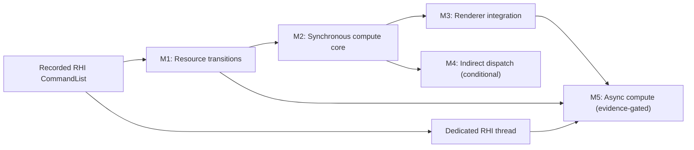

# Compute Shader Pipeline Roadmap

Summary: Establish production-ready compute shader execution through a sequence of bounded synchronization, pipeline, integration, and optional asynchronous-compute plans.

Last reviewed: 2026-08-21

Status: Completed
Completed: 2026-08-21

## Current Status

Recorded command replay, the dedicated RHI thread, M1 resource transitions, and
M2 synchronous compute are complete through their linked plans in the milestone
table. Their lasting contracts are owned by
[RHI Command Execution](../Runtime/Rendering/RHICommandExecution.md),
[RHI Resource Transitions](../Runtime/Rendering/RHIResourceTransitions.md), and
[Synchronous Compute Pipelines](../Runtime/Rendering/SynchronousComputePipelines.md).

[Compute Renderer Integration](../Plans/ComputeRendererIntegration.md)
completed M3 on 2026-08-21. Its production directional-contact workload passed
exact pixel, structural, timing, fallback, recovery, validation-enabled runtime,
and clean-shutdown gates, so eligible contact visibility uses compute normally.
The required M1-M3 roadmap is complete. M4 indirect dispatch and M5 asynchronous
compute are deferred because no concrete GPU-driven argument workload or
measured queue-overlap opportunity meets their entry gates.

## Outcome

Durin can compile, create, bind, dispatch, synchronize, diagnose, and validate
compute shader work through backend-neutral RHI interfaces. A renderer feature
can consume compute output in later compute, graphics, copy, or readback work
without Vulkan-specific calls or whole-device idle waits.

The required roadmap ends with synchronous compute on a compute-capable
immediate queue and one representative renderer consumer. Indirect dispatch and
asynchronous compute are separate evidence-gated extensions rather than
prerequisites for the core outcome.

## Scope

- A general RHI resource-transition model for buffers and texture subresources.
- Distinct compute pipeline state, creation, caching, binding, push constants,
  shader parameters, and direct dispatch.
- Vulkan implementation on a queue that advertises compute capability.
- Compute-to-compute, compute-to-graphics, compute-to-copy, and
  compute-to-readback synchronization.
- Storage buffer and storage image validation through public RHI paths.
- Pipeline creation failure diagnostics, cache/lifetime behavior, and a first
  renderer-owned compute workload.
- Conditional follow-up plans for indirect dispatch and asynchronous compute.

## Non-Goals

- A render graph or automatic whole-frame resource scheduler as a prerequisite
  for synchronous compute.
- Queue-parallel compute in the first compute pipeline implementation.
- Ray tracing, mesh shaders, or general shader-stage architecture changes not
  required by compute.
- Implementing non-Vulkan backends that do not currently exist in the runtime.
- Moving all existing graphics rendering to the new transition API in one
  migration.
- Selecting a first renderer consumer before its requirements and measurable
  value are established in the integration plan.

## Program Decisions and Invariants

### Execution order

- Complete the recorded RHI command-list contract before implementing new
  transition or compute commands. Synchronous compute may replay through either
  the inline or threaded executor.
- Ship synchronous compute before considering asynchronous compute.
- The initial execution path uses one immediate queue whose family explicitly
  supports compute. A combined graphics-and-compute family is preferred for the
  first vertical slice so queue ownership transfers are not smuggled into the
  synchronous milestone.
- `Dispatch` is invalid inside an active graphics render pass unless a later
  backend contract explicitly introduces compatible subpass behavior.
- A dedicated CPU RHI thread does not imply GPU queue concurrency. Async compute
  still requires its own measured workload, queue, synchronization, ownership,
  and fallback work.

### RHI ownership

- Compute PSO identity is distinct from graphics PSO identity. A compute
  initializer owns exactly one compute shader and one reflected pipeline
  layout; it does not carry render-target, vertex-input, raster, blend, or depth
  state.
- Compute PSO creation inherits the current graphics identity boundary: a
  stable debug name is diagnostic-only, identity is the complete canonical
  compute descriptor, and the RHI publishes a complete-or-null result. A
  bounded device-owned cache may reuse equal descriptors through full value
  equality and least-recently-used eviction; it must not add a name-keyed
  owning cache or public name lookup. A Renderer slot or explicit consumer owns
  workload publication independently of cache reuse.
- Command-list pipeline selection resolves an active command context rather
  than storing a graphics-only context under a generic API.
- Descriptor materialization, descriptor-set caching, push-constant handling,
  and pipeline-layout creation become common pipeline facilities where their
  contracts are genuinely identical. Graphics-only dynamic state remains in
  graphics pending state.

### Synchronization

- Public RHI access states describe intended usage; Vulkan stage masks, access
  masks, and image layouts are backend mappings rather than renderer-authored
  Vulkan concepts.
- Buffer transitions may target byte ranges, and texture transitions may target
  explicit mip/layer ranges. Whole-resource helpers may be supplied for common
  cases.
- Render-pass attachment transitions and explicit transitions share one
  authoritative resource-state model. Neither path may silently overwrite
  state tracked by the other.
- Compute correctness must not depend on `RHIBlockUntilGPUIdle`, command-buffer
  submission boundaries, or an incidental same-queue execution order.

### Rollout

- Direct dispatch is required; indirect dispatch is a separate conditional
  plan.
- The first renderer consumer must exercise a real compute-to-consumer
  dependency. A standalone sample that only dispatches and blocks the GPU does
  not complete the integration milestone.
- Each milestone receives its own implementation plan and completion commit.
  The roadmap records cross-plan status but does not absorb child-plan stages.

## Current Foundations and Gaps

| Area | Existing foundation | Roadmap gap |
| --- | --- | --- |
| Shader frontend | `EShaderFrequency::Compute`, Slang compilation, reflection, cache serialization, and compute stage flags exist. | Add compute-specific end-to-end shader-map and RHI pipeline coverage. |
| Resource model | Storage buffer/image binding types, creation flags, descriptors, and Vulkan usage bits exist. | Define explicit post-write visibility and state transitions across all consumers. |
| Pipeline layout | Reflection builds descriptor layouts and push-constant ranges; Vulkan has bounded structural-layout, descriptor-snapshot, and graphics-PSO caches. | Extract only genuinely shared descriptor facilities and add compute PSO/pending state without graphics dynamic-state regression. |
| RHI commands | `ERHIPipeline::Compute` is declared and recorded command payloads retain referenced resources. | Admit compute pipeline replay, compute PSO binding, compute-aware parameters/push constants, and direct dispatch outside render passes. |
| Vulkan pipeline | Raw tests prove `vkCreateComputePipelines` and `vkCmdDispatch` work. | Implement canonical compute identity, complete-or-null creation, bounded reuse, binding, dispatch, diagnostics, and deferred lifetime. |
| Queues | Device admission requires one graphics/compute/present family and aliases all current work to its single immediate queue. | Route compute through the existing immediate context without introducing a second queue, ownership transfer, or async semantics. |
| Validation | Storage reflection tests and one Vulkan-direct compute dispatch exist. | Add public-RHI buffer/image dispatch, interop, readback, lifetime, and runtime coverage. |

## Milestone Map

| Milestone | Requirement | Proposed child plan | Entry gate | Exit gate |
| --- | --- | --- | --- | --- |
| M1: Resource transitions | Required; completed | [GPUResourceTransitions](../Plans/Archive/2026-08/GPUResourceTransitions.md) and [lasting contract](../Runtime/Rendering/RHIResourceTransitions.md) | Met on 2026-08-10: recorded replay is stable, synchronization2 availability is published, and render-pass/upload/readback/subresource mutation paths have a bounded audit. | Met on 2026-08-10: exact buffer/image transitions, inline/threaded replay, Vulkan mappings, implicit-path reconciliation, focused/native/full-build qualification, and runtime smoke passed without divergent state or new global idle waits. |
| M2: Synchronous compute core | Required; completed 2026-08-12 | [Synchronous Compute Pipeline](../Plans/Archive/2026-08/SynchronousComputePipeline.md) | Met; activated on 2026-08-12 after confirming M1 compute-intent mappings, recorded replay/lifetime, the shared compute-capable immediate queue, reflected storage bindings, and the raw Vulkan dispatch proof. | Met on 2026-08-12: canonical complete-or-null PSOs, reflected binding/push constants, direct dispatch, buffer/image results, compute/graphics/copy handoffs, both executors, aggregate/full build, and runtime smoke passed. |
| M3: Renderer integration | Required; completed 2026-08-21 | [Compute Renderer Integration](../Plans/ComputeRendererIntegration.md) | Met on 2026-08-12; M2 vertical slice and public-RHI interop validation pass. Revised on 2026-08-18 after the deferred renderer qualified: the plan selects directional contact visibility, its existing fragment fallback, and a predeclared measurement gate. | Met on 2026-08-21: compute is the normal eligible route; deferred lighting consumes it without a Vulkan escape hatch or copy; exact pixels, fallback, refresh, timing, main/auxiliary runtime, Present/resize, validation, and clean shutdown passed. |
| M4: Indirect dispatch | Conditional | `ComputeDispatchExtensions` | A concrete GPU-driven workload requires indirect dispatch and M2 is complete. | Indirect argument creation, transitions, bounds validation, and `DispatchIndirect` pass focused and runtime tests. |
| M5: Async compute | Evidence-gated | `AsyncComputeExecution` | M1-M3 and the dedicated RHI thread plan are complete; profiling identifies overlap opportunity that exceeds scheduling and ownership costs on target hardware. | Separate compute submission, cross-queue synchronization, ownership transfer, resource lifetime, fallback, and frame shutdown are validated without global idle waits. |

M1 through M3 define the required roadmap. M4 and M5 do not block roadmap
completion when their entry evidence is absent; they must instead be explicitly
marked deferred with the evidence reviewed.

Final disposition: M4 is deferred because no selected consumer requires
GPU-generated indirect arguments. M5 is deferred because the qualified contact
workload runs on the shared immediate queue and no target trace demonstrates an
overlap benefit exceeding cross-queue scheduling, synchronization, ownership,
and lifetime costs.

## Child Plan Boundaries

Completed upstream, M1, and M2 boundaries are preserved by their archived plans
and lasting runtime contracts. Later milestones consume those interfaces and do
not reopen their local implementation stages.

### [Compute Renderer Integration](../Plans/ComputeRendererIntegration.md)

Owns the selected directional-contact-visibility workload, existing fragment
fallback and factor-one terminal fallback, Renderer resource ownership,
reload/failure behavior, diagnostics, mask/final-image parity, GPU timing
evidence, and runtime validation. Existing deferred lighting immediately
samples the compute output, so M3 does not absorb display mapping, final-target
formats, graphics copies, or swapchain storage admission.

It also moves stable compute usage and synchronization contracts into
`Documentation/Runtime/Rendering/` after they are validated.

### `ComputeDispatchExtensions`

Owns indirect argument buffer semantics, `DispatchIndirect`, capability limits,
and validation required by an identified GPU-driven consumer. It must not grow
into async-compute scheduling.

### `AsyncComputeExecution`

Owns compute command contexts, per-queue command pools and submission,
semaphore/timeline policy, queue-family ownership transfer, frame/fence
integration, resource lifetime, shutdown, fallback to synchronous execution,
and profiling evidence. It starts only after the required roadmap proves the
same workloads synchronously.

## Program Validation Matrix

| Boundary | Required milestone | Evidence |
| --- | --- | --- |
| Shader compile/reflection -> compute PSO | M2 | Compute shader map produces one compute stage, reflected pipeline layout, valid Vulkan module, and successful PSO creation. |
| CPU/upload -> compute read | M1, M2 | Buffer and texture uploads transition to compute-readable state and produce deterministic output. |
| Compute write -> compute read/write | M1, M2 | Consecutive dispatches observe prior writes through explicit transitions. |
| Compute write -> graphics read | M1, M2, M3 | A draw samples or reads compute output with validation layers clean. |
| Compute write -> copy/readback | M1, M2 | Readback returns expected bytes without relying on a whole-device idle as the memory dependency. |
| PSO/descriptor lifetime -> frame submission | M2 | Repeated frames, cache hits, release, and shutdown complete without stale descriptor or pending-delete failures. |
| Renderer resource refresh -> compute use | M3 | Failed refresh retains valid resources and a later successful refresh becomes visible in process. |
| Compute queue -> graphics queue | M5 only | Cross-queue visibility and ownership are correct on shared- and separate-family configurations. |

Every implementation plan references the root [build and run](../Development/Build/BuildAndRun.md)
contract and defines its own focused tests. M3 includes the full `all` build and
real runtime validation when the selected consumer is user-visible in the
editor.

## Risks and Control Gates

| Risk | Control gate |
| --- | --- |
| Explicit transitions disagree with render-pass final layouts. | M1 tests state handoff in both directions before M2 begins. |
| Graphics descriptor state is over-generalized and regresses draw submission. | M2 retains graphics-focused tests and extracts only layout/descriptor behavior shared by both PSO types. |
| Compute pipeline switching accidentally implies a separate queue or ownership transfer. | M2 resolves graphics and compute to the already-admitted shared immediate context and adds no second queue or async capability. |
| Named graphics and compute PSO caches collide. | M2 gives pipeline type an explicit identity boundary and validates same-name behavior. |
| Readback barriers retain graphics-only stage masks. | M1 covers shader-write-to-transfer/readback with compute stages before M2 readback acceptance. |
| Async compute is implemented without an overlap opportunity. | M5 cannot start without workload traces and a target-hardware benefit hypothesis. |
| A CPU RHI thread is mistaken for GPU async compute readiness. | M5 requires the dedicated-thread plan plus explicit GPU queue, ownership, synchronization, and profiling gates. |
| The first consumer turns the core plan into a renderer redesign. | M3 selects a bounded consumer with fallback and excludes unrelated renderer architecture work. |

## Completion Criteria

The required roadmap is complete when:

- M1, M2, and M3 child plans are completed with their acceptance evidence.
- Public RHI code contains no Vulkan escape hatch for the selected compute
  workload.
- Direct compute dispatch and all required synchronization boundaries in the
  validation matrix pass.
- Graphics rendering, resource upload/readback, lifecycle, and shutdown
  behavior remain validated.
- Stable resource-transition and compute-pipeline contracts are documented
  under `Documentation/Runtime/Rendering/`.
- M4 and M5 are either completed or explicitly deferred because their entry
  evidence is absent.
- This roadmap records final child-plan links, completion evidence, and a
  completion date.

## Related Documentation

- [Implementation plan rules](../Plans/AGENTS.md)
- [Recorded RHI Command List](../Plans/Archive/2026-08/RecordedRHICommandList.md)
- [Dedicated RHI Thread](../Plans/Archive/2026-08/DedicatedRHIThread.md)
- [Build and run](../Development/Build/BuildAndRun.md)
- [Shader parameters](../Runtime/Rendering/ShaderParameters.md)
- [Texture system](../Runtime/Rendering/TextureSystem.md)

## Related Code

- `Engine/Source/Runtime/RHI/Public/RHIDefinitions.h`
- `Engine/Source/Runtime/RHI/Public/RHIResources.h`
- `Engine/Source/Runtime/RHI/Public/RHIContext.h`
- `Engine/Source/Runtime/RHI/Public/RHICommandList.h`
- `Engine/Source/Runtime/RHI/Public/DynamicRHI.h`
- `Engine/Source/Runtime/RenderCore/Private/Shader/SlangShaderCompiler.cpp`
- `Engine/Source/Runtime/VulkanRHI/Private/VulkanPipeline.cpp`
- `Engine/Source/Runtime/VulkanRHI/Private/VulkanPendingState.cpp`
- `Engine/Source/Runtime/VulkanRHI/Private/VulkanContext.cpp`
- `Engine/Source/Runtime/VulkanRHI/Private/VulkanDevice.cpp`
- `Engine/Tests/Native/VulkanRHITests/Private/VulkanTextureSamplingTests.cpp`
