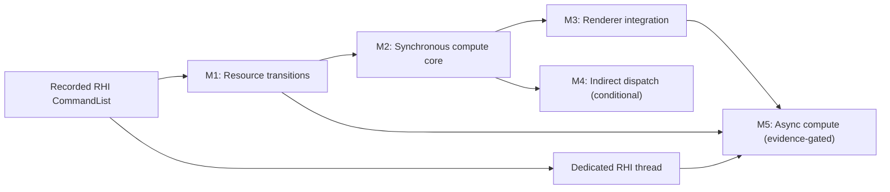

# Compute Shader Pipeline Roadmap

Summary: Establish production-ready compute shader execution through a sequence of bounded synchronization, pipeline, integration, and optional asynchronous-compute plans.

Last reviewed: 2026-08-10

Status: Active
Completed:

## Current Status

The repository has compute-aware shader compilation, reflection, storage
resources, Vulkan descriptor mappings, queue-family discovery, and a raw Vulkan
compute dispatch test. The backend-neutral RHI still exposes only graphics PSO
creation and draw submission, the command list rejects the compute pipeline,
and synchronization is limited to render-pass and resource upload/readback
paths.

Two upstream RHI submission plans are complete:
[Recorded RHI Command List](../Plans/Archive/2026-08/RecordedRHICommandList.md) establishes the
record/replay and payload-lifetime boundary required by new compute commands,
and [Dedicated RHI Thread](../Plans/Archive/2026-08/DedicatedRHIThread.md) moves replay onto its
own CPU thread. The recorded-command-list contract is required before the
resource-transition and synchronous-compute implementations. The dedicated RHI
thread is not a prerequisite for synchronous compute, but is required before
the evidence-gated asynchronous-compute milestone.

The first compute child is now active:
[GPU Resource Transitions](../Plans/GPUResourceTransitions.md). It establishes a
general transition contract before the compute vertical slice so dispatch does
not introduce a one-off synchronization mechanism. The completed
[RHI Capability and Vulkan Startup](../Plans/Archive/2026-08/RHICapabilityAndVulkanStartup.md)
plan supplies immutable synchronization2 availability; the transition plan
consumes that field and preserves a legacy-barrier fallback instead of defining
a parallel device-capability surface. This M1 is shared with the RHI and Vulkan
Backend Evolution roadmap and has one implementation and completion gate.

## Outcome

Durin can compile, create, bind, dispatch, synchronize, diagnose, and validate
compute shader work through backend-neutral RHI interfaces. A renderer feature
can consume compute output in later compute, graphics, copy, or readback work
without Vulkan-specific calls or whole-device idle waits.

The required roadmap ends with synchronous compute on a compute-capable
immediate queue and one representative renderer consumer. Indirect dispatch and
asynchronous compute are separate evidence-gated extensions rather than
prerequisites for the core outcome.

## Scope

- A general RHI resource-transition model for buffers and texture subresources.
- Distinct compute pipeline state, creation, caching, binding, push constants,
  shader parameters, and direct dispatch.
- Vulkan implementation on a queue that advertises compute capability.
- Compute-to-compute, compute-to-graphics, compute-to-copy, and
  compute-to-readback synchronization.
- Storage buffer and storage image validation through public RHI paths.
- Pipeline creation failure diagnostics, cache/lifetime behavior, and a first
  renderer-owned compute workload.
- Conditional follow-up plans for indirect dispatch and asynchronous compute.

## Non-Goals

- A render graph or automatic whole-frame resource scheduler as a prerequisite
  for synchronous compute.
- Queue-parallel compute in the first compute pipeline implementation.
- Ray tracing, mesh shaders, or general shader-stage architecture changes not
  required by compute.
- Implementing non-Vulkan backends that do not currently exist in the runtime.
- Moving all existing graphics rendering to the new transition API in one
  migration.
- Selecting a first renderer consumer before its requirements and measurable
  value are established in the integration plan.

## Program Decisions and Invariants

### Execution order

- Complete the recorded RHI command-list contract before implementing new
  transition or compute commands. Synchronous compute may replay through either
  the inline or threaded executor.
- Ship synchronous compute before considering asynchronous compute.
- The initial execution path uses one immediate queue whose family explicitly
  supports compute. A combined graphics-and-compute family is preferred for the
  first vertical slice so queue ownership transfers are not smuggled into the
  synchronous milestone.
- `Dispatch` is invalid inside an active graphics render pass unless a later
  backend contract explicitly introduces compatible subpass behavior.
- A dedicated CPU RHI thread does not imply GPU queue concurrency. Async compute
  still requires its own measured workload, queue, synchronization, ownership,
  and fallback work.

### RHI ownership

- Compute PSO identity is distinct from graphics PSO identity. A compute
  initializer owns exactly one compute shader and one reflected pipeline
  layout; it does not carry render-target, vertex-input, raster, blend, or depth
  state.
- Compute PSO creation inherits the graphics creation-only boundary: a stable
  debug name is diagnostic-only, the RHI publishes a fresh complete-or-null
  candidate, and a Renderer slot or explicit consumer owns its logical
  lifetime. The first compute implementation must not add a name-keyed owning
  cache or a public name lookup. Any later descriptor-keyed reuse requires full
  immutable value equality plus bounded ownership and eviction.
- Command-list pipeline selection resolves an active command context rather
  than storing a graphics-only context under a generic API.
- Descriptor materialization, descriptor-set caching, push-constant handling,
  and pipeline-layout creation become common pipeline facilities where their
  contracts are genuinely identical. Graphics-only dynamic state remains in
  graphics pending state.

### Synchronization

- Public RHI access states describe intended usage; Vulkan stage masks, access
  masks, and image layouts are backend mappings rather than renderer-authored
  Vulkan concepts.
- Buffer transitions may target byte ranges, and texture transitions may target
  explicit mip/layer ranges. Whole-resource helpers may be supplied for common
  cases.
- Render-pass attachment transitions and explicit transitions share one
  authoritative resource-state model. Neither path may silently overwrite
  state tracked by the other.
- Compute correctness must not depend on `RHIBlockUntilGPUIdle`, command-buffer
  submission boundaries, or an incidental same-queue execution order.

### Rollout

- Direct dispatch is required; indirect dispatch is a separate conditional
  plan.
- The first renderer consumer must exercise a real compute-to-consumer
  dependency. A standalone sample that only dispatches and blocks the GPU does
  not complete the integration milestone.
- Each milestone receives its own implementation plan and completion commit.
  The roadmap records cross-plan status but does not absorb child-plan stages.

## Current Foundations and Gaps

| Area | Existing foundation | Roadmap gap |
| --- | --- | --- |
| Shader frontend | `EShaderFrequency::Compute`, Slang compilation, reflection, cache serialization, and compute stage flags exist. | Add compute-specific end-to-end shader-map and RHI pipeline coverage. |
| Resource model | Storage buffer/image binding types, creation flags, descriptors, and Vulkan usage bits exist. | Define explicit post-write visibility and state transitions across all consumers. |
| Pipeline layout | Reflection already builds descriptor layouts and push-constant ranges. | Decouple layout ownership and descriptor binding from graphics-only PSO state. |
| RHI commands | `ERHIPipeline::Compute` is declared. | Add active compute context selection, compute PSO binding, and direct dispatch. |
| Vulkan pipeline | Raw tests prove `vkCreateComputePipelines` and `vkCmdDispatch` work. | Implement complete-or-null compute PSO creation, explicit consumer ownership, command recording, and diagnostics. |
| Queues | The device discovers and creates a compute queue. | Validate capability selection, context/submission ownership, and later cross-queue synchronization. |
| Validation | Storage reflection tests and one Vulkan-direct compute dispatch exist. | Add public-RHI buffer/image dispatch, interop, readback, lifetime, and runtime coverage. |

## Milestone Map

| Milestone | Requirement | Proposed child plan | Entry gate | Exit gate |
| --- | --- | --- | --- | --- |
| M1: Resource transitions | Required; active | [GPUResourceTransitions](../Plans/GPUResourceTransitions.md) | Met on 2026-08-10: recorded replay is stable, synchronization2 availability is published, and render-pass/upload/readback/subresource mutation paths have a bounded audit. | Public buffer/image transitions pass focused Vulkan tests without breaking current render-pass or transfer behavior. |
| M2: Synchronous compute core | Required | `SynchronousComputePipeline` | M1 access-state and barrier contracts are stable enough for compute mappings. | Public RHI creates a complete compute PSO, binds reflected resources/push constants, dispatches outside a render pass, and validates storage buffer and image results. |
| M3: Renderer integration | Required | `ComputeRendererIntegration` | M2 vertical slice and interop validation pass; a consumer is selected with an explicit fallback and measurable benefit. | The selected renderer path consumes compute output without Vulkan escape hatches, survives resource refresh/lifetime scenarios, and passes its runtime validation. |
| M4: Indirect dispatch | Conditional | `ComputeDispatchExtensions` | A concrete GPU-driven workload requires indirect dispatch and M2 is complete. | Indirect argument creation, transitions, bounds validation, and `DispatchIndirect` pass focused and runtime tests. |
| M5: Async compute | Evidence-gated | `AsyncComputeExecution` | M1-M3 and the dedicated RHI thread plan are complete; profiling identifies overlap opportunity that exceeds scheduling and ownership costs on target hardware. | Separate compute submission, cross-queue synchronization, ownership transfer, resource lifetime, fallback, and frame shutdown are validated without global idle waits. |

M1 through M3 define the required roadmap. M4 and M5 do not block roadmap
completion when their entry evidence is absent; they must instead be explicitly
marked deferred with the evidence reviewed.

## Child Plan Boundaries

### Upstream RHI submission plans

[Recorded RHI Command List](../Plans/Archive/2026-08/RecordedRHICommandList.md) owns immutable
command batches, payload/resource lifetime, inline replay, submission serials,
and precise flush semantics. Compute child plans add transition and dispatch
command types to that established recording surface; they do not restore direct
context calls.

[Dedicated RHI Thread](../Plans/Archive/2026-08/DedicatedRHIThread.md) owns CPU-thread transfer,
backend affinity, replay, queue submission, frame/present lifecycle, and
shutdown drain. It can proceed independently of synchronous compute after its
recorded-command-list prerequisite. Only M5 requires it; M1 through M3 remain
valid in inline executor mode.

### [GPUResourceTransitions](../Plans/GPUResourceTransitions.md)

Owns the backend-neutral access vocabulary, buffer and image transition
descriptors, subresource/range semantics, command-list API, Vulkan barrier
mapping, and reconciliation with render-pass and transfer layout tracking. It
does not add compute PSOs or queue ownership transfers.

The plan must decide whether the first implementation uses Vulkan legacy
pipeline barriers or synchronization2 based on enabled device features. That
choice stays local so the roadmap does not promise an unavailable API.

### `SynchronousComputePipeline`

Owns compute RHI resource types and references, initializer validation,
creation-only DynamicRHI publication, active command-context
selection, compute PSO construction, common descriptor/pipeline-layout state,
push constants, direct dispatch, and public-RHI tests. It consumes the M1
transition API and does not create an asynchronous scheduler.

The implementation must preserve graphics behavior while removing hard-coded
graphics bind points only from facilities shared by both pipeline types.

### `ComputeRendererIntegration`

Owns selection and delivery of the first renderer workload, capability/fallback
policy, renderer resource ownership, reload/failure behavior, diagnostics, and
runtime validation. Candidate workloads may include image processing, mip
generation, culling, or other measured needs, but the child plan selects one
before implementation.

It also moves stable compute usage and synchronization contracts into
`Documentation/Runtime/Rendering/` after they are validated.

### `ComputeDispatchExtensions`

Owns indirect argument buffer semantics, `DispatchIndirect`, capability limits,
and validation required by an identified GPU-driven consumer. It must not grow
into async-compute scheduling.

### `AsyncComputeExecution`

Owns compute command contexts, per-queue command pools and submission,
semaphore/timeline policy, queue-family ownership transfer, frame/fence
integration, resource lifetime, shutdown, fallback to synchronous execution,
and profiling evidence. It starts only after the required roadmap proves the
same workloads synchronously.

## Program Validation Matrix

| Boundary | Required milestone | Evidence |
| --- | --- | --- |
| Shader compile/reflection -> compute PSO | M2 | Compute shader map produces one compute stage, reflected pipeline layout, valid Vulkan module, and successful PSO creation. |
| CPU/upload -> compute read | M1, M2 | Buffer and texture uploads transition to compute-readable state and produce deterministic output. |
| Compute write -> compute read/write | M1, M2 | Consecutive dispatches observe prior writes through explicit transitions. |
| Compute write -> graphics read | M1, M2, M3 | A draw samples or reads compute output with validation layers clean. |
| Compute write -> copy/readback | M1, M2 | Readback returns expected bytes without relying on a whole-device idle as the memory dependency. |
| PSO/descriptor lifetime -> frame submission | M2 | Repeated frames, cache hits, release, and shutdown complete without stale descriptor or pending-delete failures. |
| Renderer resource refresh -> compute use | M3 | Failed refresh retains valid resources and a later successful refresh becomes visible in process. |
| Compute queue -> graphics queue | M5 only | Cross-queue visibility and ownership are correct on shared- and separate-family configurations. |

Every implementation plan references the root [build and run](../Development/Build/BuildAndRun.md)
contract and defines its own focused tests. M3 includes the full `all` build and
real runtime validation when the selected consumer is user-visible in the
editor.

## Risks and Control Gates

| Risk | Control gate |
| --- | --- |
| Explicit transitions disagree with render-pass final layouts. | M1 tests state handoff in both directions before M2 begins. |
| Graphics descriptor state is over-generalized and regresses draw submission. | M2 retains graphics-focused tests and extracts only layout/descriptor behavior shared by both PSO types. |
| The immediate graphics queue does not advertise compute on some device. | M2 validates queue flags and defines a supported fallback or startup diagnostic before recording dispatches. |
| Named graphics and compute PSO caches collide. | M2 gives pipeline type an explicit identity boundary and validates same-name behavior. |
| Readback barriers retain graphics-only stage masks. | M1 covers shader-write-to-transfer/readback with compute stages before M2 readback acceptance. |
| Async compute is implemented without an overlap opportunity. | M5 cannot start without workload traces and a target-hardware benefit hypothesis. |
| A CPU RHI thread is mistaken for GPU async compute readiness. | M5 requires the dedicated-thread plan plus explicit GPU queue, ownership, synchronization, and profiling gates. |
| The first consumer turns the core plan into a renderer redesign. | M3 selects a bounded consumer with fallback and excludes unrelated renderer architecture work. |

## Completion Criteria

The required roadmap is complete when:

- M1, M2, and M3 child plans are completed with their acceptance evidence.
- Public RHI code contains no Vulkan escape hatch for the selected compute
  workload.
- Direct compute dispatch and all required synchronization boundaries in the
  validation matrix pass.
- Graphics rendering, resource upload/readback, lifecycle, and shutdown
  behavior remain validated.
- Stable resource-transition and compute-pipeline contracts are documented
  under `Documentation/Runtime/Rendering/`.
- M4 and M5 are either completed or explicitly deferred because their entry
  evidence is absent.
- This roadmap records final child-plan links, completion evidence, and a
  completion date.

## Related Documentation

- [Implementation plan rules](../Plans/AGENTS.md)
- [Recorded RHI Command List](../Plans/Archive/2026-08/RecordedRHICommandList.md)
- [Dedicated RHI Thread](../Plans/Archive/2026-08/DedicatedRHIThread.md)
- [Build and run](../Development/Build/BuildAndRun.md)
- [Shader parameters](../Runtime/Rendering/ShaderParameters.md)
- [Texture system](../Runtime/Rendering/TextureSystem.md)

## Related Code

- `Engine/Source/Runtime/RHI/Public/RHIDefinitions.h`
- `Engine/Source/Runtime/RHI/Public/RHIResources.h`
- `Engine/Source/Runtime/RHI/Public/RHIContext.h`
- `Engine/Source/Runtime/RHI/Public/RHICommandList.h`
- `Engine/Source/Runtime/RHI/Public/DynamicRHI.h`
- `Engine/Source/Runtime/RenderCore/Private/Shader/SlangShaderCompiler.cpp`
- `Engine/Source/Runtime/VulkanRHI/Private/VulkanPipeline.cpp`
- `Engine/Source/Runtime/VulkanRHI/Private/VulkanPendingState.cpp`
- `Engine/Source/Runtime/VulkanRHI/Private/VulkanContext.cpp`
- `Engine/Source/Runtime/VulkanRHI/Private/VulkanDevice.cpp`
- `Engine/Tests/Native/VulkanRHITests/Private/VulkanTextureSamplingTests.cpp`
