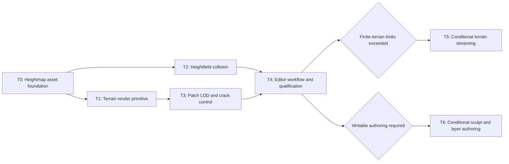

# Heightfield Terrain Roadmap

Summary: Deliver a finite authored heightfield terrain primitive through bounded asset, rendering, LOD, collision, and editor plans while preserving one authoritative height dataset.

Last reviewed: 2026-08-12

Status: Active
Completed:

## Current Status

Durin now has a dedicated `DTerrainHeightmap` asset with exact grayscale16 PNG
import, immutable row-major samples, a deterministic regional min/max
hierarchy, transactional reimport, DDC restore, and source-free cooked-runtime
load. It remains renderer- and collision-neutral.
The renderer already provides typed scene proxies and SceneInfo storage,
conservative per-view frustum visibility, projected-size LOD selection,
material pass classification, PBR surface binding, and counted indexed draws.
RHI exposes sampled `R16_UNORM`, `R16_FLOAT`, and `R32_FLOAT` formats, but the
authored `DTexture2D` path decodes source images to RGBA8 and selects BC formats;
it cannot preserve a 16-bit height contract.

Aether already owns immutable shared primitive, hull, and triangle-mesh
geometry with asset BVHs and complete Ray/Sweep/Overlap queries. It does not
own heightfield geometry. A generated triangle mesh can qualify an early
bounded terrain fixture, but it is not the lasting collision representation
for large regular grids.

T0 is complete; its lasting contract is
[Terrain Heightmap Asset](../Runtime/Terrain/TerrainHeightmapAsset.md).
T1 is complete; its lasting contract is
[Terrain Rendering](../Runtime/Rendering/TerrainRendering.md). T2 is now active
through the [Aether Heightfield Collision Plan](../Plans/AetherHeightfieldCollision.md).
It will add a regular-grid AetherCore resource, complete query algorithms,
Terrain BodyInstance publication, Cook/runtime behavior, and measured local-cell
scaling without opening source files or defining a second height authority.

## Outcome

Durin can author, save, Cook, load, place, render, select, and collide with a
finite regular-grid heightfield terrain. One versioned height asset is the
authority for rendering, bounds, editor queries, and collision derivation.
Terrain participates in the existing renderer scene, visibility, material,
view, diagnostics, and lifetime contracts instead of maintaining a parallel
world or frame pipeline.

The required program delivers:

- lossless linear 16-bit height source and cooked data;
- a reflected Terrain Actor/Component with detached renderer-owned scene data;
- bounded patch rendering with reusable regular-grid geometry;
- conservative patch bounds, deterministic LOD selection, and crack control;
- exact World trace, sweep, and overlap behavior against heightfield geometry;
- basic import, placement, property, picking, reimport, and inspection flows;
- structural, image, collision-parity, performance, memory, Cook, and runtime
  evidence at a frozen finite-terrain scale.

## Scope

- One finite rectangular heightfield per Terrain Component.
- Linear unsigned 16-bit authored samples on a regular XY grid.
- Component-owned horizontal spacing, vertical scale, vertical offset,
  transform, visibility, material, and collision policy.
- Runtime Engine asset/component/actor ownership, Renderer primitive-family
  integration, AetherCore/Aether geometry, and Level Editor workflows.
- Patch-local bounds and visibility; deterministic CPU-selected terrain LOD.
- Opaque and Masked PBR surface participation using existing material passes.
- Line traces, sphere/capsule/box sweeps, and overlaps through existing World
  collision APIs.
- Editor and cooked-runtime operation without source files or DDC availability.

## Non-Goals

- Infinite terrain, world partition, origin rebasing, virtual textures, or
  automatic asset streaming.
- Runtime deformation, networked terrain edits, destructible terrain, caves,
  overhangs, or arbitrary voxel surfaces.
- Foliage placement/rendering, navmesh generation, water, roads, splines, or
  procedural biome generation.
- A full Landscape material graph, unlimited painted layers, runtime virtual
  texturing, triplanar projection, or automatic slope blending.
- Sculpt, smooth, flatten, erosion, hole, or paint brushes in the required
  program. These may be activated after immutable import/reimport is qualified.
- Tessellation, mesh shaders, compute-generated geometry, GPU-driven indirect
  submission, or occlusion/HZB as prerequisites.
- Merging renderer visibility, Aether broad phase, and editor picking into one
  shared mutable spatial scene.

## Program Decisions and Invariants

### One height authority, multiple derived consumers

- `DTerrainHeightmap` is a dedicated Engine asset rather than a `DTexture2D`
  usage mode. Its canonical representation is row-major linear `uint16` data;
  color conversion, sRGB, BC compression, alpha policy, and ordinary texture
  usage never enter its identity.
- Import source provenance remains editor-only. DDC and cooked bulk are
  independently versioned and checksummed. Cooked runtime loads the exact
  canonical samples and required acceleration metadata without source or DDC.
- Renderer upload layouts, Aether heightfield resources, and editor query data
  are derived from one committed asset revision. No consumer silently decodes
  the source image, keeps an unrelated copy as authority, or publishes a new
  revision partially.
- The height asset owns normalized samples and sample-space metadata. The
  component owns world interpretation: XY sample spacing, Z scale and offset,
  local-to-world transform, material, visibility, and collision settings.

### Terrain is a first-class primitive family

- Terrain publishes detached proxy values through the established component
  render-state lifecycle. Render-thread state contains no Actor, Component,
  asset, reflected-property, or mutable CPU-height pointer.
- Renderer owns Terrain SceneInfo classification and typed membership. Terrain
  consumes the existing centralized per-view visibility result, pass policy,
  lighting/environment data, output paths, and counter snapshot.
- Terrain uses indexed triangle-list draws over reusable regular-grid patch
  topology. Hardware tessellation, compute, and indirect draws remain
  evidence-gated optimizations.
- A patch has an exact sample rectangle, conservative local/world bounds,
  stable identity, selected LOD, neighbor relation, and counted draw facts.
  Container or traversal order never chooses visible output or resolves an LOD
  tie.

### LOD never opens a crack or changes terrain extent

- All LODs sample the same committed full-resolution height authority at
  deterministic grid coordinates. Border coordinates shared by neighboring
  patches resolve to identical positions.
- The selected crack policy must cover every legal adjacent-LOD pair. The
  initial scalable plan may choose skirts or stitched index patterns, but must
  qualify grazing views, mirrored transforms, world edges, and camera motion.
- Patch bounds derive from exact regional min/max heights and remain
  conservative for every selectable LOD and supported positive component
  scale. Invalid transform or bounds data stays visible with named diagnostics;
  it never produces an unsafe false-negative cull.

### Collision shares data identity, not renderer storage

- AetherCore owns immutable shared `HeightField` geometry and narrow-phase
  algorithms; Aether owns scene publication and traversal; Engine owns
  component settings, BodyInstance lifecycle, and asset-revision synchronization.
- Render buffers and render-selected LOD are never collision geometry.
  Collision derives from canonical samples and has its own version, bounds,
  retained-byte facts, and failure state.
- Existing `DWorld` Ray/Sweep/Overlap APIs, filters, stable closest-hit order,
  initial-penetration semantics, Production/Reference/Compare policies, and
  diagnostics remain compatibility requirements.
- A triangle-mesh derivation may be used as bounded bring-up evidence, but the
  required program completes only with a regular-grid heightfield resource and
  measured query behavior that does not materialize an unbounded triangle copy.

### Finite product targets precede scalable architecture

- The first asset plan freezes supported dimensions and memory/allocation
  ceilings. The first render plan freezes a representative terrain size,
  patch size, view, GPU, resolution, draw/triangle budget, and baseline.
- World streaming and partitioning activate only after a concrete world size,
  working-set budget, streaming cell, residency latency, and authoring workflow
  prove that the finite component contract is insufficient.
- Foliage remains a separate consumer of terrain queries and visibility. It
  does not enlarge the required terrain program.

## Current Foundations and Gaps

| Area | Existing foundation | Gap | Owning milestone |
| --- | --- | --- | --- |
| Asset lifecycle | `DTerrainHeightmap`, exact grayscale16 import, immutable samples, regional extrema, registry/source integration, DDC and cooked companions; renderer consumes stable revisions | Collision does not yet derive or publish from the stable payload | T2 |
| RHI data | Terrain owns exact R16 upload, shared patch topology, shaders, and bounded resource caches | No T2 gap; collision must remain independent from RHI storage | Complete in T1 |
| Scene ownership | Terrain Actor/Component, detached proxy, typed SceneInfo, FIFO mutation, and revision recreation are implemented | Physics-body recreation is not yet coordinated with heightmap revisions | T2 |
| Surface rendering | Exact single-LOD Terrain uses shared PBR/material/output paths and signed height reconstruction | No T2 gap; collision must match its coordinate/cell contract without reading render state | Complete in T1 |
| Visibility | Primitive and exact 64x64-cell patch visibility, regional bounds, conservative fallback, and counters are implemented | No LOD-aware bounds or adjacency selection | T3 |
| LOD | StaticMesh projected-size selection and validated LOD policies | No patch adjacency, terrain error metric, crack policy, or stable patch LOD result | T3 |
| Collision | Immutable shared mesh geometry, asset BVH, complete primitive queries, Production/Reference/Compare | HeightField kind, cell acceleration, algorithms, cook payload, and component publication are absent | T2 |
| Editor | Content Browser, import/reimport providers, reflected details, viewport selection, undo transactions | No terrain asset presentation, placement, properties, picking, or diagnostics | T0, T1, T4 |
| Streaming | Asset packages and ordinary complete-asset loading | No height/patch residency, world partition, or streaming ownership | Conditional T5 |

## Milestone Map

| Milestone | Requirement | Child plan | Dependencies | Deliverable | Entry gate | Exit gate |
| --- | --- | --- | --- | --- | --- | --- |
| T0: Heightmap asset foundation | Required; complete | [Terrain Heightmap Asset](../Runtime/Terrain/TerrainHeightmapAsset.md) | Existing AssetCore, Engine asset lifecycle, StandardAssetImport | Dedicated 16-bit asset with validated source import, derived/cooked data, load, reimport, inspection facts, and bounded tests | Complete | Editor and cooked runtime reproduce identical canonical samples and regional metadata without source/DDC |
| T1: Terrain render primitive | Required; complete | [Terrain Rendering](../Runtime/Rendering/TerrainRendering.md) | T0, existing Renderer scene/visibility/material contracts | Actor/Component, proxy/info, patch resources, vertex factory/shader, PBR material mapping, single-LOD visible terrain | Complete | Exact single-LOD Terrain renders through shared PBR/output paths with conservative patch visibility, counted bounded resources, revision propagation, and editor placement |
| T2: Heightfield collision | Required; active | [Aether Heightfield Collision](../Plans/AetherHeightfieldCollision.md) | T0, existing Aether geometry/query facade | Immutable HeightField resource, cell acceleration, full Ray/Sweep/Overlap matrix, Cook/load, BodyInstance publication | Entry gate passed: stable top-left row-major samples and 64×64 extrema hierarchy exist; Stage 0 freezes query fixtures, limits, persistence, and a bounded triangle-mesh oracle | Heightfield Production matches Reference/oracle semantics, scales by local cells rather than all triangles, and tracks asset revisions safely |
| T3: Patch LOD and crack control | Required; proposed `TerrainPatchLOD` | T1 | Deterministic patch LOD, adjacency resolution, skirts or stitching, regional bounds, counters and GPU qualification | T1 has a correct single-LOD baseline and measured patch/draw/triangle costs | Camera motion and all neighbor transitions remain crack-free and deterministic within frozen CPU/GPU/memory budgets |
| T4: Editor workflow and qualification | Required; proposed `TerrainEditorWorkflow` | T1-T3 | Placement, reflected properties, picking, reimport propagation, error presentation, final fixtures and lasting docs | Runtime/render/collision contracts are stable enough that editor actions do not define them implicitly | A user can import, place, configure, save, reload, Cook, run, select, and collide with terrain; all program validation rows pass |
| T5: Terrain streaming | Conditional; proposed `TerrainStreamingAndResidency` | T4 plus concrete scale evidence | Partitioned height/render/collision residency with explicit budgets and failure behavior | Named world dimensions or measured memory/loading stalls exceed the finite component budgets | Selected working set and latency targets pass without incomplete collision or visible seam behavior |
| T6: Sculpt and layer authoring | Conditional; proposed `TerrainAuthoringTools` | T4 plus product workflow | Transactional writable height regions, brushes, undo/redo, dirty-region rebuild, optional bounded material layers | A concrete editing workflow, layer count, brush size, latency budget, and persistence model are accepted | Authoring operations are transactional, bounded, Cook-compatible, and cannot desynchronize render/collision revisions |

## Child Plan Boundaries

### Terrain Heightmap Asset Foundation

Owns `DTerrainHeightmap`, canonical sample and orientation rules, accepted
source format, validation limits, derived-data key/payload, cooked companion,
transactional import/reimport, asset registry facts, and focused inspection.
It does not create Terrain actors, GPU render resources, materials, Aether
geometry, viewport tools, or runtime deformation.

### [Terrain Render Primitive](../Runtime/Rendering/TerrainRendering.md)

Owns Engine publishers, Renderer scene family, patch resource lifetime,
single-LOD topology, height sampling, normal derivation, base-pass material
mapping, visibility integration, counters, failure/reload behavior, and the
first visible editor placement smoke. It does not own scalable LOD, collision,
streaming, foliage, or painting.

### [Aether Heightfield Collision](../Plans/AetherHeightfieldCollision.md)

Owns the immutable regular-grid collision resource, bounds/cell acceleration,
operation/pair algorithms, reference comparison, payload/versioning,
BodySetup/BodyInstance publication, debug facts, and query performance. It does
not read Renderer buffers or select visual LOD.

### `TerrainPatchLOD`

Owns the LOD metric and policy, patch adjacency resolution, crack strategy,
regional bounds across LODs, draw preparation, diagnostics, and measured
quality/performance gates. It does not introduce streaming or writable terrain.

### `TerrainEditorWorkflow`

Owns user-facing placement, details, selection, reimport propagation,
diagnostics presentation, final end-to-end fixtures, and lasting documentation.
It consumes rather than redefines asset, Renderer, and Aether contracts.

## Program Validation Matrix

| Contract | Required milestones | Validation outcome |
| --- | --- | --- |
| Height fidelity | T0 | Imported, saved, DDC-restored, cooked, and runtime-loaded corner/interior samples are bit-identical; no sRGB or BC path is reachable |
| Coordinate identity | T0-T2 | Source row/column, local XY, render UV, editor hit, and collision cell orientation agree on asymmetric fixtures |
| Transactionality | T0-T4 | Failed import/reimport/build/upload/collision publication retains the prior complete revision and never mixes consumer generations |
| Scene lifetime | T1, T3 | Add/update/remove, visibility, asset replacement, component retirement, device invalidation, and shutdown leave no stale proxy/info/resource |
| Visibility and bounds | T1, T3 | Patch regional bounds are conservative across transforms, views, LODs, and boundary planes; counters conserve every submitted patch |
| Surface output | T1, T3 | Height, derived normals, UV scale, material passes, lighting, winding, and masked output match CPU/image fixtures |
| LOD continuity | T3 | Deterministic camera motion and every legal neighbor LOD pair show no hole, T-junction exposure, extent change, or unstable oscillation outside the frozen policy |
| Collision semantics | T2 | Ray/Sphere/Capsule/Box queries, tangency, initial penetration, filters, ordering, and transformed terrains match the reference matrix |
| Collision scalability | T2 | Sparse queries visit bounded local cells/features and meet named retained-memory and timing budgets without a full triangle materialization |
| Editor workflow | T0, T1, T4 | Import, reimport, placement, property edit, undo/redo, selection, save/reload, Cook, runtime launch, and diagnostics are coherent |
| Resource budgets | T0-T4 | Maximum supported asset, representative terrain, peak build memory, CPU/GPU retained bytes, draw/triangle counts, and frame/query timings stay within frozen gates |

## Risks and Control Gates

- **Height precision is accidentally routed through ordinary texture code.** T0
  tests reject RGBA8/BC/sRGB identities and compare exact 16-bit golden samples
  through every persistence path.
- **Renderer, collision, and editor disagree on orientation.** An asymmetric
  non-square golden heightmap freezes row origin, axis direction, vertex
  winding, UV mapping, and query positions before T1 or T2 begins.
- **A monolithic terrain draw hides scaling problems.** T1 records patch-level
  submissions, bounds, draws, triangles, and bytes before T3 selects LOD.
- **LOD optimization creates cracks or unsafe culling.** T3 must retain a
  single-LOD comparison mode and image/geometry fixtures for every neighbor
  transition and frustum boundary.
- **Triangle-mesh collision becomes an accidental permanent format.** T2 may
  use it only as a bounded oracle; its exit gate requires a named HeightField
  resource and local-cell traversal evidence.
- **Feature growth turns terrain into world technology.** Streaming, foliage,
  sculpting, painted layers, navmesh, and procedural generation stay behind
  explicit consumer and measurement gates.

## Completion Criteria

- T0-T4 are completed and their lasting contracts are published under the
  owning Runtime and Editor documentation domains.
- One finite terrain fixture passes bit-exact asset persistence, all required
  render views/passes, deterministic crack-free LOD, complete collision-query
  semantics, editor workflow, Cook, runtime launch, resource lifetime, and
  shutdown qualification.
- Recorded peak build memory, runtime CPU/GPU bytes, patch/draw/triangle counts,
  render timing, collision work, and query timing meet their child-plan gates.
- T5 and T6 are either completed or explicitly remain conditional with their
  activation evidence absent; no required contract relies on them.
- Rendering Capability Expansion and Aether Physics Evolution link the
  completed terrain capabilities without duplicating their contracts.

## Related Documentation

- [Rendering Capability Expansion](Archive/2026-08/RenderingCapabilityExpansion.md)
- [Aether Physics Evolution](AetherPhysicsEvolution.md)
- [Texture System](../Runtime/Rendering/TextureSystem.md)
- [Static Mesh Rendering](../Runtime/Rendering/StaticMeshRendering.md)
- [Renderer Scene Representation](../Runtime/Rendering/SceneRepresentation.md)
- [Material System](../Runtime/Rendering/MaterialSystem.md)
- [Runtime Collision](../Runtime/Physics/Collision.md)
- [Asset Data Lifecycle and Storage](../Runtime/Assets/AssetDataLifecycle.md)
- [Asset Packages](../Runtime/Assets/AssetPackages.md)

## Related Code

- `Engine/Source/Runtime/Engine/Public/Texture/Texture2D.h`
- `Engine/Source/Runtime/Engine/Private/Texture/Texture2D.cpp`
- `Engine/Source/Runtime/Engine/Public/IScene.h`
- `Engine/Source/Runtime/Renderer/Public/Scene.h`
- `Engine/Source/Runtime/Renderer/Private/Scene.cpp`
- `Engine/Source/Runtime/Renderer/Private/Renderers/SceneVisibility.cpp`
- `Engine/Source/Runtime/Renderer/Private/Renderers/SceneRenderer.cpp`
- `Engine/Source/Runtime/AetherCore/Public/Collision/CollisionGeometry.h`
- `Engine/Source/Runtime/AetherCore/Private/Collision/CollisionGeometry.cpp`
- `Engine/Source/Runtime/Engine/Public/Components/PrimitiveComponent.h`
- `Engine/Source/Editor/StandardAssetImport/Private/StandardAssetImportProviders.cpp`
- `Engine/Source/Editor/LevelEditor`
- `Engine/Tests/Native/EngineTests`
