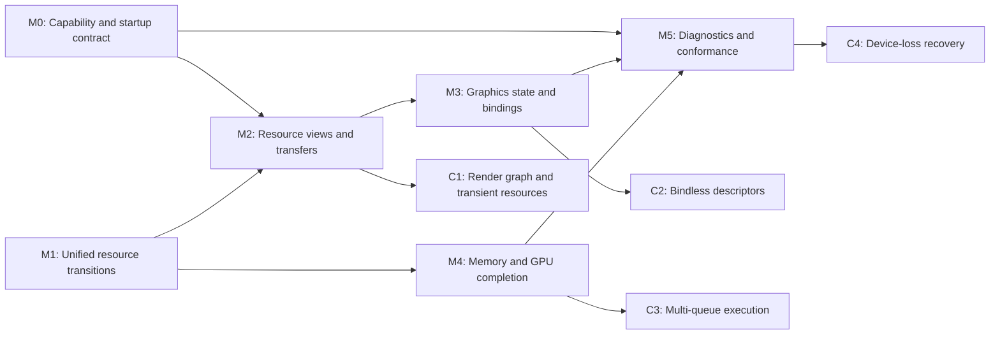

# RHI and Vulkan Backend Evolution Roadmap

Summary: Evolve Durin's RHI and Vulkan backend from a reliable graphics execution core into a capability-driven, synchronization-correct, observable, and scalable rendering platform.

Last reviewed: 2026-08-09

Status: Active
Completed:

## Current Status

The RHI has a strong CPU execution and lifetime foundation. Backend-neutral
commands are recorded into owned storage, replayed by one executor on a
dedicated RHI thread by default, bounded by serial fences and backpressure, and
drained through an audited shutdown path. Vulkan resource factories publish
complete resources or null, swapchain replacement is transactional, and
Renderer resource owners already isolate and retry expected creation failures.

The next constraints are no longer command transport or basic indexed drawing.
The public RHI advertises more concepts than the Vulkan backend can execute
consistently, while the backend still makes several policy choices implicitly:

- `ERHIFeatureLevel` is not connected to an immutable runtime capability set;
  texture-format support is the only narrow public capability query.
- Vulkan validation is requested unconditionally, required and optional
  extensions share one activation path, and physical-device selection can
  retain a device whose suitability score is zero.
- Public texture dimensions include arrays, cube arrays, and 3D textures, but
  Vulkan image creation currently fixes `imageType` to 2D and public descriptor
  validation does not reject the unsupported combinations.
- Attachment layouts, upload barriers, and readback barriers each carry part of
  resource state. `ERHIAccess` is attachment-oriented and shader access maps to
  graphics stages, so it cannot yet describe compute, copy, or general
  subresource handoff.
- `FRHIBindingSet` exists without a creation or binding contract. Descriptor
  layouts advertise arrays, while materialization writes one descriptor at
  array element zero and uses a per-frame, PSO-address-keyed cache.
- Graphics pipeline state covers only a narrow fixed-state subset, and Vulkan
  pipelines remain coupled to cached legacy render passes. The declared draw,
  view, and pipeline vocabulary is not yet broad enough for production feature
  growth.
- VMA buffer allocation applies a host-access hint to every buffer, uploads
  allocate one staging buffer per operation, native destruction is aged by CPU
  frame number, and no backend-neutral GPU-memory or descriptor-pressure
  telemetry is published.
- Presentation-family compatibility is resolved only after logical-device
  creation; cross-family presentation ownership is not a declared contract.
  Current WSI coverage proves the primary hidden-window path, not a device and
  multi-viewport portability matrix.
- Debug labels exist for render passes, but there is no owned debug messenger,
  systematic native object naming, GPU timestamp/query surface, or persistent
  pipeline cache. Vulkan integration tests emphasize failure recovery and
  texture sampling rather than conformance across the whole public RHI.

One internal correctness gap belongs in the first milestone rather than a later
optimization program: render-pass creation logs and retains a null native
handle instead of failing the structural-cache candidate transaction. Similar
internal caches must follow the complete-or-null publication rule already
enforced for public factories.

The active [Compute Shader Pipeline](ComputeShaderPipeline.md) roadmap owns
compute transitions, pipeline creation, direct dispatch, renderer integration,
and optional asynchronous compute. This roadmap supplies the wider RHI and
Vulkan foundations and shares its resource-transition milestone; it does not
create a second compute program.

The first child plan is now active:
[RHI Capability and Vulkan Startup](../Plans/Archive/2026-08/RHICapabilityAndVulkanStartup.md).
Its entry audit confirmed the roadmap's startup correctness gaps in the current
code: validation-layer activation is unconditional, unsuitable zero-score
devices remain selectable, public texture support is broader than native image
creation, present-family provisioning is deferred until after device creation,
and render-pass failure can poison the structural cache with a null handle.
M0 therefore precedes new feature-family work as the current foundation
priority. M1 remains independently ready for just-in-time activation, but it
must consume rather than duplicate capability fields selected by M0.

## Outcome

Durin exposes one honest, backend-neutral rendering contract whose supported
features and limits are known at startup, whose resource states and views are
explicit, and whose correctness does not depend on implicit Vulkan layout or
queue behavior. The Vulkan backend implements that contract with bounded
allocation and cache policies, GPU-completion-aware lifetime management,
actionable diagnostics, and a conformance suite broad enough to make future
renderer features incremental rather than backend-specific rewrites.

The required roadmap ends when the current graphics renderer and the required
synchronous-compute path can share the same capability, transition, view,
binding, memory, and diagnostic foundations. Render graphs, bindless resources,
multi-queue overlap, and device-loss recovery remain evidence- or
product-gated extensions.

## Scope

- RHI capability, limit, format, queue, and presentation-support contracts.
- Vulkan instance, layer, extension, feature, physical-device, and queue-family
  negotiation.
- One authoritative buffer and texture-subresource state model shared by
  render passes, compute, copy, upload, readback, and presentation.
- Buffer and texture views plus general data-movement operations.
- A complete baseline graphics fixed-state, draw, descriptor-array, and
  pipeline-cache contract.
- Vulkan allocation policy, staging/readback reuse, memory budgets, descriptor
  pressure, and GPU-completion-aware retirement.
- Debug messenger ownership, native object names, command markers, GPU queries,
  runtime statistics, and focused conformance coverage.
- Presentation portability for the supported multi-window editor topology.

## Non-Goals

- Replacing the established command-list, executor, dedicated RHI-thread, or
  complete-or-null resource-publication contracts.
- Duplicating milestones owned by the Compute Shader Pipeline roadmap.
- Introducing a render graph before explicit state transitions and resource
  views work without one.
- Adopting bindless descriptors, asynchronous transfer, or asynchronous compute
  without measured pressure and a bounded consumer.
- Recovering a lost Vulkan device before Renderer resource resubmission and
  product policy are explicitly selected.
- Adding a second graphics backend without a supported platform or product
  requirement.
- Mirroring every Vulkan feature or exposing Vulkan handles through the
  portable RHI.

## Program Decisions and Invariants

### Portable contract and capability ownership

- The RHI describes rendering intent, ranges, limits, and fallback behavior;
  Vulkan stage masks, access masks, image layouts, feature-chain structures,
  and native handles stay backend-private.
- Startup publishes one immutable capability and limit snapshot after a backend
  is fully initialized. Renderer code selects a supported path before recording
  work; unsupported optional features do not fail later in native creation.
- Required instance extensions, required device extensions, optional
  extensions, diagnostic layers, and promoted core features are distinct
  categories with distinct diagnostics. Missing optional diagnostics cannot
  prevent a normal runtime from starting.
- Public creation descriptors must be either fully implemented or rejected by
  backend-neutral validation and capability queries. An enum value alone is not
  a support promise.

### Execution, synchronization, and completion

- Normal renderer work continues to record owned RHI commands. Only executor
  replay accesses command contexts; Vulkan integration callbacks remain narrow,
  named exceptions and cannot become a portable-feature implementation path.
- One resource-state model owns layout and visibility. Render passes, explicit
  transitions, uploads, readbacks, copies, and presentation update the same
  state rather than keeping parallel partial trackers.
- CPU executor serial completion and GPU execution completion remain different
  concepts. Resource recycling and native destruction use the relevant GPU
  completion token; CPU waits continue to target exact executor serials.
- Synchronous fallible creation remains limited to expected runtime resource
  creation. Submission, presentation, device loss, and state-contract
  violations remain terminal until a later plan selects a different public
  contract.

### Resources, bindings, and caches

- Resources own allocations; views own typed interpretation and subresource or
  byte-range selection. Shader bindings and attachments consume views when a
  whole-resource default is insufficient.
- Descriptor arrays have explicit array-element and count semantics. Missing,
  mismatched, or out-of-range bindings fail before a Vulkan update.
- Internal render-pass, layout, descriptor, framebuffer, and pipeline caches
  publish only complete candidates. Every cache has declared identity,
  ownership, bounds, invalidation, and diagnostic counters.
- A debug name labels diagnostics and captures; it never acts as the logical
  owning key of a pipeline or resource.

### Evidence gates

- First make one graphics/compute queue path correct and observable. Separate
  transfer or compute queues are enabled only with queue ownership,
  synchronization, fallback, shutdown, and measured benefit.
- Dynamic rendering, descriptor indexing, persistent pipeline caches, transient
  aliasing, and other modern Vulkan facilities are selected in their child plan
  from the published capability contract. Vulkan 1.3 availability alone does
  not bypass feature negotiation or fallback design.
- Optimization milestones start from captured command, descriptor, allocation,
  GPU-time, and wait evidence rather than API availability.

## Current Foundations and Gaps

| Area | Existing foundation | Roadmap gap |
| --- | --- | --- |
| CPU execution | Owned typed command batches, regular/immediate lists, exact serial fences, bounded dedicated-thread queue, inline diagnostic mode, and audited drain. | Preserve this contract while extending commands; add GPU-side timing and completion visibility rather than another CPU executor. |
| Resource lifetime | Intrusive counted resources, irreversible deferred deletion, complete-or-null public factories, transactional swapchain replacement, and Renderer retry generations. | Make internal structural caches transactional and retire native objects by GPU completion instead of only frame age. |
| Capabilities | Vulkan device properties, queue families, extension enumeration, and per-format feature queries are locally available. | Publish portable features/limits, classify requirements, reject unsuitable devices, and make consumer fallback explicit. |
| Resource descriptions | Texture formats, mips, arrays, cubes, storage flags, buffer usages, and sampler descriptions exist. | Validate all dimension/usage/sample combinations, retain the full immutable resource description, and add typed views. |
| Synchronization | Render-pass dependencies and targeted upload/readback barriers work for current graphics paths; per-subresource Vulkan layouts are tracked. | Establish portable access/range transitions and one state owner spanning graphics, compute, copy, and presentation. |
| Graphics pipelines | Shaders, reflected layouts, push constants, vertex declarations, indexed draws, MRT, depth, alpha blend, wireframe, MSAA resolve, and render-pass compatibility exist. | Complete fixed-state and draw variants, descriptor arrays/views, cache bounds, and driver cache persistence without name-based ownership. |
| Memory and transfers | VMA-backed resources, mapped dynamic uniforms, staging uploads, texture readback, two frame slots, and pooled command buffers/fences exist. | Separate device-local and host-visible policy, reuse staging/readback storage, expose budgets/pressure, and tie recycling to GPU completion. |
| Presentation | Transactional swapchain candidates, unavailable-output handling, resize recovery, present fences when supported, and per-viewport teardown exist. | Negotiate present-compatible queues and surface usage before commitment, cover cross-family rules, and validate the supported multi-window topology. |
| Diagnostics and tests | CPU executor statistics, render-pass labels, validation-clean smoke evidence, failure injection, texture sampling, and fake-context RHI tests exist. | Add owned Vulkan diagnostics, object names, GPU queries, cache/memory statistics, and public-RHI conformance across resources, bindings, transfers, WSI, and shutdown. |

## Milestone Map

| Milestone | Requirement | Proposed child plan | Dependencies | Deliverable | Entry gate | Exit gate |
| --- | --- | --- | --- | --- | --- | --- |
| M0: Capability and startup contract | Required; completed | [RHICapabilityAndVulkanStartup](../Plans/Archive/2026-08/RHICapabilityAndVulkanStartup.md) and [lasting contract](../Runtime/Rendering/RHICapabilitiesAndVulkanStartup.md) | Recorded command and initialization rollback contracts | Immutable public capabilities/limits; explicit Vulkan layer, extension, feature, device, queue, format, and WSI negotiation; transactional internal structural creation | Met: initialization rollback, the Win64 profile matrix, and the frozen capability/topology contract established implementation scope. | Met on 2026-08-10: optional diagnostics remain optional; only suitable device/queue candidates publish; exact unsupported textures reject before native creation; structural-cache retry is complete; focused/native/full-build/runtime qualification is recorded in the child plan. |
| M1: Unified resource transitions | Required, shared | `GPUResourceTransitions` from the [Compute Shader Pipeline](ComputeShaderPipeline.md) roadmap | Established recorded-command replay; coordinate access-relevant capability fields with M0 | Portable buffer/image range transitions and one authoritative Vulkan state tracker shared by pass, upload, readback, copy, compute, and present paths | The recorded command-list contract is stable and the current state-mutating paths have a bounded inventory | Graphics, compute, copy, readback, and presentation handoffs pass focused tests without global idle waits or divergent layout state |
| M2: Resource views and transfers | Required | `RHIResourceViewsAndTransfers` | M1 transition contract | Texture mip/layer/aspect views, buffer range/format views, default-view policy, and explicit buffer/texture copy, resolve, blit, and upload/readback operations required by current consumers | M1 subresource and byte-range semantics are stable; concrete texture-array/volume or copy consumers are selected | Views validate against parent resources and remain alive through replay/GPU use; required transfer combinations work through public RHI commands and unsupported combinations fail before Vulkan recording |
| M3: Graphics state and bindings | Required | `RHIGraphicsStateAndBindings` | M0 limits and M2 view contract | Complete baseline raster/depth/stencil/blend/color-mask/vertex-instance state, non-indexed and instanced draw variants, explicit binding-set semantics, descriptor arrays, bounded descriptor/pipeline caches, and persistent driver cache policy | Current renderer pipeline identities and reflected binding layouts have a bounded inventory; M2 defines resources bound into descriptors | Representative opaque, blended, depth/stencil, MRT, instanced, and array-binding draws pass; binding mismatches fail at the RHI boundary; caches expose bounds/hits/misses and publish no partial candidate |
| M4: Memory and GPU completion | Required | `VulkanMemoryTransferAndRetirement` | M0 memory limits and M1 state/completion vocabulary | Allocation classes, reusable staging/readback arenas, memory-budget and pressure statistics, descriptor/allocation telemetry, and GPU-completion-aware recycling/deletion | Workload captures identify current allocation sizes, upload/readback volume, frame waits, and deferred-delete depth | Static resources prefer device-local memory, dynamic resources retain correct mapping, repeated uploads avoid per-operation native allocation, pressure is attributable, and destruction/reuse is proven safe under irregular submission and frame cadence |
| M5: Diagnostics and conformance | Required | `RHIDiagnosticsAndConformance` | M0-M4 public contracts | Configurable debug messenger, systematic object names and command regions, timestamp/query support, consolidated RHI/Vulkan stats, and a public-RHI conformance matrix for inline/threaded execution and supported WSI topology | Required contracts are stable enough that tests assert behavior rather than freeze temporary Vulkan details | Debug and non-debug startup both work; captures identify resources/passes; GPU timings and memory/cache pressure are queryable; validation-clean conformance covers creation, transitions, views, bindings, draws, transfers, presentation, failure, and shutdown |
| C1: Render graph and transient resources | Evidence-gated | `RenderGraphAndTransientResources` | M1, M2, M4 | Pass/resource dependency compilation, transient lifetime/alias policy, and barrier generation for selected renderer consumers | Manual transition complexity, transient memory, or pass scheduling cost is measured and exceeds an accepted threshold | Selected consumers move without changing visible output; generated barriers match the public state contract; transient allocation saves measured memory or CPU work |
| C2: Bindless descriptors | Evidence-gated | `BindlessResourceBinding` | M0, M2, M3, M5 | Descriptor-indexing capability/fallback, stable handle lifetime, update/reuse rules, and bounded migration of one pressured consumer | Descriptor allocation/update captures identify a concrete bottleneck and supported target hardware has an acceptable capability floor | Selected consumer reduces measured descriptor cost; handle reuse and fallback are validated across resource replacement and shutdown |
| C3: Multi-queue execution | Evidence-gated | Compute M5 and/or `AsynchronousTransferExecution` | M1, M4, M5 and the dedicated RHI thread | Separate queue contexts, timeline/semaphore policy, queue-family ownership, fallback, lifetime, and shutdown for one measured workload | GPU traces show a transfer or compute overlap opportunity greater than scheduling/ownership cost | Shared- and separate-family paths are correct; fallback preserves output; overlap improves the target workload without new global-idle waits |
| C4: Device-loss recovery | Product-gated | `VulkanDeviceRecovery` | M0-M5 plus a Renderer resubmission inventory | Detection, admission stop, device teardown/recreation, resource resubmission, viewport restoration, user diagnostics, and terminal fallback | Product requirements justify recovery and every persistent GPU owner can recreate from CPU-side state | Injected or supported device-loss scenarios either restore a coherent renderer exactly once or terminate with one owned diagnostic and no deadlock/leak |

M0 through M5 define this roadmap's required outcome. C1 through C4 do not
block completion when their entry evidence is absent; each must be explicitly
marked completed, transferred to another owning roadmap, or deferred with the
reviewed evidence.

## Child Plan Boundaries

### [RHICapabilityAndVulkanStartup](../Plans/Archive/2026-08/RHICapabilityAndVulkanStartup.md)

Owns the public capability/limit snapshot and Vulkan startup selection. It also
closes present-family negotiation and the known mismatch between public texture
descriptors and native image creation. It may repair internal creation caches
needed to guarantee that initialization publishes no partial backend state. It
does not redesign renderer features or add new draw commands.

### `GPUResourceTransitions`

Remains owned by the Compute Shader Pipeline roadmap. This roadmap treats its
public transition and state-tracking contract as a shared platform milestone.
There must be one child plan and one implementation, not parallel graphics and
compute transition systems.

### `RHIResourceViewsAndTransfers`

Owns typed view descriptions, parent-resource lifetime, default views, transfer
commands, and their validation. It does not introduce a frame graph, transient
aliasing, streaming policy, or bindless handles. Advanced texture asset types
remain in their asset/renderer plans; this plan supplies only the RHI mechanics
required by selected consumers.

### `RHIGraphicsStateAndBindings`

Owns the portable graphics state and draw baseline, the decision to implement
or remove the unused `FRHIBindingSet` abstraction, descriptor-array semantics,
and bounded pipeline/descriptor caching. It may select legacy render passes or
dynamic rendering from M0 capabilities, but must preserve attachment and
transition invariants. It does not own compute PSOs or bindless migration.

### `VulkanMemoryTransferAndRetirement`

Owns VMA allocation classes, staging/readback reuse, budget reporting, GPU
completion tokens, and safe native-object retirement. It does not change asset
streaming or Renderer residency policy; the existing Texture Support plan may
consume its accounting and decide whether streaming is justified.

### `RHIDiagnosticsAndConformance`

Owns diagnostics configuration, debug callback lifetime, Vulkan object names,
command regions, timestamp/query primitives, consolidated counters, and the
cross-contract test matrix. It does not turn validation-only facilities into
shipping requirements or make GPU timing queries implicit synchronization
points.

### Conditional plans

Conditional plans own only their selected optimization or recovery boundary.
The render graph consumes explicit transitions rather than replacing their
public semantics. Bindless consumes resource views and completion-aware handle
reuse. Multi-queue work shares the Compute Shader Pipeline roadmap where
compute is involved. Device recovery starts only after persistent resource
owners have a complete resubmission inventory.

## Program Validation Matrix

| Boundary | Required milestone | Required evidence |
| --- | --- | --- |
| Configuration -> Vulkan instance | M0 | Debug layer present/absent, required extension present/absent, loader/API-version floor, and initialization rollback produce deterministic owned diagnostics. |
| Physical device -> logical device | M0 | Unsuitable feature, limit, format, and queue candidates are rejected; the published candidate satisfies graphics and supported presentation policy. |
| RHI descriptor -> native resource | M0, M2 | Every supported buffer/texture dimension, usage, sample count, mip/layer range, and view combination validates and creates; unsupported descriptions fail before native calls. |
| Upload/copy -> graphics or compute use | M1, M2 | Explicit transitions provide visibility and correct layout without whole-device idle. |
| Render pass -> shader/copy/present use | M1 | Final attachment state becomes the authoritative next state for the exact subresources. |
| Resource/view -> descriptor array | M2, M3 | Array elements, ranges, types, retained lifetimes, replacement, and missing bindings are validated before descriptor update and remain safe through GPU completion. |
| Graphics state -> draw | M3 | Opaque, blend, depth/stencil, MRT, wireframe, vertex instancing, non-indexed, indexed, and instanced variants produce expected output through public RHI commands. |
| CPU data -> device-local memory | M4 | Static placement, dynamic mapping, staged upload, readback invalidation, pressure behavior, and allocator failure are covered without per-operation leaks or unintended host-visible placement. |
| CPU serial -> GPU completion | M4 | Command storage releases at executor completion while native allocations, descriptors, command buffers, and views recycle only after the responsible GPU token completes. |
| Window/surface -> present | M0, M5 | Main and detached editor viewports cover create, minimize, resize, suboptimal/out-of-date, differing present support, recovery, and teardown without cross-viewport device idle when the negotiated path supports it. |
| Diagnostics -> actionable evidence | M5 | Validation messages carry object/pass identity; GPU timestamps and cache/memory/queue counters are bounded, queryable, and do not alter ordering. |
| Inline executor -> threaded executor | Every required milestone | The same command/state/lifetime scenarios pass in both modes; threaded mode additionally proves RHI affinity, backpressure, drain, and failure wakeup. |

Every child plan references the root [build and run](../Development/Build/BuildAndRun.md)
and [native tests](../Development/Build/NativeTests.md) contracts instead of
copying commands. Hardware-backed tests declare GPU resource locking and retain
headless or mock coverage for failure paths that do not need a physical device.

## Risks and Control Gates

| Risk | Control gate |
| --- | --- |
| Capability objects become a mirror of Vulkan rather than a portable contract. | M0 adds only limits and features consumed by a selected RHI path and records fallback behavior with each field. |
| Capability work broadens into multiple backend support. | M0 validates portability at the interface boundary but implements only the supported Vulkan runtime. |
| Explicit transitions conflict with render-pass implicit transitions. | M1 installs one state owner and tests handoff in both directions before M2 or compute dispatch begins. |
| Resource views create lifetime or cache-key aliases. | M2 uses counted parent ownership and full immutable view identity; native handle reuse is never sufficient identity. |
| Graphics-state expansion creates an unbounded PSO space. | M3 inventories current consumers, separates compatibility from full identity, bounds caches, and exposes hit/miss/creation data. |
| Descriptor caching retains stale raw resources. | M3 and M4 tie descriptor identity and recycling to view/resource lifetime plus GPU completion and test replacement within a frame. |
| Staging reuse overwrites in-flight data. | M4 assigns every arena range a GPU completion token and stress-tests wrap, overflow, irregular frames, and shutdown. |
| Frame-number retirement becomes invalid with multiple queues. | M4 establishes completion-token retirement before C3 can add queue concurrency. |
| Validation or profiling changes shipping startup requirements. | M0 and M5 keep diagnostic layers/extensions optional and test both enabled and unavailable configurations. |
| Dynamic rendering or bindless is adopted because the API is available. | Each requires a child-plan decision, published capability/fallback, a selected consumer, and measured or complexity-reduction evidence. |
| Device-loss work starts without recreatable Renderer state. | C4 entry requires a complete resource-owner/resubmission inventory and a selected user-facing failure policy. |

## Completion Criteria

The required roadmap is complete when:

- M0 through M5 are completed with their exit-gate evidence and linked child
  plan provenance.
- The active runtime publishes an immutable capability/limit snapshot and
  rejects unsupported work before Vulkan object creation or command recording.
- Buffer and texture state, views, transfers, graphics bindings, and the
  required synchronous-compute path use one portable contract without Vulkan
  escape hatches.
- Vulkan internal caches publish no partial native object, have bounded
  ownership/invalidation, and expose diagnostic counters.
- Static, dynamic, staging, and readback memory policies are distinct;
  allocation/descriptor pressure is attributable; GPU-owned objects recycle by
  completion evidence.
- Supported main-window and editor detached-viewport WSI scenarios pass without
  undeclared queue-family behavior.
- Debug and non-debug startup, inline and threaded execution, focused
  conformance, validation-clean runtime rendering, full build, and orderly
  shutdown pass through the repository workflow.
- Lasting contracts move into `Documentation/Runtime/Rendering/`, while this
  roadmap retains only milestone status, dependencies, and historical plan
  links.
- C1 through C4 are completed, transferred to their owning roadmap, or
  explicitly deferred with their entry evidence reviewed.

## Related Documentation

- [RHI command execution](../Runtime/Rendering/RHICommandExecution.md)
- [Viewport rendering](../Runtime/Rendering/ViewportRendering.md)
- [Compute Shader Pipeline roadmap](ComputeShaderPipeline.md)
- [Texture Support plan](../Plans/TextureSupport.md)
- [Recorded RHI Command List plan](../Plans/Archive/2026-08/RecordedRHICommandList.md)
- [Dedicated RHI Thread plan](../Plans/Archive/2026-08/DedicatedRHIThread.md)
- [Recoverable RHI Creation Failures plan](../Plans/Archive/2026-08/RecoverableRHICreationFailures.md)
- [Build and run](../Development/Build/BuildAndRun.md)
- [Native tests](../Development/Build/NativeTests.md)

## Related Code

- `Engine/Source/Runtime/RHI/Public/DynamicRHI.h`
- `Engine/Source/Runtime/RHI/Public/RHIContext.h`
- `Engine/Source/Runtime/RHI/Public/RHICommandList.h`
- `Engine/Source/Runtime/RHI/Public/RHIDefinitions.h`
- `Engine/Source/Runtime/RHI/Public/RHIFeatureLevel.h`
- `Engine/Source/Runtime/RHI/Public/RHIResources.h`
- `Engine/Source/Runtime/VulkanRHI/Public/VulkanDynamicRHI.h`
- `Engine/Source/Runtime/VulkanRHI/Private/VulkanDynamicRHI.cpp`
- `Engine/Source/Runtime/VulkanRHI/Private/VulkanDevice.cpp`
- `Engine/Source/Runtime/VulkanRHI/Private/VulkanContext.cpp`
- `Engine/Source/Runtime/VulkanRHI/Private/VulkanTexture.cpp`
- `Engine/Source/Runtime/VulkanRHI/Private/VulkanDescriptorSets.cpp`
- `Engine/Source/Runtime/VulkanRHI/Private/VulkanPendingState.cpp`
- `Engine/Source/Runtime/VulkanRHI/Private/VulkanPipeline.cpp`
- `Engine/Source/Runtime/VulkanRHI/Private/VulkanRenderPass.cpp`
- `Engine/Source/Runtime/VulkanRHI/Private/VulkanMemory.cpp`
- `Engine/Source/Runtime/VulkanRHI/Private/VulkanViewport.cpp`
- `Engine/Source/Runtime/VulkanRHI/Private/VulkanSwapchain.cpp`
- `Engine/Tests/Native/RHITests/Private/RHICommandListTests.cpp`
- `Engine/Tests/Native/RHITests/Private/RHIThreadTests.cpp`
- `Engine/Tests/Native/VulkanRHITests/Private/VulkanTextureSamplingTests.cpp`
- `Engine/Tests/Native/VulkanRHITests/Private/VulkanFailureInjectionTests.cpp`
