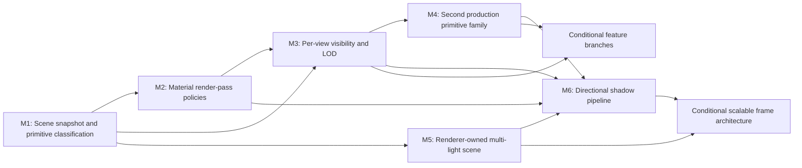

# Rendering Capability Expansion Roadmap

Summary: Expand the current static-mesh forward renderer into a pass-classified, visibility-aware platform for additional primitive, lighting, and effect families.

Last reviewed: 2026-08-12

Status: Active
Completed:

## Current Status

Durin has two production scene-geometry paths: StaticMesh through
`FStaticMeshSceneProxy`/`FLocalVertexFactory` and SkeletalMesh through
`FSkeletalMeshSceneProxy`/`FSkeletalMeshVertexFactory`. Both are prepared and
executed by the shared scene renderer and family-owned renderer resources.
SkyBox, TextureCube preview, post-process, and editor-assistance rendering are
separate Renderer-private feature owners composed explicitly by
`FSceneRenderer`. This is a sound ownership baseline: shader maps, pipelines,
RHI payloads, resource invalidation, retry, and release are no longer
concentrated in the module adapter.

The frame remains a fixed forward sequence. Sky, StaticMesh, and TextureCube
preview draws share one LDR Scene Color plus depth pass, followed by copy or
FXAA and an optional editor-assistance pass. StaticMesh now consumes one
centralized visible-family list, selects a validated LOD once per primitive,
groups Opaque and Masked work by complete value keys, and retains deterministic
distance-first Translucent ordering. Resource preparation finishes before Scene
Color; execution consumes only complete prepared draws.

Material render snapshots identify Opaque, Masked, and Translucent blend modes,
Lit and Unlit shading, two-sided state, depth-write policy, and a mask threshold.
Those properties now select complete effective RHI state and visible shader/pass
behavior, including strict masked threshold coverage and straight-alpha output.

The scene mutation boundary now uses paired SceneProxy and SceneInfo ownership
for StaticMesh, TextureCube preview, SkyBox, and directional lights. Strong
family identities and FIFO render commands address entries without component
pointers or a universal revision. Primitive transforms, bounds, visibility,
classification, and typed membership live in `FPrimitiveSceneInfo`; feature
renderers consume authoritative typed views without whole-scene RTTI scans.

M1 is complete through the
[Renderer Scene Proxy and Info Contract Plan](../Plans/Archive/2026-08/RendererSceneProxyAndInfoContract.md).
The lasting contract is recorded in
[Renderer Scene Representation](../Runtime/Rendering/SceneRepresentation.md).
M2 is complete through the
[Material Render Pass Policies Plan](../Plans/Archive/2026-08/MaterialRenderPassPolicies.md),
with lasting contracts recorded in
[Static Mesh Rendering](../Runtime/Rendering/StaticMeshRendering.md) and
[Material System](../Runtime/Rendering/MaterialSystem.md).

M3 is complete through the
[Per-View Visibility and LOD Plan](../Plans/Archive/2026-08/PerViewVisibilityAndLOD.md), with
lasting contracts recorded in
[Static Mesh Rendering](../Runtime/Rendering/StaticMeshRendering.md).
Production views now default to authored visibility, conservative frustum
culling, and deterministic projected-size LOD selection while retaining an
immutable culling-disabled/forced-LOD-0 comparison seam. This opens the shared
visibility/preparation dependency for M4 and M6; their remaining entry gates
still apply.

M4 completed on 2026-08-11 through the shared
[Skeletal Mesh Rendering Plan](../Plans/Archive/2026-08/SkeletalMeshRendering.md). SkeletalMesh
now reuses typed scene mutation, centralized visibility, all three surface
modes, combined translucent ordering, viewport variants, invalidation, and
resource lifetime while adding bounded frame-local palette storage and a
second production vertex factory. The lasting contract is recorded in
[Skeletal Mesh Rendering](../Runtime/Rendering/SkeletalMeshRendering.md). M4's
dependency gate for M6 is open; M6 still waits for the M5 light snapshot and
selected shadow quality/budget entry gates.

M5 is active through the
[Renderer Light Scene Contract Plan](../Plans/RendererLightSceneContract.md).
Its initial forward budget is selected as four directional lights and thirty-two
combined point/spot lights per view. The plan adds renderer-owned point and spot
snapshots, deterministic view preparation, one shared bounded light payload,
and visible local-light falloff without waiting for compute or clustered
lighting. Stage 0 is ready; M6 remains closed until M5 completes and a separate
directional-shadow quality and memory budget is selected.

## Outcome

Durin can add a production primitive or lighting family without extending an
RTTI scan in every feature renderer, retaining reflected objects on the render
thread, or duplicating viewport and resource-lifecycle policy. Each view
prepares deterministic visible work, classifies it into explicit passes, and
executes those passes through Renderer-private feature owners.

The required program delivers:

- detached SceneProxy and SceneInfo state for primitives, lights, and SkyBox;
- explicit opaque, masked, and translucent StaticMesh behavior;
- per-view visibility, LOD selection, pass classification, and ordering;
- a second production geometry family that proves the extension boundary;
- renderer-owned directional, point, and spot light snapshots; and
- a first directional shadow-depth and shadow-sampling path.

Additional effects, GPU-driven submission, deferred or clustered lighting, and
a render graph remain conditional. They are activated by concrete product or
profiling evidence rather than treated as prerequisites for adding the next
rendering type.

## Scope

- Renderer-facing primitive kind, bounds, visibility, identity, and material-
  binding mutation contracts split between SceneProxy and SceneInfo.
- Renderer-owned typed primitive collections or an equivalent internal
  dispatch structure that removes repeated whole-scene RTTI discovery.
- Immutable directional, point, and spot light snapshots and ordered scene
  mutation.
- Per-view draw preparation, frustum culling, deterministic LOD selection,
  pass buckets, state grouping, and required depth ordering.
- Opaque, masked, and translucent material execution, including two-sided and
  depth-write behavior.
- RHI raster, depth/stencil, blend, and color-write state expansion only where
  a selected pass requires it.
- One second production primitive family, with SkeletalMesh as the default
  recommendation when character rendering is the next product requirement.
- Directional shadow-depth rendering and lighting integration.
- Diagnostics for submitted, culled, pass-classified, sorted, and shadow work.
- Main, auxiliary, window-backed, offscreen, fixed-aspect, and editor-
  assistance compatibility.

## Non-Goals

- Public or runtime-polymorphic renderer, pass, or plugin registration before
  a second module has a concrete registration requirement.
- A render graph, deferred renderer, clustered lighting, GPU-driven rendering,
  or asynchronous compute as an entry requirement.
- Implementing every potential primitive family in one program. Particles,
  sprites, decals, terrain, foliage, and volumetrics use evidence-gated branch
  plans after the shared gates are stable.
- Material graph compilation or a general shader-authoring language; those
  remain Material System work.
- Defining animation graphs, gameplay animation state, or skeletal asset-
  authoring UX inside the rendering plan for a SkeletalMesh vertical slice.
- Texture streaming, sparse residency, or advanced texture asset types.
- Preserving two complete opaque production shading paths indefinitely for
  A/B migration.
- Adding a second RHI backend as part of Renderer feature expansion.

## Program Decisions and Invariants

### Rendering types are separate axes

Do not encode all expansion in one `ERendererType` or `ERenderType` enum. A
rendered item has independent axes:

- primitive family and vertex factory, such as static or skinned mesh;
- material surface policy, such as opaque, masked, or translucent;
- pass participation, such as base, depth-only, shadow-depth, or overlay;
- shading model and view mode;
- lighting family; and
- output/view policy.

The scene proxy supplies stable renderer-facing facts. View preparation derives
pass participation and sorting from those facts. The pass executor selects
shaders and immutable graphics state. Keeping these axes independent avoids a
cross-product enum and lets a new primitive reuse existing pass semantics.

### Scene state is detached from reflected objects

- The render thread must not retain or read `DObject`, component, actor, or
  asset state during draw preparation or execution.
- Every scene-resident primitive, light, and SkyBox has an Engine-facing
  SceneProxy paired one-to-one with a Renderer-private SceneInfo. The SceneInfo
  owns scene membership and the Proxy after unique ownership crosses to the
  rendering thread.
- Every mutable scene entry has a strong family-specific runtime identity.
  Ordinary game-thread mutations use the FIFO render-command order; revisions
  or generations are added only at a named asynchronous reordering or handle-
  reuse boundary.
- Primitive transforms, bounds, visibility flags, material-proxy bindings, and
  light data cross through immutable values or counted render resources.
- Concrete render-data borrows remain legal only when an owning asset protocol
  removes all scene proxies and fences release before destroying storage, as
  the StaticMesh lifecycle already requires.

### Composition remains explicit and private

- `FSceneRenderer` remains the visible orchestration owner. Feature renderers
  own their pipelines, caches, retry state, and release paths.
- `FScene` owns authoritative Renderer-private typed SceneInfo collections for
  StaticMesh, TextureCubePreview, SkyBox, directional light, and later selected
  families. Feature renderers consume those collections without repeated RTTI
  discovery. They do not need a public registration API.
- A public registration boundary is considered only after a second runtime
  module must contribute a feature and its lifetime, ordering, dependencies,
  invalidation, and diagnostics are concrete.

### Preparation precedes pass execution

- Per-view preparation determines visibility, selected LOD, material snapshot,
  pass membership, sort key, and draw payload before the first scene pass.
- Opaque and masked work may be grouped by pipeline/material and ordered to
  reduce state changes while retaining deterministic output.
- Translucent work is ordered back-to-front within an explicitly documented
  view-space metric; equal keys have a stable tie-break.
- Shadow and depth-only participation is explicit. A base-pass draw does not
  silently imply that every primitive can render into every auxiliary pass.

### Material policy has one visible meaning

- Opaque materials do not blend and follow their resolved culling and depth-
  write policy.
- Masked materials reject coverage using the resolved mask and threshold,
  otherwise following opaque ordering and depth behavior.
- Translucent materials use a defined blend mode, default to depth test with no
  depth write under `Automatic`, and never enter an opaque GBuffer if a
  deferred path is later selected.
- View-level Lit/Unlit and Solid/Wireframe choices remain immutable snapshots.
  They do not mutate global Renderer policy after command enqueue.
- Material static identity, pass identity, vertex-factory identity, render-
  target layout, and relevant RHI state all participate in the effective
  shader/PSO key.

### RHI growth is consumer-driven

- Replace Boolean graphics-state fields with value descriptors only as M2 or
  later passes require blend factors/operations, cull modes, compare
  operations, color masks, depth bias, or stencil behavior.
- Preserve complete-or-null RHI creation and creation-only PSO factories.
  Renderer slots, not debug names or the backend, own logical reuse.
- Do not add Render Graph abstractions to disguise missing access-state or
  render-pass contracts. The Compute Shader roadmap owns general explicit
  transitions.

### Multi-view and editor behavior are non-negotiable

- Main and auxiliary views may render sequentially at different dimensions and
  settings without sharing view history or visibility results.
- Size-keyed targets may be reused only for frame-local sequential work.
  Temporal histories use stable view identity; shadows use scene/light
  identity.
- Fixed-aspect black bars remain outside all scene, sky, translucent, and
  shadow-composition draws.
- Post-process precedes editor assistance. Grid, gizmos, lines, and icons do
  not enter scene anti-aliasing, temporal history, or shadow passes.

## Current Foundations and Gaps

| Area | Existing foundation | Expansion gap | Owning milestone |
| --- | --- | --- | --- |
| Feature ownership | `FSceneRenderer` explicitly composes private StaticMesh, SkyBox, TextureCube preview, post-process, and editor-assistance owners with coordinated invalidation and typed scene inputs. | Adding a feature still requires hand-editing orchestration, which remains acceptable until a named external module requires registration. | Conditional public registration |
| Primitive scene state | `FPrimitiveSceneInfo` owns strong identity, transform, finite local/world bounds, visibility, explicit kind, and authoritative StaticMesh/SkeletalMesh membership; one command-local classifier produces typed visible lists and conserved outcomes. | Additional families extend the private kind switch and consume the same visibility result. | Complete through M4 |
| Light scene state | `FDirectionalLightSceneProxy` and `FLightSceneInfo` detach copied values from components and mutate through FIFO render commands. | Point/spot families, bounded GPU payloads, and multi-light selection remain M5 work. | M5 |
| SkyBox scene state | `FSkyBoxSceneProxy` and `FSkyBoxSceneInfo` own retained texture state, strong identity, deterministic selection, and typed membership without a duplicate revision map. | No M1 ownership gap remains. | Complete |
| Materials | Versioned immutable v3 representation drives visible Opaque, Masked, and Translucent behavior with authored cull/depth policy. | Material graph compilation and additional authored blend modes remain later Material System work. | Complete for M2 |
| Graphics state | RHI value descriptors and Vulkan mapping cover selected polygon/cull/winding, depth, blend factors/ops, and RGBA write mask. | Depth bias and stencil remain unselected until M6 or another concrete consumer. | Complete for M2; M6 extension |
| Geometry families | StaticMesh owns validated multi-LOD resources; SkeletalMesh owns validated LOD0 resources, animated conservative bounds, a distinct vertex factory, and bounded palette ranges. Both use immutable prepared primitives/draws, common surface sort facts, and fenced lifecycle. | Instancing and additional skeletal LODs remain evidence-gated. | Complete through M4 |
| Scene passes | Scene Color/depth executes family-grouped Opaque/Masked work and one globally ordered StaticMesh/SkeletalMesh Translucent stream before post-process and preserved-depth assistance. | There are no depth-only, shadow, GBuffer, or debug-view pass contracts. | Complete through M4; M6 extension |
| Scene targets | Size-keyed cache is capped at eight entries and supports sequential multi-view rendering. | Scene Color is LDR `SRGBA8_UNORM`; D32 lacks shader-resource usage; allocation is entry-count rather than byte-budget based; no view history identity exists. | Conditional architecture branch |
| View policy | Per-view Lit/Unlit, Solid/Wireframe, FXAA, fitted content rect, editor assistance, visibility mode, and LOD mode are immutable snapshots; one value counter snapshot explains each invocation. | Exposure, debug buffers, temporal matrices/history, and persistent performance history remain conditional work. | Complete for M3; conditional branches |
| Validation | Pass classification/order, effective state, lifecycle, visibility, counters, palette transport, CPU/GPU deformation, sequential views, and Vulkan readback cover both geometry families. | Multi-light ordering and shadow image baselines remain. | Complete through M4; M5-M6 |

## Milestone Map

| Milestone | Requirement | Proposed child plan | Dependencies | Deliverable | Entry gate | Exit gate |
| --- | --- | --- | --- | --- | --- | --- |
| M1: Scene Proxy/Info ownership and primitive classification | Required | [RendererSceneProxyAndInfoContract](../Plans/Archive/2026-08/RendererSceneProxyAndInfoContract.md) | Current primitive, SkyBox, and rendering-thread contracts | Paired SceneProxy/SceneInfo ownership for StaticMesh, TextureCube preview, SkyBox, and directional light; stable primitive kind/bounds/visibility facts; strong typed identities; internal typed lookup; mutation no longer hard-codes StaticMesh in `FScene`. | Current call sites, thread ownership, proxy lifetimes, mutation ordering, and any genuine asynchronous revision boundary are recorded with focused tests. | Rendering reads no component pointer; each live scene entry has exactly one Proxy/SceneInfo pair; ordered lifecycle mutations cannot affect a retired entry; existing features use typed classification with unchanged images and lifecycle behavior. |
| M2: Material render-pass policies | Required; also executes Material System milestone 4 | [MaterialRenderPassPolicies](../Plans/Archive/2026-08/MaterialRenderPassPolicies.md) | M1 classification contract; current material v3 identity | Opaque, masked, and translucent buckets; visible mask/blend/cull/depth policy; minimal required RHI state descriptors; deterministic translucent sorting. | M1 is stable and the exact RHI state gaps for three surface policies are enumerated. | All static properties have tested on-screen meaning across Lit/Unlit, Solid/Wireframe, main/auxiliary, present/offscreen, and fixed-aspect views; Vulkan validation is clean. |
| M3: Per-view visibility and LOD | Required; complete | [PerViewVisibilityAndLOD](../Plans/Archive/2026-08/PerViewVisibilityAndLOD.md) | M1 proxy bounds; M2 pass buckets | Frustum culling, deterministic LOD selection, prepared draw lists, sort/state keys, and counters. | Met: bounds semantics, pass inputs, projection/LOD policy, representative assets, and comparison views were frozen before production defaults. | Passed: invisible primitives issue no base-pass draw, LOD thresholds and ordering are deterministic, and counters reconcile submitted, culled, selected, prepared, resource, and execution work across qualified viewport paths. |
| M4: Second production primitive family | Completed 2026-08-11 | [Skeletal Mesh Rendering](../Plans/Archive/2026-08/SkeletalMeshRendering.md) | M2-M3 shared pass and visibility contracts; Skeletal S1-S2; completed RHI Graphics State and Bindings handoff | GPU-skinned SkeletalMesh with coherent pose/bounds snapshots, bounded palette transport, a second vertex factory, and shared material/pass/viewport participation. | Met on 2026-08-10: prerequisites, selected family, budgets, fixtures, and gaps were frozen before implementation. | Passed: SkeletalMesh reuses scene mutation, visibility, pass, material, invalidation, and viewport contracts without a parallel frame renderer or whole-scene RTTI scan; Debug/Shipping Vulkan, full build, and editor smoke are green. |
| M5: Renderer-owned multi-light scene | Required; active | [RendererLightSceneContract](../Plans/RendererLightSceneContract.md) | M1 detached light mutation | Directional, point, and spot Proxy/SceneInfo types, typed collections, visibility inputs, bounded GPU-facing light data, and explicit versions only for independently reordered work. | Met on 2026-08-12: M1 removed component reads and the initial budget is frozen at four directional plus thirty-two combined local lights per view. | Add/update/remove order is deterministic; any retained asynchronous version rejects stale work; no render-thread object read occurs; multiple view renders consume identical scene state; point/spot falloff has focused and image coverage. |
| M6: Directional shadow pipeline | Required | `DirectionalShadowPipeline` | M2 pass state, M3 visibility/draw lists, M4 second-family participation, M5 light snapshots | Shadow-depth target/layout, caster classification, masked caster behavior, directional shadow matrices, bias/filtering, lifetime, diagnostics, and lighting sampling. | M2-M5 contracts are stable; one directional shadow quality/budget target is selected. | StaticMesh and the selected M4 family cast and receive deterministic shadows; masked coverage, camera/light motion, multi-view reuse, invalidation, and Vulkan validation pass without whole-device idle waits. |

M1 through M6 define the required roadmap. M4 intentionally requires one
selected second family rather than SkeletalMesh by name: SkeletalMesh is the
default recommendation because it proves a genuinely different vertex factory
and dynamic geometry input, but the entry gate may select instanced geometry or
another higher-value production need. A preview-only or editor-assistance type
does not satisfy M4.

## Child Plan Boundaries

### [RendererSceneProxyAndInfoContract](../Plans/Archive/2026-08/RendererSceneProxyAndInfoContract.md)

This plan owns the one-to-one SceneProxy/SceneInfo model, strong family-specific
scene identities, primitive classification, bounds, visibility facts, typed
internal storage/dispatch, and detached light publication. StaticMesh,
TextureCube preview, SkyBox, and directional light all migrate to paired
ownership. Post-process and editor-assistance feature owners remain outside the
scene-entry model. Ordinary mutation uses the FIFO render-command order;
versions remain only at proven asynchronous or handle-reuse boundaries.

The plan may make material-binding update polymorphic or route it through a
typed scene entry, but it does not implement new surface appearance, culling
algorithms, or a public registry. Existing `FStaticMeshSceneProxy` render-data
and material-proxy lifetime contracts remain intact.

The current directional-light pointer read is a correctness gate, not merely a
future scalability improvement. The plan must demonstrate that game-thread
mutation and render-thread consumption are ordered without reading component
memory from `FScene::GetDirectionalLight()`.

### [MaterialRenderPassPolicies](../Plans/Archive/2026-08/MaterialRenderPassPolicies.md)

This plan is the execution boundary for Material System roadmap milestone 4.
The Material System continues to own asset schema, inheritance, static
identity, and future compilation. This plan owns how those identities classify
and execute Renderer passes, including masked discard, translucent blending and
sorting, culling, depth writing, and pass-specific PSO identity.

Generalize only the RHI state required by the selected policies. Shadow depth,
stencil-heavy decals, and arbitrary blend equations do not enter M2 unless the
three surface modes cannot be expressed correctly without them.

### [PerViewVisibilityAndLOD](../Plans/Archive/2026-08/PerViewVisibilityAndLOD.md)

This completed plan owns the command-local prepared-view boundary before the first scene
pass, centralized CPU primitive visibility, the first deterministic projected-
screen-size LOD policy and required StaticMesh policy data, two-level prepared
StaticMesh work, stable sort/state keys, and conservation diagnostics. It may
replace the current monolithic StaticMesh draw entrypoint and repeated private
`IScene` casts, but does not add occlusion queries, HZB, GPU culling, meshlets,
indirect draw, a public pass registry, or a render graph. Those require evidence
after the CPU baseline exposes draw, triangle, state-change, and culling counts.

### Selected M4 primitive plan

The completed
[Skeletal Mesh Rendering Plan](../Plans/Archive/2026-08/SkeletalMeshRendering.md) is the shared
M4/S3 child. It owns the renderer-facing vertical slice, palette integration,
skinning vertex factory, conservative animated bounds, and material/pass
participation. Animation graphs and editor animation authoring remain outside
the rendering slice and move forward only through their own evidence gates.

The plan must not copy `FSceneRenderer`, post-process, viewport output, default
textures, environment lighting, material layout decoding, or invalidation
coordination into a parallel system.

### [RendererLightSceneContract](../Plans/RendererLightSceneContract.md)

This plan owns renderer-facing light types, Proxy/SceneInfo extensions,
identities, typed collections, any versions required by independently reordered
work, and the first bounded CPU-to-GPU payload. It does not select clustered or
tiled lighting unless the selected light-count target proves a simple bounded
loop or light-volume approach inadequate. Light editor UX and authored asset
workflows stay with their component/editor owners.

### `DirectionalShadowPipeline`

This plan owns the first auxiliary geometry pass, its resources, view/light
matrices, caster filtering, bias, filtering, cache/update policy, and sampling.
Point and spot shadows remain later branches. The plan reuses pass
classification and draw preparation; it does not rediscover scene components
or maintain an unrelated caster registry.

### Conditional feature branches

| Branch | Proposed child plan | Activation evidence | Boundary |
| --- | --- | --- | --- |
| Static instancing and GPU-driven submission | `InstancedAndIndirectRendering` | Draw-call and CPU submission profiling identifies repeated geometry as a material bottleneck; indirect/compute prerequisites are available. | Reuse M1-M3 scene/pass contracts; Compute Shader Pipeline owns dispatch and synchronization primitives. |
| Sprite and particle rendering | `ParticleAndSpriteRendering` | A VFX requirement defines emitter count, transparency, sorting, simulation, and fallback targets. | Reuse M2 translucency; decide CPU versus compute simulation in the child plan. |
| Decals | `DecalRendering` | Surface-layering requirements and the forward-versus-deferred projection path are selected. | Do not force a GBuffer solely to advertise decal support; stencil/RHI growth is decal-plan work. |
| Terrain and foliage | `TerrainAndFoliageRendering` | World scale, streaming units, LOD, density, and authoring data are concrete. | Asset streaming and world partition remain separate owners; reuse visibility and material passes. |
| Volumetrics | `VolumetricRendering` | A fog/cloud/participating-media requirement supplies quality and performance targets. | Texture3D, compute, temporal history, and composition dependencies must be explicit before activation. |

### Conditional scalable frame architecture

Deferred or clustered lighting, Render Graph, temporal effects, and GPU-driven
visibility should not be one child plan. Activate bounded plans independently:

- `DeferredLightingPipeline` when measured light/material complexity or screen-
  space features justify a GBuffer and the target attachment/memory budget is
  accepted.
- `ClusteredLighting` when M5 light counts exceed the accepted simple path and
  the Compute Shader Pipeline integration gate is complete.
- `RenderGraphFoundation` when pass/resource growth makes manual lifetime,
  access transitions, and aliasing materially error-prone. A pass-count alone
  is not sufficient; record the concrete dependency and transient-memory
  problem.
- `TemporalViewHistory` when TAA, temporal upscaling, SSR, or volumetrics has a
  selected consumer. History is keyed by view identity, never target size.

## Program Validation Matrix

| Contract | Required milestones | Validation outcome |
| --- | --- | --- |
| Thread ownership | M1, M5 | Ordered add/update/remove, component retirement, visibility changes, and scene release never expose reflected objects or retired Proxy/SceneInfo state to rendering. |
| Primitive lifecycle | M1, M4 | Proxy replacement/removal, render-data replacement, material rebinding, device invalidation, and engine shutdown release every counted and borrowed resource through the owning fences. |
| Surface policy | M2 | Opaque, masked, and translucent pixels, culling, depth test/write, mask threshold, and sorting match deterministic focused scenes and readback/image baselines. |
| View policy | M2-M6 | Lit/Unlit, Solid/Wireframe, fixed aspect, main/auxiliary, present/offscreen, post-process, and editor-assistance ordering remain correct. |
| Visibility and LOD | M3-M4 | Perspective and orthographic frusta, mirrored transforms, bounds at planes, camera motion, multiple dimensions, and LOD thresholds produce deterministic draw lists and counters. |
| Lighting | M5 | Zero, one, and multiple directional/point/spot lights; deterministic mutation order; any named asynchronous version boundary; range/cone edges; and no-light fallback pass focused and image validation. |
| Shadows | M6 | Caster/receiver inclusion, masked coverage, bias, filtering, camera/light motion, resize, multi-view sequencing, and resource reload pass without validation-layer errors. |
| RHI/Vulkan | M2, M6 | Every added blend/raster/depth state, layout transition, attachment use, depth sampling use, and pipeline compatibility rule has public-RHI and Vulkan coverage. |
| Failure recovery | M1-M6 | Nullable creation, failed shader/PSO/target creation, manual retry, shader invalidation, device invalidation, and last-known-good retention remain feature-isolated and diagnosable. |
| Performance visibility | M3-M6 | Per-view submitted, culled, pass, LOD, light, shadow, draw, triangle, target-byte, and cache counts make later architecture gates evidence-based. |
| Handoff qualification | Every user-visible milestone | Follow the repository build/test guidance; complete the required focused coverage and, for editor-visible changes, a successful full `all` build and editor smoke before handoff. |

## Risks and Control Gates

| Risk | Control gate |
| --- | --- |
| A generic pass/plugin framework is designed before a real external contributor exists. | M1 uses private explicit typed composition; public registration requires a named second module and reviewed lifetime/order/invalidation needs. |
| New primitive types multiply whole-scene RTTI scans and type-specific mutation branches. | M1 exit requires one authoritative internal classification/lookup and a generic or typed mutation route before M4 starts. |
| Directional-light component pointers race or outlive their game-thread owner. | M1 cannot exit while render-thread code reads component memory; M5 builds only on Renderer-owned Light Proxy/SceneInfo state. |
| Material identity and visible PSO/pass behavior diverge. | M2 tests each static property from asset resolution through shader/pipeline selection and final pixels. |
| Translucent sorting appears correct only in trivial scenes. | M2 defines the sort metric and stable tie-break and validates intersecting distances, multiple materials, camera motion, and auxiliary views. |
| RHI state becomes another Boolean collection that cannot express later passes. | M2 introduces cohesive value descriptors for selected needs and includes full equality/key and Vulkan mapping tests. |
| Visibility work changes output while hiding missing draws. | M3 starts from counters and a culling-disable comparison path, then validates boundary cases and LOD transitions before enabling the production default. |
| SkeletalMesh expansion absorbs animation, import, editor, and rendering into one unbounded plan. | M4 entry names the rendering slice and external prerequisites; split asset/import/animation plans when they cannot retain bounded acceptance gates. |
| Scene-target memory grows with HDR, GBuffer, shadows, and temporal history. | Conditional plans record byte budgets, cache ownership, dimensions, and eviction; entry count is not accepted as the only memory control. |
| Forward and deferred opaque paths become permanent duplicates. | Any deferred migration defines A/B duration and retirement criteria; only genuinely forward surfaces such as translucency remain after convergence. |
| Compute or Render Graph work blocks basic new geometry. | Those paths remain conditional unless a selected primitive or measured workload proves the dependency. |

## Completion Criteria

- M1 through M6 pass their exit gates in independently reviewable child plans.
- At least Opaque, Masked, and Translucent surfaces have distinct, documented,
  tested visible behavior.
- StaticMesh and one second production primitive family share the same scene,
  visibility, pass, material, resource-invalidation, and viewport contracts.
- Directional, point, and spot lights are detached renderer-owned snapshots,
  and the first directional shadow path is production-validated.
- Render-thread frame work reads no reflected component or asset object.
- Per-view diagnostics explain visibility, LOD, pass, light, shadow, submission,
  target-memory, and failure behavior sufficiently to decide conditional work.
- Every conditional branch is completed, linked to an active child plan, or
  explicitly deferred with its activation evidence reviewed.
- Lasting contracts are moved to Runtime Rendering documentation, Roadmap
  status is updated, and no roadmap-only design rule remains the sole source of
  truth for implemented behavior.

## Related Documentation

- [Viewport Rendering](../Runtime/Rendering/ViewportRendering.md)
- [Static Mesh Rendering](../Runtime/Rendering/StaticMeshRendering.md)
- [Renderer Scene Proxy and Info Contract Plan](../Plans/Archive/2026-08/RendererSceneProxyAndInfoContract.md)
- [Material System](../Runtime/Rendering/MaterialSystem.md)
- [Material System Roadmap](MaterialSystem.md)
- [Compute Shader Pipeline Roadmap](ComputeShaderPipeline.md)
- [Skeletal Mesh and Animation Roadmap](Archive/2026-08/SkeletalMeshAndAnimation.md)
- [Skeletal Mesh Rendering Plan](../Plans/Archive/2026-08/SkeletalMeshRendering.md)
- [Renderer Light Scene Contract Plan](../Plans/RendererLightSceneContract.md)
- [Texture System](../Runtime/Rendering/TextureSystem.md)
- [RHI Command Execution](../Runtime/Rendering/RHICommandExecution.md)
- [Build and Run](../Development/Build/BuildAndRun.md)
- [PBR Pipeline Production Gaps](../Investigations/PBRPipelineProductionGaps.md)

## Related Code

- `Engine/Source/Runtime/RenderCore/Public/IRendererModule.h`
- `Engine/Source/Runtime/RenderCore/Public/SceneView.h`
- `Engine/Source/Runtime/Engine/Public/IScene.h`
- `Engine/Source/Runtime/Engine/Public/Engine/FPrimitiveSceneProxy.h`
- `Engine/Source/Runtime/Engine/Public/Components/PrimitiveComponent.h`
- `Engine/Source/Runtime/Engine/Public/Materials/MaterialTypes.h`
- `Engine/Source/Runtime/Renderer/Public/Scene.h`
- `Engine/Source/Runtime/Renderer/Private/Scene.cpp`
- `Engine/Source/Runtime/Renderer/Private/Renderers/SceneRenderer.cpp`
- `Engine/Source/Runtime/Renderer/Private/Renderers/StaticMeshRenderer.cpp`
- `Engine/Source/Runtime/Renderer/Private/Renderers/PostProcessRenderer.cpp`
- `Engine/Source/Runtime/Renderer/Private/Resources/RenderTargetLayouts.cpp`
- `Engine/Source/Runtime/RHI/Public/RHIResources.h`
- `Engine/Source/Runtime/VulkanRHI/Private/VulkanPipeline.cpp`
- `Engine/Shaders/Slang/StaticMeshBasePass.slang`
