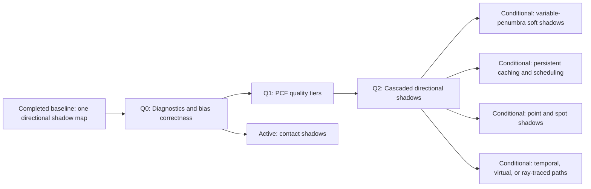

# Shadow System Evolution Roadmap

Summary: Evolve the first directional shadow-map path into a stable, scalable production shadow system with diagnosable bias, filtered edges, and camera-range resolution.

Last reviewed: 2026-08-15

Status: Completed
Completed: 2026-08-14

## Current Status

The completed
[Directional Shadow Pipeline Plan](../Plans/Archive/2026-08/DirectionalShadowPipeline.md)
established the first production shadow path. The selected directional light
renders Opaque and Masked StaticMesh, SplineMesh, SkeletalMesh, and Terrain
casters into one reusable 2048x2048 D32 map, and the shared forward-lighting
path samples that map for every supported view family. Resource recovery,
multi-view isolation, explicit transitions, texel stabilization, off-camera
caster discovery, deformation, diagnostics, and the fully lit failure fallback
are already qualified.

Q0 is complete through the
[Directional Shadow Diagnostics And Bias Plan](../Plans/DirectionalShadowDiagnosticsAndBias.md).
The production tier now has per-view causal depth/coverage, receiver-before/
after-bias, texel-grid, contribution, and classification modes plus a bounded
texel/orientation bias policy. Its checked-in package retains fixed and
selected Lit captures, diagnostic evidence, exact disabled/Unlit references,
valid/defective modular controls, and sub-texel motion results. StaticMesh,
SplineMesh, SkeletalMesh, Terrain, Masked material, supported views, resource
recovery, shader ABI, full Debug build, and editor smoke are qualified.

Q1 is complete through the
[Directional Shadow PCF Quality Tiers Plan](../Plans/DirectionalShadowPCFQualityTiers.md).
Low, Medium, and High have exact immutable kernels, footprints, guards,
diagnostics, counters, fallbacks, complete Q0/Q1 capture parity, and target-GPU
evidence. The shadow-only frequency ratios are 0.837 for Medium/Low and 0.893
for High/Medium. Medium passes the dedicated motion gate at 51/76 pixels and
adds 768 ns median Scene Color over Low, so it is the production default. High
is retained as a bounded tier but rejected as default by its 487/563 motion
results. Low remains byte-identical, numeric zero, and the invalid/resource
fallback.

Q2 cascaded directional shadows is complete through the
[Cascaded Directional Shadows Plan](../Plans/CascadedDirectionalShadows.md).
Its frozen entry candidate is three 2048x2048 D32 array layers (48 MiB logical),
the existing 256-unit shadow distance, practical splits at lambda 0.65, bounded
10% transitions, independent caster discovery, and the selected Medium 3x3
tent with nine comparisons normally and eighteen during overlap. Stage 0 owns
the exact RHI/Vulkan layer contract, image and motion thresholds, backend bytes,
and target-GPU evidence. The array contract is validation-clean, logical and
backend bytes are 50,331,648, and the measured Medium combined increment over
SingleMap Medium is 12,608 ns against the 1,000,000 ns gate. Three cascades
with Medium are now the production default.
Screen-space contact shadows are active through the
[DirectionalContactShadows](../Plans/DirectionalContactShadows.md) plan.
Variable-penumbra filtering, persistent caching, local-light shadows, and
alternative representations remain conditional branches.

## Outcome

Deliver a directional shadow result that is visually stable under camera and
light motion, preserves contact across valid modular geometry, has controlled
and measurable edge filtering, and maintains useful resolution from the camera
near field through the authored shadow distance. The system must retain the
existing detached scene ownership, shared geometry/material participation,
multi-view isolation, recoverable resource lifetime, and unshadowed fallback.

The required program ends with one qualified default directional-shadow tier
and bounded lower/higher tiers whose image quality, GPU time, and target bytes
are observable. It also leaves explicit activation gates for shadow features
that require different scheduling, visibility, history, or light-selection
contracts instead of treating them as implicit extensions of the first map.

## Scope

- Diagnostic views and counters that distinguish shadow-map coverage holes,
  receiver-comparison errors, excessive bias, insufficient filtering, cascade
  transitions, and authored geometry gaps.
- A texel-scale-aware directional bias model covering raster depth bias,
  receiver comparison bias, normal offset, grazing angles, and bounded failure
  behavior.
- Stable percentage-closer filtering quality tiers with explicit kernel,
  texture-sample, guard-band, and performance contracts.
- Cascaded directional shadow maps with camera-relative splits, independent
  fitting and stabilization, conservative caster selection, cascade blending,
  and per-cascade diagnostics.
- Opaque and Masked StaticMesh, SplineMesh, SkeletalMesh, and Terrain parity
  through their existing vertex and material contracts.
- Main, auxiliary, preview, present, offscreen, fixed-aspect, Lit/Unlit,
  Solid/Wireframe, post-process, and editor-assistance compatibility.
- Target-GPU image, memory, GPU-time, motion-stability, recovery, and Vulkan
  qualification for every selected production tier.
- Evidence gates for optional contact, soft-shadow, caching, local-light,
  temporal, virtualized, or ray-traced extensions.

## Non-Goals

- Treating a larger single shadow texture as the complete solution to camera-
  range resolution or seam leakage.
- Hiding invalid mesh gaps, T-junctions, inconsistent deformation, or broken
  material coverage solely through filtering or bias. Asset/build validation
  remains responsible for real geometry defects once diagnostics identify them.
- Requiring point-light, spot-light, translucent, colored, dithered, or
  opacity-weighted shadow casting to complete the directional-quality program.
- Selecting variance, exponential-variance, moment, virtual, or ray-traced
  shadows before a named product requirement and artifact/performance evidence
  justify their distinct failure modes and platform costs.
- Introducing a Render Graph, deferred renderer, clustered lighting, temporal
  history, asynchronous compute, or a public pass registry solely for this
  roadmap.
- Duplicating scene primitives, materials, vertex factories, deformation,
  visibility ownership, or forward-light evaluation in a shadow-only system.
- Freezing user-facing editor controls or a global graphics-settings UX before
  production quality tiers and their budgets have been qualified.

## Program Decisions and Invariants

### Correctness precedes softness

- Q0 classifies each visible artifact before Q1 widens filtering. A white gap
  in shadow depth, a continuous map with a failed receiver comparison, an
  over-biased detached edge, and a real base-geometry opening are different
  failures and must not share one undiagnosed tuning response.
- Bias values are expressed from stable physical inputs, including shadow
  texel world size and surface/light orientation. One global receiver-depth
  constant is not the lasting production policy.
- Raster bias, receiver comparison bias, and normal offset have separate named
  responsibilities and bounded ranges. A child plan must prevent their effects
  from silently accumulating into excessive peter-panning.
- Valid modular surfaces that share the same authored boundary must not expose
  light through that boundary in the qualification fixtures. Invalid geometry
  discovered by the diagnostic path is reported to the owning asset/build
  workflow rather than concealed by an unbounded shadow heuristic.

### Filtering is stable and quality-tiered

- Percentage-closer filtering averages comparison results; it does not filter
  raw depth and does not redefine caster coverage. Kernel offsets derive from
  exact shadow texel dimensions.
- The first wider-filter candidate is a deterministic 3x3 tent kernel. A 5x5
  or optimized equivalent may become the high tier only after measured image
  and target-GPU evidence. The current single hardware-linear comparison
  remains a valid low/fallback tier.
- Per-frame rotated or stochastic kernels do not become a production default
  until a temporal-history owner and motion-stability acceptance contract
  exist. In the current FXAA-oriented renderer, temporal shimmer is a rejection
  condition rather than an acceptable replacement for spatial aliasing.
- The fitting guard band, atlas/array boundaries, and out-of-range fully lit
  behavior account for the maximum selected filter footprint.

### Cascades own camera-range resolution

- Q2 solves near/far texel allocation with cascades rather than an ever-larger
  single map. The entry candidate is three stabilized cascades; the child plan
  freezes exact split count, resolutions, practical-split parameter, and shadow
  distance only after memory and target-GPU candidates are recorded.
- Each cascade derives from the fitted scene view, has independent conservative
  caster discovery and texel snapping, and never reuses camera visibility as
  caster visibility.
- Cascade selection is deterministic. Neighboring cascades overlap and blend
  across a bounded transition region so that split movement does not expose a
  hard lighting seam.
- Bias and filter footprints scale per cascade from that cascade's texel world
  size. One near-cascade tuning value is not copied blindly to the far cascade.
- Texture arrays are preferred when the selected RHI/Vulkan layer-view and
  attachment contract is complete. An atlas remains a valid child-plan choice
  only with explicit tile guards, viewport/scissor isolation, and no cross-tile
  filtering.

### Ownership, participation, and failure remain shared

- `FDirectionalShadowRenderer` remains the private feature owner unless a
  selected local-light or scheduling plan proves a broader owner necessary.
  Cascades extend one per-view directional-shadow value; they do not introduce
  process-global mutable camera state.
- Shadow-depth preparation continues to consume authoritative SceneInfo
  collections, shared material snapshots, and existing vertex deformation.
  Base and shadow passes must agree on masked coverage and geometry position.
- Every quality tier preserves complete descriptor bindings and a fully lit
  fallback. Failure of one cascade or an optional contact/softness feature
  cannot make an otherwise valid Scene Color pass fail or sample stale state.
- Sequential views regenerate or consume only contents owned by that view's
  published shadow state. Any later persistent cache is keyed by stable scene,
  light, caster, and view facts, never texture dimensions alone.
- Ordinary rendering, resize, invalidation, retry, and shutdown introduce no
  whole-device `WaitIdle`, command-list flush, or hidden component/asset read.

### Budgets are evidence, not nominal settings

- Each candidate records logical texture bytes, backend allocation bytes,
  shadow-depth GPU time, Scene Color sampling increment, draw/triangle counts,
  filter samples, failed/retried frames, and the exact measurement fixture.
- The GTX 1060 6GB remains the continuity target for comparison with the first
  pipeline qualification until a child plan records a replacement product
  target. Each child plan freezes its own incremental GPU and memory gates
  before implementation changes the production default.
- A tier cannot become default because it has a familiar resolution or cascade
  count. It must pass fixed-camera image comparisons, motion captures, memory
  limits, and target-GPU timing against the immediately preceding tier.

## Current Foundations and Gaps

| Area | Existing foundation | Evolution gap |
| --- | --- | --- |
| Feature ownership | One private `FDirectionalShadowRenderer` owns target, views, sampler, shaders, PSOs, failure state, retry, invalidation, and release. | No atomic multi-cascade resource record or partial-layer failure policy exists. |
| View fitting | Camera-relative receiver fitting, 256-unit clamp, conservative caster extrusion, two-texel guard, and whole-texel XY stabilization are qualified. | One projection distributes 2048 texels over the whole receiver volume; no split/blend contract exists. |
| Bias | Q0 derives bounded raster, receiver, and normal-offset terms from texel world size and production surface/light orientation. | Q2 must apply the same contract independently per cascade. |
| Filtering | Exact Low/Medium/High PCF tiers, footprints, guards, diagnostics, and counters exist; Medium is the selected default. | Selection and blending must apply the chosen tier independently per cascade without cross-layer samples. |
| Casters | Opaque/Masked StaticMesh, SplineMesh, SkeletalMesh, and Terrain reuse production visibility inputs, material coverage, deformation, culling, and LOD rules; Q0 adds valid/defective seam evidence. | Q2 must conserve the same caster meaning independently per cascade. |
| Receivers | One shared Slang helper consumes production position/normal, applies the Q0 bias policy, attenuates only selected directional direct lighting, and emits causal diagnostics. | The helper has no cascade selection or blending. |
| RHI/Vulkan | D32 attachments, exact sampled views, comparison samplers, depth bias, transitions, and recorded-resource retention are available. | Array-layer attachment/view support or guarded atlas policy must be selected and qualified before Q2. |
| Diagnostics | Q0/Q1 provide immutable coverage, comparison, bias, classification, filter-footprint, tap-validity, and tier-difference evidence. | Q2 adds cascade index, transition weight, per-layer coverage, split, and candidate-difference diagnostics. |
| Performance | Q1 Medium records 16 MiB, 12,640 ns Scene Color, 10,240 ns Shadow Depth, and zero failed measured frames on its RTX 3090 fixture. | Three maps need exact logical/backend bytes, per-layer depth cost, overlap sampling cost, and a selected production budget. |

## Milestone Map

| Milestone | Requirement | Proposed child plan | Dependencies | Deliverable | Entry gate | Exit gate |
| --- | --- | --- | --- | --- | --- | --- |
| Q0: Diagnostics and bias correctness | Completed 2026-08-13 | `DirectionalShadowDiagnosticsAndBias` | Completed `DirectionalShadowPipeline`; current depth/bias RHI | Visual shadow-depth, comparison-error, coverage, texel-grid, and bias diagnostics; representative artifact fixtures; texel-scale-aware bounded bias model shared by all receivers. | Passed: named valid/defective, acne, contact, Masked, grazing, and motion entry evidence was frozen before defaults changed. | Passed: selected captures, exact fallbacks, geometry/view parity, motion, recovery, memory, timing, builds, and smoke meet the completed child-plan gate. |
| Q1: PCF quality tiers | Completed 2026-08-14; Medium selected, High rejected by motion | [DirectionalShadowPCFQualityTiers](../Plans/DirectionalShadowPCFQualityTiers.md) | Completed Q0 bias/diagnostic contract | Deterministic low/medium/high directional filtering candidates, exact kernel/guard metadata, shared sampling helper, counters, image fixtures, and a selected default tier. | Passed by Q0 causal classification; Stage 0 froze the 1-sample-linear, 3x3 tent, literal 5x5 tent, guards, image/motion metrics, and RTX 3090 GPU budgets without changing Low. | Passed: Medium reduces shadow-only high-frequency energy, passes motion/correctness/performance and is default; High is bounded but rejected by motion; Low and failure output remain exact and fully bound. |
| Q2: Cascaded directional shadows | Completed 2026-08-14 | [CascadedDirectionalShadows](../Plans/CascadedDirectionalShadows.md) | Q0-Q1; selected RHI texture-array contract | Three camera-relative cascades with deterministic splitting, independent fitting/stabilization/culling, array ownership, selection/blending, diagnostics, quality-tier integration, and qualified default budgets. | Passed: three 2048 D32 layers, 50,331,648 logical/backend bytes, lambda-0.65 practical splits, 256-unit maximum distance, 10% overlap, Medium's 1.5-texel footprint/two-texel guard, independent casters, exact Vulkan layer views, and RTX 3090 memory/time gates are frozen. | Passed: split/selection goldens, three-layer Vulkan captures, caster families, supported views, retry/reload, sequential-view isolation, 50,331,648 bytes, and a 12,608 ns combined increment all pass; ThreeCascades Medium is the default. |

Q0 through Q2 are the required roadmap. Each is implemented through a bounded
child plan created only when its entry gate is satisfied. A child plan may
tighten or reject a candidate after recording evidence, but it must preserve
the milestone outcome or revise this roadmap before selecting a materially
different path.

## Child Plan Boundaries

### `DirectionalShadowDiagnosticsAndBias`

This plan owns the artifact taxonomy, deterministic scenes/captures, shadow
debug visualizations, per-contribution bias diagnostics, and the first texel-
scale-aware bias equation. It may add the minimum normal data required by the
shared forward shadow helper and the minimum development/editor controls needed
to compare candidates. It does not add cascades, broaden the production filter,
repair source meshes, or turn diagnostic controls into a user-facing settings
system.

Its core proof is causal: each test must identify whether the observed result
originates in shadow-depth coverage, receiver comparison, bias displacement,
filter footprint, or authored geometry. The plan must qualify both successful
valid seams and intentionally defective controls so that a visually convenient
but incorrect over-bias cannot pass.

### `DirectionalShadowPCFQualityTiers`

This plan owns wider comparison-filter kernels, exact texel offsets and weights,
guard-band changes, shader ABI additions, quality identity, sampling counters,
and per-tier image/performance qualification. It reuses Q0's bias and fixtures.
It does not add cascade selection, stochastic temporal filtering, blocker
search, variable penumbrae, or replace comparison depth with moment-based
representations.

The child plan may select an optimized kernel with fewer instructions or
hardware comparisons than the nominal square kernel only when its effective
footprint and image acceptance are explicit. “3x3” or “5x5” is not accepted as
a proxy for the actual sample count or measured cost.

### `CascadedDirectionalShadows`

This plan owns cascade count/resolution candidates, practical split policy,
per-cascade fitting and stabilization, caster classification, texture array or
atlas resources, pass recording, receiver selection/blending, per-cascade bias
and filter scale, lifetime, counters, and target qualification. It extends the
existing directional feature owner and shared geometry preparation rather than
creating one renderer per cascade.

Point/spot scheduling, persistent caching, screen-space contact rays, temporal
history, virtual pages, ray tracing, and user-facing graphics menus remain
outside this child plan. The plan may expose an internal immutable quality
candidate for tests and profiling, while lasting public/configuration policy is
selected only from qualified tiers.

### Conditional branches

| Branch | Proposed child plan | Activation evidence | Boundary |
| --- | --- | --- | --- |
| Screen-space contact shadows | [DirectionalContactShadows](../Plans/DirectionalContactShadows.md) | Activated 2026-08-15; Q0/Q2 captures show short-range contact loss from necessary bias after valid geometry and cascade resolution are ruled out; scene depth and target-GPU cost support bounded ray marching. | Supplements only the near-field selected directional result; cannot represent off-screen casters or repair geometry gaps; owns explicit maximum world/screen distance and failure fallback. |
| Variable-penumbra directional softness | `DirectionalShadowPCSS` | A product lighting requirement supplies source angular size, desired penumbra behavior, representative blocker/receiver scenes, and budget beyond Q1 PCF. | Owns blocker search and variable kernel; builds on Q2 and does not change caster visibility or cascade ownership. |
| Persistent shadow caching and scheduling | `ShadowCacheAndScheduling` | Shadow-depth profiling, static-scene captures, or multi-view workloads show regeneration cost is material; stable scene/light/caster revision facts are available. | Cache keys include scene, light, caster/material/deformation, quality, and view/cascade facts; no stale cross-view contents or dimension-only identity. |
| Point and spot shadows | `LocalLightShadowScheduling` | A product scene specifies shadowed light counts, ranges, update frequency, selection priority, atlas/cube memory, and target-GPU budget. | Extends renderer-owned light snapshots and bounded selection; does not let arbitrary visible lights allocate unbounded maps. Point cube maps and spot projections retain distinct fitting tests. |
| Translucent or colored shadowing | `TranslucentShadowRepresentation` | Material/art direction defines opacity, color transmission, sorting/composition, and target-platform cost. | Does not overload the current opaque comparison map with undefined blending; selects a representation and pass policy explicitly. |
| Temporal shadow filtering | `TemporalShadowFiltering` | A stable per-view history owner exists and Q1/Q2 evidence shows spatial filtering cannot meet quality within budget. | Owns reprojection, disocclusion, reset, jitter, and view identity; camera cuts and failed history remain correct without stale shadows. |
| Moment/variance representation | `MomentShadowMaps` | Wide-filter performance or quality evidence justifies representation change and light-bleeding controls have acceptance fixtures. | Replacement/additional representation owns precision, blur passes, transition/storage, and quantified light bleeding; not selected merely because it is filterable. |
| Virtual or ray-traced shadows | Separate product/platform plan | World scale, geometry density, hardware targets, acceleration/page ownership, fallback platforms, and memory/performance goals are concrete. | May replace rather than extend Q2; must preserve material/deformation meaning and define coexistence/retirement of raster tiers. |

## Program Validation Matrix

| Contract | Required milestones | Validation outcome |
| --- | --- | --- |
| Artifact classification | Q0-Q2 | Debug outputs distinguish missing caster depth, receiver/bias failure, filter footprint, cascade selection, and authored geometry; intentionally defective controls cannot pass as valid seams. |
| Bias correctness | Q0-Q2 | Horizontal, vertical, sloped, grazing, thin, mirrored, two-sided, masked, skinned, spline-deformed, terrain, and modular coincident surfaces meet frozen acne, leak, and detachment tolerances at representative scales. |
| Filtering | Q1-Q2 | Kernel weights/offsets and comparison direction have CPU/shader or image proof; border and maximum-footprint samples remain fully lit outside valid coverage and never cross an atlas tile. |
| Cascade fitting | Q2 | Perspective/orthographic views, split boundaries, practical-split goldens, guard bands, per-cascade snapping, camera/light motion, far-distance clamp, and degenerate matrices are deterministic. |
| Caster conservation | Q0-Q2 | Submitted, hidden, culled, invalid-bounds, selected-family, prepared, resource, draw, and triangle counts reconcile independently per cascade without reusing camera visibility. |
| Material and deformation parity | Q0-Q2 | Opaque/Masked StaticMesh, SplineMesh, SkeletalMesh, and Terrain positions and mask thresholds agree between shadow and base passes for every tier/cascade. |
| View isolation | Q0-Q2 | Main, auxiliary, preview, present, offscreen, fixed-aspect, post-process, and editor-assistance sequences cannot consume another view's matrix, cascade, target region, or diagnostic state. |
| Motion stability | Q0-Q2 | Sub-texel camera translation, rotation, split crossing, light-direction changes, animation, and resize captures stay within frozen shimmer/popping thresholds. |
| Failure and lifetime | Q0-Q2 | Partial target/view/sampler/shader/PSO failure, retry, reload, device invalidation, scene release, and shutdown retain complete descriptors, recorded resources, and an unshadowed fallback without whole-device waits. |
| Memory and performance | Q1-Q2 | Logical/backend bytes, pass and sampling GPU medians, filter samples, cascade draws, warm-up, rejected frames, and enabled-minus-previous-tier deltas pass each child plan's frozen target fixture. |
| Handoff qualification | Q0-Q2 | Follow repository build/test guidance; focused math/shader/RHI/Vulkan/image coverage, required builds, validation layers, and editor smoke pass before a tier becomes the production default. |

## Risks and Control Gates

| Risk | Control gate |
| --- | --- |
| Increasing map resolution or filter width hides symptoms without identifying seam cause. | Q0 completes causal diagnostics and valid/invalid controls before Q1 or Q2 changes the production image. |
| Bias tuned for one scene causes acne at another scale or detached shadows in a farther cascade. | Q0 derives bounded terms from texel scale/orientation; Q2 qualifies the same policy independently per cascade and geometry family. |
| Wider PCF turns aliasing into unstable noise or causes border/tile light changes. | Q1 starts with deterministic tent filtering, freezes maximum footprint, expands guards, and rejects motion shimmer or cross-boundary samples. |
| Cascades multiply memory, draw submission, and descriptor state without a default-tier budget. | Q2 freezes resource layout, logical/backend bytes, per-cascade counters, and target-GPU gates before implementation. |
| Cascade transitions remain visible despite locally sharp maps. | Q2 requires bounded overlap/blending and moving-camera split-crossing captures, not only static screenshots. |
| Caster preparation is copied per cascade and diverges across Static/Spline/Skeletal/Terrain paths. | Q2 extends common immutable prepared-shadow records and asserts family/material/deformation parity and conserved outcomes. |
| Contact shadows conceal bad geometry or become a second general shadow system. | The branch activates only after Q0 classification and remains a bounded near-field screen-space supplement with explicit limitations. |
| A local-light feature allocates a map for every light and destabilizes frame cost. | `LocalLightShadowScheduling` requires authored counts, deterministic priority, memory/update budgets, and a bounded selected set before activation. |
| Persistent caching returns stale animated, material, light, or cross-view contents. | Cache work waits for stable revision facts and qualifies invalidation by scene/light/caster/material/deformation/quality/view identity. |
| Advanced representations are adopted for feature prestige rather than a measured gap. | Every conditional representation requires named artifacts, target hardware, budgets, fallback behavior, and comparison against the qualified Q2 raster tier. |

## Completion Criteria

- Q0 through Q2 pass their exit gates in independently executable and reviewed
  child plans.
- The production default uses a documented texel-scale-aware bias model and
  has no unexplained light leaks in valid modular-geometry fixtures.
- Low, selected-default, and any high directional filter tiers have exact
  kernel/sample, image, motion, GPU-time, and fallback contracts.
- The selected cascaded tier provides qualified near/mid/far detail without
  visible hard split seams, unacceptable shimmer, cross-layer/tile sampling,
  or stale multi-view state.
- StaticMesh, SplineMesh, SkeletalMesh, and Terrain retain shared Opaque/Masked
  caster and receiver meaning through all required tiers.
- Logical/backend target memory, shadow-depth and Scene Color GPU cost, draws,
  triangles, samples, failures, and retries are observable per view/cascade.
- Required build, focused test, Vulkan validation, image, target-GPU, and editor
  smoke qualification pass for the selected default.
- Every conditional branch is either completed, linked to an active child plan,
  or explicitly deferred with its activation evidence reviewed.
- Lasting behavior moves to Runtime Rendering documentation; this roadmap no
  longer remains the sole source for an implemented shadow contract.

## Related Documentation

- [Directional Shadow Pipeline Plan](../Plans/Archive/2026-08/DirectionalShadowPipeline.md)
- [Directional Shadow PCF Quality Tiers Plan](../Plans/DirectionalShadowPCFQualityTiers.md)
- [Directional Shadows](../Runtime/Rendering/DirectionalShadows.md)
- [Rendering Capability Expansion Roadmap](Archive/2026-08/RenderingCapabilityExpansion.md)
- [Viewport Rendering](../Runtime/Rendering/ViewportRendering.md)
- [Static Mesh Rendering](../Runtime/Rendering/StaticMeshRendering.md)
- [Skeletal Mesh Rendering](../Runtime/Rendering/SkeletalMeshRendering.md)
- [Terrain Rendering](../Runtime/Rendering/TerrainRendering.md)
- [RHI Resource Views and Transfers](../Runtime/Rendering/RHIResourceViewsAndTransfers.md)
- [RHI Resource Transitions](../Runtime/Rendering/RHIResourceTransitions.md)
- [RHI Diagnostics and Conformance](../Runtime/Rendering/RHIDiagnosticsAndConformance.md)
- [Agent Build and Run Workflow](../Agents/BuildAndRun.md)
- [Agent Testing Workflow](../Agents/Testing.md)

## Related Code

- `Engine/Source/Runtime/Renderer/Private/Renderers/DirectionalShadowRenderer.h`
- `Engine/Source/Runtime/Renderer/Private/Renderers/DirectionalShadowRenderer.cpp`
- `Engine/Source/Runtime/Renderer/Private/Renderers/DirectionalShadowView.h`
- `Engine/Source/Runtime/Renderer/Private/Renderers/DirectionalShadowView.cpp`
- `Engine/Source/Runtime/Renderer/Private/Renderers/SceneRenderer.cpp`
- `Engine/Source/Runtime/Renderer/Private/Renderers/ForwardLighting.h`
- `Engine/Source/Runtime/Renderer/Private/Renderers/ForwardLighting.cpp`
- `Engine/Source/Runtime/Renderer/Private/Renderers/StaticMeshRenderer.cpp`
- `Engine/Source/Runtime/Renderer/Private/Renderers/SkeletalMeshRenderer.cpp`
- `Engine/Source/Runtime/Renderer/Private/Renderers/TerrainRenderer.cpp`
- `Engine/Source/Runtime/RHI/Public/RHIResources.h`
- `Engine/Source/Runtime/VulkanRHI/Private/VulkanPipeline.cpp`
- `Engine/Shaders/Slang/Lighting/DirectionalShadow.slang`
- `Engine/Shaders/Slang/StaticMeshBasePass.slang`
