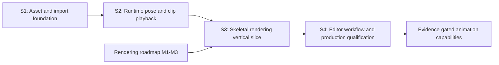

# Skeletal Mesh and Animation Roadmap

Summary: Establish skeletal assets, deterministic source ingestion, runtime pose evaluation, GPU skinning, and production editor workflows through just-in-time implementation plans.

Last reviewed: 2026-08-09

Status: Active
Completed:

## Current Status

Durin has no skeletal runtime asset, animation clip asset, pose evaluator,
skinned vertex factory, skeletal component, or skeletal scene proxy. The
current Scene source workflow imports glTF and FBX as static geometry,
materials, and textures. Its shared geometry adapter recursively accumulates
node transforms and bakes them into vertex data; the normalized scene result
does not retain nodes, skins, joint weights, inverse-bind matrices, or animation
channels.

The surrounding infrastructure is suitable for a bounded skeletal program.
The provider-neutral import framework already owns immutable source capture,
asynchronous value-only preparation, candidate validation, failure-atomic
publication, import records, and reimport reconciliation. AssetCore and Engine
already provide authored packages, disposable DDC objects, cooked bulk
payloads, transactional runtime decode, and runtime-only dependency closure.
Core math supplies transforms, matrices, and quaternions. StaticMesh proves the
material-slot, render-data, resource-invalidation, SceneProxy, and component
lifecycle patterns that a skeletal path can reuse without inheriting its
static-geometry assumptions.

The first child completed on 2026-08-08 through the
[Skeletal Asset and Import Foundation Plan](../Plans/Archive/2026-08/SkeletalAssetAndImportFoundation.md).
It owns the initial asset graph, glTF skeletal normalization, provider outputs,
derived/cooked payloads, and non-rendering validation. The S2 entry gate is
satisfied for planning, but no skeletal child plan is active; S2 remains the
next ready skeletal child when that program is selected. Later child plans will
be authored only when their entry gates are reached, they are selected as
active work, and the then-current runtime and renderer contracts can be
inspected.

Skeletal rendering is also the default second production primitive in the
[Rendering Capability Expansion Roadmap](RenderingCapabilityExpansion.md).
That roadmap owns the shared scene, pass, visibility, material, and shadow
contracts. This roadmap owns skeletal data, pose, playback, and product
behavior. The eventual skeletal-rendering plan is one shared child of both
roadmaps rather than two competing implementations.

## Outcome

Durin can import a supported glTF skeletal scene into independent runtime
assets, cook and load those assets without editor/import dependencies, evaluate
animation clips deterministically, publish immutable skinning state to the
rendering thread, and render the animated mesh through the ordinary scene,
material, pass, visibility, viewport, invalidation, and shadow contracts.

The required program delivers:

- stable Skeleton, SkeletalMesh, and AnimationClip asset identities;
- deterministic glTF joint, bind-pose, influence, and animation normalization;
- transactional editor import, reimport, DDC, cook, and runtime load behavior;
- a bounded runtime pose and clip-playback contract;
- GPU linear-blend skinning through the shared renderer architecture; and
- editor inspection, preview, diagnostics, and end-to-end qualification.

Advanced animation authoring and character-control systems remain conditional.
They are activated by a named gameplay or production requirement after the
import, playback, and rendering baseline is measured.

## Scope

- Runtime asset schemas and compatibility identities for skeletons, skeletal
  meshes, and animation clips.
- glTF 2.0 nodes, skins, inverse-bind matrices, vertex influences, and
  translation/rotation/scale animation channels for the selected initial
  subset.
- Provider-neutral planning, multi-output Scene import, reimport
  reconciliation, typed candidate exchange, diagnostics, and cancellation.
- Deterministic derived-data and cooked-payload codecs for large skeletal mesh
  and animation data.
- Pose representation, clip sampling, local-to-component transform evaluation,
  and immutable game-to-render publication.
- A skinning vertex factory, bone-palette resources, skeletal SceneProxy and
  SceneInfo participation, dynamic/conservative bounds, materials, passes, and
  shadows.
- Content Browser and inspector identity, source/reimport status, skeleton and
  clip inspection, animation preview, and failure diagnostics.

## Non-Goals

- Replacing Assimp or changing accepted StaticMesh outputs as a prerequisite.
- Supporting every glTF extension or arbitrary DCC-specific FBX behavior in the
  first source contract.
- CPU skinning as a permanent second production rendering path.
- Animation graphs, blend trees, state machines, inverse kinematics, motion
  matching, control rigs, or in-editor keyframe authoring in the required
  baseline.
- General cross-skeleton retargeting, humanoid semantics, root motion, or
  gameplay notifies before a concrete consumer defines their contracts.
- Compute skinning, mesh shaders, GPU-driven animation, animation streaming, or
  crowd-specific palette sharing before profiling justifies them.
- A skeletal-only renderer, viewport, material system, resource coordinator,
  or scene-mutation path.

## Program Decisions and Invariants

### Domain ownership

| Concern | Owner | Lasting rule |
| --- | --- | --- |
| Source capture, generic planning, cancellation, candidates, records, and publication | `AssetImportCore` | Skeletal import uses the existing provider-neutral transaction; no skeletal transaction framework is introduced. |
| glTF skeletal parsing, normalized source values, output policy, and diagnostics | `StandardAssetImport` | Source schema and third-party types remain editor-only. |
| Skeleton, SkeletalMesh, AnimationClip, payload codecs, cook contributions, and runtime validation | `Engine` | Runtime assets contain no Assimp, provider, import-record, source-reader, or physical DDC dependency. |
| Pose evaluation and playback | `Engine` | Game/runtime code owns mutable playback state; assets remain immutable inputs. |
| SceneInfo, skinning shaders, palette resources, pass participation, and draw submission | `Renderer` | Skeletal rendering reuses shared renderer contracts and reads no reflected object on the rendering thread. |
| Backend buffer, descriptor, pipeline, and synchronization mechanics | `RHI` and `VulkanRHI` | Backend expansion occurs only for a capability the selected skinning path proves is missing. |

### Asset graph and compatibility

- Skeleton is an independent runtime asset containing the canonical parent-
  before-child reference hierarchy and stable compatibility identity.
- SkeletalMesh references one Skeleton and owns mesh-specific inverse-bind data
  aligned with its skin palette. It does not make the Skeleton own geometry or
  material state.
- AnimationClip references one compatible Skeleton and owns tracks aligned by
  stable skeletal identity rather than by an unchecked source-node name.
- Scene import outputs are peer assets managed by one editor-only import record.
  Runtime references such as SkeletalMesh-to-Skeleton and
  AnimationClip-to-Skeleton are genuine runtime dependencies; the import record
  is not.
- Compatibility is structural and deterministic. Name coincidence alone never
  permits a clip to drive an unrelated skeleton.
- Reimport preserves authored output identities through provider reconciliation
  and reports removed outputs as orphans. It never silently deletes, adopts, or
  redirects an occupied output.

### Source and transform semantics

- The initial production source is a bounded glTF 2.0 subset. FBX skeletal
  import is a later compatibility milestone and does not weaken the glTF
  contract.
- Skeletal glTF accessors, nodes, skins, weights, and animation channels are
  decoded through a format-owned normalized path. Joint/weight correspondence
  does not rely on Assimp geometry reordering or the static path's baked-node
  transforms.
- Joint local reference transforms, mesh bind space, inverse-bind matrices,
  and animation local transforms use one documented Durin-space convention.
  Source-to-engine conversion is applied coherently to the full relationship;
  it is not applied independently to vertices while leaving joints or tracks in
  source space.
- Parent indices precede children. Every matrix, transform, time, weight, and
  bound is finite before a candidate can be published.
- The initial runtime path uses at most four normalized influences per vertex.
  Zero-weight removal, duplicate-joint merging, normalization, and tie-breaking
  are deterministic and diagnosed where lossy normalization occurs.

### Runtime and thread ownership

- Authored assets and decoded runtime payloads are immutable playback inputs.
  A component or future animation instance owns time, looping, blend state, and
  the mutable current pose.
- Source capture, parsing, normalization, payload construction, hashing, and
  validation may run on workers using value-only state. `DObject`, package,
  registry, render-resource, and RHI mutation remains on its owning thread.
- Pose evaluation publishes a complete immutable palette candidate. The
  rendering thread never traverses Skeleton, AnimationClip, component, actor,
  or other reflected state.
- Ordinary ordered palette updates use the established render-command ordering.
  Revisions are added only when a later plan proves independently reordered or
  stale work.
- Asset decode, import, reimport, pose publication, render-resource creation,
  and device invalidation are complete-or-null transitions. Failure retains the
  previous valid authored or runtime state.

### Just-in-time planning

- Only the plan for the current milestone is authored in advance. A future
  milestone row defines outcome and gates, not its implementation stages.
- Before a future child plan is written, its entry gate is revalidated against
  current code, active-plan handoffs, payload schemas, RHI capabilities, and
  renderer ownership.
- If a milestone's product requirement changes, update this roadmap before
  selecting its plan. Do not preserve a speculative child-plan design merely
  because it appeared in an earlier roadmap revision.

## Current Foundations and Gaps

| Area | Reusable foundation | Gap owned by this program |
| --- | --- | --- |
| Import framework | Immutable snapshots, provider discovery, async CPU preparation, candidates, records, reconciliation, atomic publication, and stable skeletal peer graphs | Runtime playback has no component/animation-instance owner |
| Source adapters | Direct bounded glTF/GLB skeletal decoding plus the unchanged Assimp-backed static Scene workflow | FBX skeletal import remains evidence-gated; S2 consumes runtime assets and does not extend source formats |
| Assets and storage | Validated Skeleton, SkeletalMesh, and AnimationClip packages, hard compatibility relationships, DSKM/DANM DDC objects, DBLK cook, and runtime-only load | No runtime pose, sampler, clock, loop policy, or immutable palette candidate |
| Math | Frozen glTF-to-Durin basis conversion, canonical reference transforms, compatibility encoding, and transform goldens | S2 must select pose composition, sampling edge cases, and palette publication contracts |
| Components and scene | Primitive components, ordered render-state recreation, SceneProxy lifecycle | No skeletal component, animation instance, palette publication, skeletal proxy, or dynamic bounds |
| Rendering | Static vertex factory, PBR material slots, resource coordination, viewport paths | No joint/weight streams, skinning shader, palette binding, pass participation, or shadow participation |
| Validation | Repository-authored skeletal `.gltf`/`.glb` success and malformed corpus, normalized goldens, asset/payload/DDC/cook/runtime-only tests, plus existing rendering coverage | No sampled-pose goldens, palette lifetime coverage, or animated image baseline |

## Milestone Map

| Milestone | Requirement | Child-plan policy | Entry gate | Exit gate |
| --- | --- | --- | --- | --- |
| S1: Asset and import foundation | Completed 2026-08-08 | [Skeletal Asset and Import Foundation](../Plans/Archive/2026-08/SkeletalAssetAndImportFoundation.md) | Existing import, package, DDC, cook, math, and static-model behavior was recorded; the selected glTF fixture corpus did not change StaticMesh outputs. | Met: stable peer assets, deterministic bounded authored/DDC/cooked paths, runtime-only loading, and transactional structured failures are implemented and qualified below. |
| S2: Runtime pose and clip playback | Required; entry gate satisfied, plan authored when implementation starts | No plan yet | Met for planning: S1 schemas, compatibility, immutable payload access, transform convention, and fixture corpus are stable. Component/animation-instance ownership remains a required just-in-time decision. | One component/runtime owner samples supported clips deterministically, evaluates local-to-component poses, handles time/looping, rejects incompatible clips, and publishes a bounded immutable palette candidate without rendering-thread object reads. |
| S3: Skeletal rendering vertical slice | Required; shared with Rendering M4; plan authored at entry | No plan yet | S1-S2 are stable; Rendering Capability Expansion M1-M3 have completed; the current RHI binding limits and shared pass/visibility APIs are measured; SkeletalMesh remains the selected second primitive family. | GPU-skinned SkeletalMesh shares scene mutation, materials, passes, visibility, viewport, invalidation, and applicable shadow behavior with StaticMesh; palette and bounds updates are deterministic and lifecycle-safe; Vulkan validation and animated image coverage pass. |
| S4: Editor workflow and production qualification | Required; plan authored at entry | No plan yet | S3 renders a representative animated asset and exposes stable inspection/playback seams; current Content Browser and inspector extension contracts are re-inspected. | Users can import/reimport, identify, inspect, preview, diagnose, cook, and run supported skeletal assets through documented workflows; representative engine/project fixtures pass full editor and runtime qualification. |

S3 is intentionally represented once. When its entry gate is reached, the new
child plan must be linked from both this roadmap and Rendering Capability
Expansion M4, with one plan status and one set of acceptance gates.

## S1 Completion Evidence and S2 Entry Re-inspection

S1 completed through the six staged commits recorded by the
[foundation plan](../Plans/Archive/2026-08/SkeletalAssetAndImportFoundation.md). The shipped
boundary consists of `DSkeleton`, `DSkeletalMesh`, `DAnimationClip`, structural
compatibility encoding version 1, direct bounded glTF normalization, stable
Scene-provider peer outputs, DSKM/DANM version-1 codecs and DDC keys, asset-level
cook publication, and transactional runtime-only loading. Repository-authored
data-URI `.gltf`, external-buffer `.gltf`, `.glb`, static-projection, and
malformed fixtures supply reproducible source evidence. Lasting contracts now
live in [Asset Data Lifecycle and Storage](../Runtime/Assets/AssetDataLifecycle.md)
and [Asset Import Framework](../Editor/Architecture/AssetImportFramework.md).

The S2 entry gate is satisfied for planning, but this does not authorize or
pre-design playback. Current world ticking traverses actor-owned components,
while render publication accepts detached candidates and forbids render-thread
reads of reflected objects. When S2 implementation actually starts, its new
plan must re-inspect those seams and choose one explicit owner for clip time,
loop/rate state, compatibility binding, local pose evaluation, and immutable
palette publication. It must also freeze sampling edge cases and pose goldens.
No S2 plan is created as part of S1 completion.

Final S1 qualification passed `CoreObjectTests`, AssetCore package/DDC/cook,
`AssetImportCoreTests`, the complete StandardAssetImport fixture corpus,
SkeletalAsset payload/cook/runtime tests in Debug Editor and Shipping Game,
StaticMesh regressions, Scene/editor workflow tests, and a full
`Win64-Debug-DurinEditor-Tests` `all` build. The Scene regression performs one
import and two unchanged reimports for both data-URI `.gltf` and `.glb`, while
comparing exact Skeleton, SkeletalMesh payload, AnimationClip payload, object,
record, and DDC-key stability. A separate lifecycle test performs two
byte-identical clean cooks of both imported graphs, deletes authored Engine/Game
content and DDC, then loads every skeletal mesh and clip through cooked-runtime
ownership.

## Evidence-Gated Follow-Ups

| Capability | Activation evidence | Required boundary |
| --- | --- | --- |
| FBX skeletal import | A named production source cannot use glTF and representative exporter fixtures define acceptable bind/animation semantics | A source-compatibility plan that preserves the normalized runtime contract and isolates DCC-specific diagnostics |
| Clip blending, layering, and state machines | A gameplay consumer requires transitions or simultaneous clips beyond single-clip playback | Runtime animation-instance ownership, deterministic blend semantics, update order, and debugging observability |
| Root motion and animation events | Character movement or gameplay event delivery names exact authority and frame-order requirements | Transform authority, extraction interval, looping, rollback/replay, and event delivery guarantees |
| Skeleton retargeting | Two named incompatible skeleton families must share authored motion | Explicit source/target rigs, semantic mapping, reference poses, scale policy, diagnostics, and offline/runtime ownership |
| IK or control rigs | A named gameplay/editor feature cannot be authored or evaluated through clip playback | Solver ownership, constraint ordering, iteration/error budgets, determinism, and editor/runtime split |
| Compute or cached skinning | Profiling shows vertex-shader skinning or repeated palette evaluation is a material bottleneck | Reuse the Compute Shader Pipeline roadmap and preserve an explicit fallback and synchronization contract |
| Animation streaming/compression | Measured clip memory, load latency, or install size exceeds a recorded budget | Independent codec, chunking, residency, cache, corruption, fallback, and platform-quality policies |

## Risks and Control Gates

| Risk | Control gate |
| --- | --- |
| Static and skeletal imports silently disagree about coordinates or geometry identity. | S1 freezes golden source-to-engine transforms and keeps skeletal decoding format-owned; existing StaticMesh fixtures remain unchanged. |
| Assimp mesh or node rewriting breaks joint/weight correspondence. | The initial glTF skeletal path decodes correspondence directly and never joins weights to geometry through count or declaration-order coincidence. |
| One plan absorbs import, playback, rendering, editor tooling, and advanced animation. | Each required milestone gets a child plan only at its entry gate; S1 contains no evaluator or renderer implementation. |
| Skeleton names are treated as compatibility. | Structural compatibility identity and explicit Skeleton references gate every mesh/clip relationship. |
| Large untrusted source counts cause overflow or excessive allocation. | Every source, normalized, payload, and runtime reader has explicit limits, checked arithmetic, complete consumption, and transactional publication. |
| The render thread reads assets or components to obtain the current pose. | S2 must publish a complete immutable palette candidate before S3 begins. |
| Skeletal rendering duplicates the frame renderer or bypasses pass/visibility work. | S3 cannot enter before Rendering M1-M3 and must be the shared Rendering M4 child. |
| Early schema choices prevent future compression or retargeting. | Authored schema, payload schema, builder version, compatibility identity, and target profile remain independent version axes. |
| Dynamic bounds either clip animation or disable useful culling. | S3 records the initial conservative/dynamic policy and validates representative extrema before enabling production culling. |

## Completion Criteria

- S1 through S4 have completed their independently reviewable child plans and
  all required gates.
- A supported glTF skeletal scene imports and reimports into stable independent
  assets with deterministic diagnostics and no silent StaticMesh behavior
  change.
- Authored, DDC, cooked package, and cooked bulk paths round-trip through their
  intended ownership, and a runtime-only target loads without source,
  `AssetImportCore`, `StandardAssetImport`, Assimp, or DDC fallback.
- A compatible AnimationClip produces deterministic poses and visible GPU
  deformation across looping, pause, rate, component transform, viewport, and
  resource-invalidation cases.
- SkeletalMesh reuses shared material, pass, visibility, scene, viewport,
  invalidation, and applicable shadow contracts without a parallel renderer.
- Import, playback, payload, palette, bounds, and rendering failures retain the
  previous valid state and expose asset-qualified diagnostics.
- Lasting implemented contracts have moved to their owning Runtime or Editor
  documentation, future conditional capabilities remain evidence-gated, and
  this roadmap no longer serves as the only specification of shipped behavior.

## Related Documentation

- [Skeletal Asset and Import Foundation Plan](../Plans/Archive/2026-08/SkeletalAssetAndImportFoundation.md)
- [Rendering Capability Expansion Roadmap](RenderingCapabilityExpansion.md)
- [Asset Import Framework](../Editor/Architecture/AssetImportFramework.md)
- [Asset Data Lifecycle and Storage](../Runtime/Assets/AssetDataLifecycle.md)
- [Asset Packages](../Runtime/Assets/AssetPackages.md)
- [Core Math](../Runtime/Core/Math.md)
- [Static Mesh Rendering](../Runtime/Rendering/StaticMeshRendering.md)
- [Viewport Rendering](../Runtime/Rendering/ViewportRendering.md)
- [Build and Run](../Development/Build/BuildAndRun.md)

## Related Code

- `Engine/Source/Editor/StandardAssetImport/Public/ImportedScene.h`
- `Engine/Source/Editor/StandardAssetImport/Private/GltfSceneAdapter.cpp`
- `Engine/Source/Editor/StandardAssetImport/Private/AssimpSceneGeometry.cpp`
- `Engine/Source/Editor/StandardAssetImport/Private/SceneImport.cpp`
- `Engine/Source/Runtime/Engine/Public/StaticMesh/StaticMesh.h`
- `Engine/Source/Runtime/Engine/Public/StaticMesh/StaticMeshResources.h`
- `Engine/Source/Runtime/Engine/Public/Engine/PrimitiveSceneProxy.h`
- `Engine/Source/Runtime/Renderer/Private/Renderers/StaticMeshRenderer.cpp`
