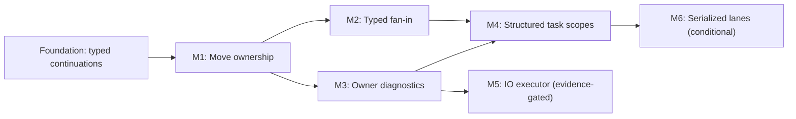

# Task System Evolution Roadmap

Summary: Evolve Durin's bounded task graph from shared typed continuations into ownership-complete, structured, observable asynchronous workflows without weakening subsystem or render/RHI boundaries.

Last reviewed: 2026-08-07

Status: Active
Completed:

## Current Status

The foundational [Task Continuations and Thread Dispatch](../Plans/TaskContinuationsAndThreadDispatch.md)
plan and M1 [Move-Only Tasks and Consuming Results](../Plans/MoveOnlyTasksAndConsumingResults.md)
are complete. Durin now has bounded worker execution, immutable shared typed
results, move-only callable admission, explicit unique result handles,
one-consumer Worker/GameThread sinks, checked retained-result bytes,
deterministic terminal diagnostics, and cross-executor shutdown. The Asset
Compatibility Audit remains the shared-result production pilot; AsyncImportCore
is the unique-result pilot and retains its owner/provider mailbox policy.

M2 typed fan-in and M3 owner diagnostics now satisfy their M1 entry gates.
Neither child plan is activated by this milestone; each receives a detailed
plan when selected as bounded repository work. Later milestones remain gated by
their named composition, attribution, production-owner, and measurement
evidence.

## Outcome

Durin subsystems can express bounded asynchronous workflows with the ownership
mode their data requires:

- immutable shared results for fan-out;
- unique results for exactly one move-consuming sink;
- typed fan-in for value composition;
- explicit owner scopes for admission, cancellation, shutdown, and diagnostics;
- aggregate measurements that justify any new executor or scheduling policy;
- domain mailboxes, serialized lanes, and render/RHI queues retained where
  their ordering and lifetime contracts are stronger than the generic graph.

The required roadmap improves the existing Worker and GameThread task graph.
IO execution and serialized lanes are conditional extensions. RenderThread,
RHIThread, fibers, coroutines, and work stealing are not implied by roadmap
completion.

## Scope

- Move-only task callable storage while preserving current source-compatible
  `std::function` entry points.
- Type-distinct unique result handles and one-consumer sink continuations.
- Typed shared-result fan-in with deterministic failure/cancellation outcomes.
- Owner attribution, aggregate queue/latency/execution diagnostics, and
  profiler flow correlation.
- Structured task scopes with explicit close, cancel, drain, and quiescence.
- Production pilots that retain subsystem-specific mailbox and lifecycle
  policy.
- Evidence gates for a bounded IO executor and a worker-backed serialized lane.
- Lasting contract updates under `Documentation/Runtime/Core/` as milestones
  complete.

## Non-Goals

- Replacing `LaunchTask`, `FTaskHandle`, void tasks, immutable shared results,
  or existing continuation APIs.
- Converting every subsystem mailbox into a continuation.
- Adding generic RenderThread or RHIThread task targets.
- Treating GameThread deferred work as frame-critical synchronization.
- Adding a native thread per task scope, serialized lane, or resource.
- Hard task termination, preemptive cancellation, or a promise that deadlines
  can interrupt blocking platform calls.
- Adopting fibers, coroutine-backed suspension, work stealing, Worker
  priorities, or asynchronous GPU compute without separate workload evidence.
- Allowing a roadmap milestone to bypass the engine-owned startup, frame pump,
  or cross-executor shutdown protocol.

## Program Decisions and Invariants

### Compatibility and ownership modes

- Existing void and shared typed APIs remain valid and retain their current
  semantics. New ownership modes are additive and type-distinct.
- Shared results remain immutable and fan-out capable. Unique results are
  move-only, admit exactly one consuming continuation, and expose no shared
  result observer.
- A unique-result consumer is a sink in the first milestone. General unique
  multi-stage result production is deferred until the sink contract and one
  production migration are validated.
- No API infers ownership from whether `T` is copyable. The caller selects
  shared or unique publication explicitly at launch.
- Callable ownership and result ownership are independent: a move-only
  callable may produce a shared result, a unique result, or no result.

### Graph and lifecycle

- Every continuation remains a graph node with its own handle, target,
  diagnostics, and terminal outcome. No named-target callback runs inline.
- Result claim, consumer registration, dispatch, cancellation, and terminal
  publication have deterministic single-winner state transitions.
- Root admission, internal continuation dispatch, GameThread pumping, and
  adapter teardown retain the existing cross-executor shutdown order.
- Structured scopes do not create scheduler lifetimes and do not hide blocking
  destruction. Owners close and quiesce them at explicit lifecycle boundaries.
- GameThread ordinary waits never pump `GameThreadDeferred` work.

### Bounds and domain ownership

- Every queue remains bounded by its owning contract. Unique results reachable
  from a deferred callback contribute declared retained bytes to GameThread
  admission rather than bypassing its payload bound.
- Core owns graph nodes, result-state transitions, generic targets, scope
  tracking, and task diagnostics. Subsystems own streaming, batching,
  latest-wins, provider admission, result-taking, and resource policy.
- RenderCore and the active RHI backend retain their command queues, callable
  contexts, fences, backpressure, and resource lifetime.
- A serialized lane, if justified, executes through bounded Worker capacity; it
  does not create a dedicated native thread.
- An IO executor, if justified, must define independent bounded admission,
  concurrency, cancellation limitations, shutdown, and workload ownership.

### Evidence before scheduling complexity

- Owner attribution and latency/execution distributions precede any decision to
  add IO scheduling, Worker priorities, work stealing, or suspension machinery.
- Conditional milestones require named production callers and profiler evidence
  showing that the existing Worker/continuation model is the limiting factor.
- Qualification numbers are environment baselines, not release guarantees.

## Current Foundations and Gaps

| Area | Existing foundation | Roadmap gap |
| --- | --- | --- |
| Callable ownership | Legacy aliases remain while forwarding launches and continuations erase one move-only callable through both executors. | Attribute retained callable storage to owners in M3. |
| Shared and unique results | `TTaskHandle<T>` supports immutable fan-out; `TUniqueTaskHandle<T>` admits exactly one consuming sink with declared retained bytes. | Add typed shared aggregate fan-in in M2; multi-stage unique production remains deferred. |
| Composition | `Then`, `ThenOutcome`, and additional prerequisites compose graph nodes. | Add typed aggregate fan-in without manual handle capture and result lookup. |
| Owner lifetime | Cancellation sources, generations, handles, and subsystem shutdown code exist. | Add a structured owner scope with explicit admission and quiescence. |
| Diagnostics | Per-task relationships/timing plus Worker and GameThread queue counters exist. | Attribute work to owners and expose bounded aggregate latency, execution, and budget distributions. |
| IO work | File-backed editor tasks run on general Workers. | Measure blocking occupancy before deciding whether a dedicated bounded executor is warranted. |
| Serialization | Owners can enforce order with prerequisites or custom queues. | Consider a reusable Worker-backed lane only after multiple production callers need the same contract. |

## Milestone Map

| Milestone | Requirement | Child plan | Entry gate | Exit gate |
| --- | --- | --- | --- | --- |
| Foundation: Typed continuations | Complete prerequisite | [Task Continuations and Thread Dispatch](../Plans/TaskContinuationsAndThreadDispatch.md) | Existing bounded Worker scheduler and subsystem mailbox contracts. | Shared typed results, continuations, GameThread deferred routing, cross-executor shutdown, pilot, and lasting documentation are complete. |
| M1: Move ownership | Required; completed | [Move-Only Tasks and Consuming Results](../Plans/MoveOnlyTasksAndConsumingResults.md) | Foundation complete; concrete AsyncImportCore and thumbnail ownership gaps identified. | Move-only callables and one-consumer result sinks passed Core/lifecycle validation; AsyncImportCore adopted the sink without removing domain policy. |
| M2: Typed fan-in | Required | `TypedTaskFanIn` | M1 ownership modes and terminal rules are stable. | Shared typed `WhenAll`/aggregate outcome composition is deterministic across success, failure, cancellation, fan-in, and destruction. |
| M3: Owner diagnostics | Required | `TaskOwnerDiagnostics` | M1 can attribute retained callable/result storage and existing queue timing is stable. | Tasks carry bounded owner/category identity and aggregate latency, execution, rejection, stale, and budget metrics can be correlated in profiler flows. |
| M4: Structured task scopes | Required | `StructuredTaskScopes` | M2 composition and M3 owner attribution are complete; two subsystem owners have explicit shutdown boundaries. | Scopes close admission, cancel or drain descendants, report nonterminal work, and quiesce explicitly without destructor blocking or scheduler-lifetime ownership. |
| M5: IO executor | Evidence-gated | `BoundedIOTaskExecutor` | M3 shows material Worker occupancy from blocking file operations in a named caller and platform cancellation limits are documented. | A bounded IO target improves the selected workload without starving CPU tasks and passes drain/cancel/shutdown validation. |
| M6: Serialized lanes | Conditional | `SerializedTaskLanes` | At least two production owners need ordered non-affine work after M4 and cannot express it cleanly with a scope plus prerequisites. | Worker-backed lanes provide bounded FIFO execution, owner shutdown, reentrancy protection, and no thread-per-lane growth. |

M1 through M4 define the required roadmap. M5 and M6 do not block completion
when their entry evidence is absent; the roadmap must record the reviewed
evidence and explicitly disposition them.

## Child Plan Boundaries

### `MoveOnlyTasksAndConsumingResults`

Owns task-internal move-only callable erasure, forwarding launch/continuation
entry points, a move-only unique result handle, one-consumer void sink APIs,
declared retained-result bytes, race/terminal diagnostics, and one
AsyncImportCore pilot. It does not add typed fan-in, task scopes, new executors,
or general multi-stage unique result production.

### `TypedTaskFanIn`

Owns tuple/aggregate shared-result composition, aggregate outcomes, callback
signatures, failure precedence, result lifetime, and ergonomic `WhenAll`-style
APIs. It does not add `WhenAny`, implicit cancellation of losing tasks, or
scope ownership.

### `TaskOwnerDiagnostics`

Owns bounded owner/category identifiers, aggregate counters/distributions,
retained callable/result byte reporting, and profiler flow correlation. It does
not change task ordering or add adaptive scheduling.

### `StructuredTaskScopes`

Owns scope admission, descendant tracking, cancellation, drain/cancel
quiescence, lifecycle diagnostics, and selected subsystem migrations. It does
not create native threads, restart the process scheduler, or block from an
implicit destructor.

### `BoundedIOTaskExecutor`

Owns the optional IO target, pool/concurrency policy, bounded admission,
declared bytes, cancellation limitations, cross-target continuations,
shutdown, metrics, and one measured caller. It does not turn arbitrary blocking
third-party operations into safely cancellable work.

### `SerializedTaskLanes`

Owns optional Worker-backed FIFO lanes, bounded pending work, owner lifecycle,
same-lane wait/reentrancy rejection, diagnostics, and production pilots. It
does not expose native thread identity or replace Render/RHI command queues.

## Program Validation Matrix

| Boundary | Required milestone | Evidence |
| --- | --- | --- |
| Move-only capture -> Worker callback | M1 | Unique capture reaches one invocation, is destroyed exactly once on success/rejection/cancel/shutdown, and legacy copyable APIs remain valid. |
| Unique result -> consuming sink | M1 | One consumer moves the value with no copy; duplicate claims reject deterministically; failure/cancellation never expose a value. |
| Unique result -> GameThread admission | M1 | Declared retained result bytes participate in bounded admission and terminalize correctly on dispatch rejection or stale generation. |
| Multiple typed predecessors -> aggregate callback | M2 | Result tuple and aggregate outcome are stable under completion races, failure precedence, cancellation, and handle release. |
| Task -> owner -> profiler | M3 | Owner attribution and bounded aggregate latency/execution data agree with per-task diagnostics under normal and saturated loads. |
| Scope close -> graph quiescence | M4 | Root admission closes, descendants finish or cancel according to mode, GameThread work is pumped only by its owner, and no scope destructor hides a wait. |
| File workload -> optional IO target | M5 | Measured Worker blocking is reduced with bounded IO admission and clean process shutdown. |
| Ordered resource work -> optional lane | M6 | Multiple lanes progress without same-lane deadlock, starvation, or native-thread growth. |

Every child plan references the root [build and run](../Development/Build/BuildAndRun.md)
contract and owns its focused tests, integration coverage, stage handoffs, and
commit provenance.

## Risks and Control Gates

| Risk | Control gate |
| --- | --- |
| Unique consumption races with shared observation. | M1 uses a type-distinct unique handle with no shared observer API; duplicate consumer registration is tested. |
| Move-only callable support silently breaks legacy ABI/source usage. | M1 retains current aliases and overloads, adds compile-time compatibility fixtures, and migrates internal storage independently. |
| Large unique results bypass GameThread queue byte limits. | M1 requires declared retained-result bytes and includes them in deferred admission. |
| Structured scope destruction deadlocks an owner thread. | M4 forbids implicit blocking destruction and tests wrong-thread close/wait paths. |
| Aggregate metrics retain unbounded names or task history. | M3 uses bounded identifiers/distributions and keeps detailed history limited to existing nonterminal/handle-owned state. |
| IO threads duplicate domain queues without evidence. | M5 cannot activate until M3 identifies a named blocking workload and expected benefit. |
| A serialized lane becomes a thread-affinity API. | M6 maps to Worker execution and exposes ordering, never native thread identity. |
| Generic targets bypass Render/RHI lifetime. | Roadmap non-goals keep render and RHI command ownership outside `ETaskTarget`. |

## Completion Criteria

The required roadmap is complete when:

- M1 through M4 child plans pass their acceptance gates and record independent
  completion evidence.
- Existing void tasks, immutable shared typed results, Worker continuations,
  GameThread deferred execution, and cross-executor shutdown remain compatible.
- At least one production path uses unique result consumption and at least two
  owners validate structured scope semantics.
- Shared typed fan-in and owner-attributed aggregate diagnostics are documented
  in the owning runtime contract.
- M5 and M6 are completed or explicitly deferred after their entry evidence is
  reviewed.
- Unsupported scheduling extensions remain explicit rather than being inferred
  from generic task vocabulary.
- This roadmap records final child-plan links, validation outcomes, and a
  completion date.

## Related Documentation

- [CPU Task System](../Runtime/Core/TaskSystem.md)
- [Runtime Lifecycle](../Runtime/Core/RuntimeLifecycle.md)
- [Build and Run](../Development/Build/BuildAndRun.md)
- [Implementation Plan Rules](../Plans/AGENTS.md)
- [Task Continuations and Thread Dispatch](../Plans/TaskContinuationsAndThreadDispatch.md)

## Related Code

- `Engine/Source/Runtime/Core/Public/Threading/Task.h`
- `Engine/Source/Runtime/Core/Private/Threading/Task.cpp`
- `Engine/Source/Runtime/Launch/Private/LaunchEngineLoop.cpp`
- `Engine/Source/Editor/AssetImportCore/Private/AsyncImport.cpp`
- `Engine/Source/Editor/LevelEditor/Private/Assets/SourceImageThumbnailCache.cpp`
- `Engine/Tests/Native/CoreTests/Private/ThreadingTests.cpp`
