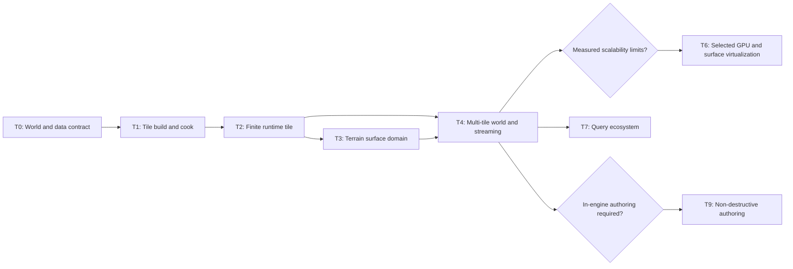

# Terrain World System Roadmap

Summary: Build a streamed, material-driven Terrain world platform with independent render, collision, query, and authoring lifecycles.

Last reviewed: 2026-08-26

Status: Active
Completed:

## Current Status

Durin currently has a qualified finite heightfield Terrain implementation with
an imported `DTerrainHeightmap`, one `DTerrainComponent`, CPU-selected patch
LOD, stitched topology, PBR material participation, collision, picking, and
editor placement. That implementation proves several reusable engine
capabilities, but it is not the compatibility baseline for this roadmap.

Existing Terrain assets, serialized component state, public Terrain APIs,
shader bindings, editor workflows, and cooked Terrain payloads may be replaced
without migration. No milestone is required to load or translate old Terrain
content. Existing code remains useful only as measured evidence for immutable
payload publication, exact height sampling, crack-free topology, collision
separation, and renderer lifecycle behavior.

The material system still exposes a fixed PBR schema. Authored material
programs, generated surface shaders, dependency-complete compilation, and
their cook lifecycle are owned by the active [Material System
Roadmap](MaterialSystem.md). The first programmable Terrain surface milestone
depends on the smallest material-program contract that can expose bounded
Terrain inputs and resources without creating a second compiler.

T0 completed through the [Terrain World Data Contract
Plan](../Plans/Archive/2026-08/TerrainWorldDataContract.md). The authoritative [Terrain World
Data](../Runtime/Terrain/TerrainWorldData.md) contract selects 256-cell tiles,
signed 64-bit global samples, 0.25 m height quanta, exact repeated borders, five
typed products, 8×8-tile region packages, four numeric profiles, bounded
failure/diagnostic vocabulary, and a World Partition-neutral interest seam.
The isolated Sandbox Terrain demonstration assets and their source files were
removed through a complete reference/deletion transaction. T1 completed with
five checked products, independent DDC, atomic generations, region Cook, and
source/DDC-free load through the [Terrain Tile Build and Cook
Plan](../Plans/TerrainTileBuildAndCook.md). T2 is active through the [Terrain
Runtime Tile Reference Plan](../Plans/TerrainRuntimeTileReference.md).

## Outcome

Durin can represent, build, stream, render, query, collide with, and author a
large continuous Terrain world through independently resident immutable data.
The world retains exact cross-tile coordinates and seams, presents stable
surface-layer and query identities to downstream systems, degrades visibly but
safely under missing render residency, and never makes render resources the
authority for physics or gameplay.

The finite product path remains usable at every required milestone. Large-
world mechanisms activate through explicit dimensions, working-set budgets,
latency targets, and measured bottlenecks rather than through an assumption
that every Terrain requires world-scale machinery.

## Scope

- A Terrain World definition with a global sample lattice, height datum,
  horizontal spacing, vertical quantization, spatial extent, tile scheme,
  layer library, build policy, and runtime budgets.
- Immutable Terrain Tile products that can be built, cooked, loaded, replaced,
  and evicted independently while retaining exact shared-edge identity.
- Separate authored source, normalized build inputs, derived data, cooked bulk,
  runtime metadata, and resident render/collision/query products.
- Hierarchical bounds and geometric error, view-dependent LOD, crack-free
  cross-patch and cross-tile topology, camera-relative rendering, and explicit
  failure fallback.
- A bounded programmable Terrain surface domain with stable logical layers,
  world-scale projection, slope/height/curvature inputs, height and normal
  blending, macro/detail evaluation, and distance-dependent execution.
- Independently budgeted height, surface, collision, and query residency with
  asynchronous request, cancellation, supersession, and device-recovery rules.
- Stable regional query and revision interfaces for physics, navigation,
  foliage, water, roads, editor tools, and gameplay.
- Optional non-destructive authoring layers and incremental regional rebuilds
  after the runtime and build contracts are qualified.
- Diagnostics and qualification for fidelity, seams, determinism, residency,
  memory, CPU/GPU work, failure, Cook, runtime, and shutdown.

## Non-Goals

- Compatibility with existing `DTerrainHeightmap`, `DTerrainComponent`,
  `ATerrainActor`, Terrain shader bindings, Terrain packages, or editor state.
- Preserving current class names, package schemas, component property layouts,
  source formats, patch dimensions, or the 1025-sample render ceiling.
- One monolithic Terrain Actor, one permanently resident heightmap, or one
  package containing an entire large world.
- Treating a render mesh, virtual texture, GPU page, editor preview, or physics
  shape as authoritative Terrain data.
- Caves, overhangs, destructible voxels, arbitrary volumetric terrain, or
  general constructive solid geometry. The required representation is a
  single-valued height surface.
- Arbitrary shader source, unbounded material layers per evaluation, or a
  Terrain-only material compiler.
- Requiring mesh shaders, hardware tessellation, bindless resources, virtual
  texturing, GPU-driven indirect submission, or runtime deformation before
  measured evidence selects them.
- Making foliage, water, roads, navigation, weathering, or biome simulation
  internal responsibilities of the Terrain renderer.
- Requiring an in-editor sculpting suite when external source tools plus
  deterministic import and rebuild satisfy the selected product workflow.

## Program Decisions and Invariants

### The world definition owns one exact coordinate contract

- A Terrain World owns one integer global sample lattice. Sample identity does
  not depend on tile, patch, package, LOD, residency, or consumer.
- Horizontal sample spacing and vertical interpretation are world-level
  values. Tiles do not normalize heights from their local observed range.
- Adjacent tiles repeat or reference their shared border samples from identical
  canonical integer values. Build and validation reject mismatched borders;
  rendering does not hide an authored seam with skirts or filtering.
- Source row order, global sample axes, local tile axes, winding, UV/projected
  coordinates, collision cells, and query positions are frozen by asymmetric
  fixtures before runtime implementation begins.
- Large coordinates are canceled in double-prepared or integer space before
  float GPU evaluation. Origin rebasing may change presentation origins but
  never canonical sample identity.

### Authored, built, cooked, and resident data are distinct

- Authoring sources may be height images, procedural graphs, erosion outputs,
  painted masks, or external tool products. No source encoding becomes the
  runtime authority merely because it was imported first.
- A normalized build input produces immutable versioned tile products. Build
  identity includes canonical source content, composition policy, tile scheme,
  layer definitions, builder versions, and platform-relevant output policy.
- Authored packages retain compact intent and stable asset identities. Large
  rebuildable artifacts remain derived data; deployable runtime bytes remain
  cooked bulk under the existing asset lifecycle.
- A tile publication is transactional across its own product generation.
  Consumers may intentionally use different product classes or revisions only
  through an explicit compatibility policy; no consumer observes partially
  published bytes.
- Failed, canceled, stale, corrupt, or out-of-budget work retains the previous
  complete product or selects a named safe fallback. It never publishes a
  partially decoded or partially uploaded generation.

### Spatial units are not ownership units

- Terrain World is the authored and runtime coordination boundary.
- Region is a logical spatial grouping used for packaging, build scheduling,
  dependency management, or authoring transactions when evidence requires it.
- Tile is the smallest independently versioned cooked and streamable Terrain
  product.
- Page is the independently resident subresource unit for a specific data
  class when a whole tile is too coarse for the measured working set.
- Patch is a transient renderer geometry and LOD unit. It is not an asset,
  package, gameplay identity, or physics authority.
- The roadmap does not require Region and Page as distinct physical objects
  until package size, request latency, or residency measurements select them.

### Surface program, layer definitions, and layer coverage stay separate

- A Terrain Surface Program describes bounded evaluation and standard PBR
  outputs. It does not own the world locations where a logical layer appears.
- A Terrain Layer Library owns stable layer IDs plus visual resources, real-
  world scale, blend policy, physical surface, and optional downstream tags.
  Display names and array positions do not replace stable identity.
- Terrain coverage data maps world locations to logical layer weights or a
  deterministic rule result. Changing a layer's textures or the surface
  program does not invalidate authored coverage identity.
- A world may contain many logical layers, but each built evaluation unit has
  a bounded active-layer set and an explicit logical-to-physical remap. The
  build rejects overflow or selects a documented multipass/bake policy; the
  shader never iterates an unbounded authored collection.
- Near evaluation may use full dynamic layer blending. Middle and far output
  may use reduced layer sets or derived surface caches, but those caches are
  replaceable products rather than authoring authority.

### Residency is typed, budgeted, and failure-aware

- Metadata, render height, surface coverage/resources, collision, query, and
  authoring residency have independent request and retention policies.
- Visibility does not imply collision readiness, and collision proximity does
  not require high-resolution surface residency. Each consumer declares its
  own safety radius, priority, latency, and fallback.
- Gameplay cannot enter an area whose required collision policy is incomplete.
  Missing render detail must fall back to a complete coarser representation;
  missing pages do not create holes, NaNs, invalid descriptors, or stale
  references.
- Request coalescing, priority, cancellation, supersession, bounded admission,
  eviction, shutdown, and device invalidation have counted terminal outcomes.
- Eviction removes replaceable resident products without mutating authored or
  cooked identity. In-flight render commands and queries retain immutable
  references until retirement.

### Rendering, collision, and queries share identity, not storage

- Render-selected LOD and GPU height/surface resources are never collision or
  gameplay query data.
- Collision and regional queries derive from the same canonical tile
  generation but own their acceleration, memory, publication, and failure
  lifecycles.
- Query results name the Terrain World, global sample or world position,
  relevant tile generation, logical surface identity, and precision/fallback
  class where consumers need reproducibility.
- Downstream systems use a capability-oriented Terrain Query Service and
  regional revision notifications. They do not retain Terrain actors,
  components, renderer scene proxies, build-worker objects, or editor graphs.

### Scalability mechanisms remain evidence-gated

- The first complete tile path uses the simplest measured geometry submission
  that satisfies its budgets. Existing indexed grids and direct instancing are
  valid evidence, not mandated architecture.
- GPU culling, HZB, indirect draws, mesh shaders, texture arrays, bindless
  resources, virtual texturing, and page-table feedback require a named
  workload and a measured CPU, GPU, descriptor, bandwidth, memory, or latency
  bottleneck.
- Every optimization retains a deterministic reference mode capable of
  qualifying geometry, surface, residency, and query parity.

### Authoring mutates intent and rebuilds bounded regions

- Optional editor mutation uses ordered, stable-ID, non-destructive operations
  over imported or generated base sources. The composed result is a build
  product, not hidden mutable authority.
- An operation declares conservative affected bounds. Recomposition rebuilds
  only intersecting tiles plus the exact neighbor border dependency required
  for seams, normals, LOD error, collision, and surface products.
- Undo, redo, save, cancellation, stale-result rejection, and failure recovery
  operate at authored-operation and build-generation boundaries.
- Runtime deformation and replication require a future roadmap because they
  change authority, persistence, networking, collision, and residency
  assumptions simultaneously.

## Current Foundations and Gaps

| Area | Reusable foundation | Long-term gap |
| --- | --- | --- |
| Asset lifecycle | Versioned packages, soft references, derived-data requests, cooked bulk, immutable payload publication | No Terrain World, tile manifest, independent tile packages, or typed Terrain residency |
| Height evidence | Exact unsigned height import, immutable samples, regional extrema, cooked construction | Existing heightmap asset and component model are disposable; no global lattice or cross-tile build contract |
| Rendering | Terrain vertex path, indexed patch topology, LOD error, stitching, instancing, camera-relative anchors, shared PBR passes | Bound to one finite component/payload; no cross-tile visibility, residency, morphing, or programmable Terrain surface |
| Materials | Stable material parameters, render proxies, fixed PBR ABI, shared forward/GBuffer/shadow execution | No authored material program or Terrain inputs; no layer library, coverage, active-layer remap, or surface cache |
| Collision | Immutable heightfield geometry and query separation from Renderer | No streamed collision safety policy or tile-generation coordination across a moving world |
| View lifetime | Persistent view identity and transactional history publication | No Terrain-specific occlusion, residency feedback, or temporal LOD/morph history |
| Editor | Import, placement, details, exact picking, reimport, and diagnostics for finite Terrain | No world creation, tile inspection, source composition, regional build, paint/sculpt layers, or streaming visualization |
| Ecosystem | General World, collision, renderer, asset, and editor service boundaries | No stable Terrain query service or regional notification contract for foliage, water, roads, navigation, and gameplay |

## Milestone Map

| Milestone | State | Dependencies | Deliverable | Entry gate | Exit gate |
| --- | --- | --- | --- | --- | --- |
| T0: Terrain World and canonical data contract | Required; completed 2026-08-25 | Asset lifecycle and package contracts | Frozen world/sample coordinates, height precision, tile/border scheme, layer identity, product classes, payload budgets, failure vocabulary, and old-Terrain removal boundary | Met: roadmap selected and T0 plan activated | Met: Runtime contract, asymmetric vectors, ownership graph, numeric budgets, compatibility rejection, and transactional legacy cleanup are complete |
| T1: Tile build, derived data, and Cook | Required; completed 2026-08-26 | T0, DerivedDataCache, TerrainBuild, AssetForge, Cook | Normalized source composition and independently buildable/cookable immutable tile products with manifests and checksums | Met: T0 freezes 256-cell tiles, one product envelope with five body classes/ceilings, 8×8 region packages, profiles, failures, and source-free load contract | Met: checked envelope and bodies, cold/warm/corrupt DDC, cancel/stale retention, exact borders, F0 regions, partial Cook, corruption, and source/DDC-free load pass in `TerrainWorldBuildTests` |
| T2: Finite runtime tile and query reference | Required; active | T1, Renderer, Engine, Physics | One correctly rendered, collided, pickable, queryable tile using new runtime ownership and a deterministic reference path | Met: complete tile products load without source or DDC through checked manifest and product handles | Render/collision/query coordinate parity, LOD continuity, pass coverage, lifecycle failure, device recovery, runtime launch, and bounded reference performance pass without old Terrain objects |
| T3: Programmable Terrain surface domain | Required; blocked on T2 and Material System M5 | T2, compiled material-program foundation, Texture system | Stable layer library and coverage assets plus bounded near/middle/far Terrain surface evaluation through shared material passes | Material compiler exposes versioned geometry inputs, dependencies, resources, diagnostics, and Cook seam | Representative grass/soil/rock/snow material proves world scale, slope/height/curvature rules, height and normal blending, triplanar cliffs, macro/detail behavior, layer-remap bounds, forward/GBuffer/shadow parity, and explicit overflow/failure fallback |
| T4: Multi-tile Terrain World and typed streaming | Required; blocked on T2-T3 | T1-T3, asset residency and task systems | World manifest, multi-tile scene/query ownership, independently budgeted residency, cross-tile LOD/seams, prefetch, eviction, and runtime recovery | Named world dimensions, movement profile, memory budgets, storage layout, and latency/safety radii are frozen | Deterministic traversal crosses package/tile boundaries without render seams or collision gaps; budgets, cancellation, eviction, teleport, corruption, device loss, Cook, reload, and shutdown gates pass |
| T5: Long-range surface cache | Conditional; evidence-gated after T4 | T3-T4 | Derived middle/far surface representation with complete coarse fallback and bounded residency | Dynamic layer evaluation exceeds measured texture, descriptor, bandwidth, or shader budgets | Selected cache reduces the named bottleneck, preserves bounded visual/physical-layer error, handles missing pages safely, and remains fully rebuildable from canonical products |
| T6: GPU-driven visibility and submission | Conditional; evidence-gated after T4 | T2-T4, optional persistent view/HZB capabilities | Selected GPU culling, LOD, occlusion, indirect, or mesh-shader path plus deterministic reference mode | CPU visibility, command preparation, draw count, or triangle work misses a frozen target on named hardware | Selected mechanism meets CPU/GPU/memory gates, preserves seam and LOD determinism, survives history discontinuity/device loss, and matches reference output within frozen tolerances |
| T7: Terrain query ecosystem | Required interface; consumers independently selectable | T2 and T4 for streamed behavior | Capability-oriented regional query/revision service with qualified physics integration and bounded consumer contracts | Canonical tile generation and typed residency are stable | Height, normal, layer, physical-surface, bounds, and revision queries remain deterministic across load/evict/rebuild; at least one non-Renderer consumer qualifies the contract without internal Terrain references |
| T8: Navigation, foliage, water, and roads | Conditional by product selection | T7 plus owning subsystem roadmaps | Separate consumers using Terrain queries and regional invalidation | A named product workflow and owner selects a consumer | Each selected consumer owns its data, budgets, update policy, failure behavior, Cook, and validation without enlarging Terrain renderer authority |
| T9: Non-destructive Terrain authoring | Conditional; external tools remain valid | T1, T4, T7, editor async-operation contracts | Ordered height/coverage operations, bounded dirty regions, regional preview/build, undo/redo, diagnostics, and save/reload | A named workflow proves import/reimport insufficient | Regional edits rebuild exact dependent products transactionally; borders, cancellation, stale publication, memory, save/reload, Cook, and runtime output qualify |

## Child Plan Boundaries

| Proposed plan | Milestone | Boundary | Activation |
| --- | --- | --- | --- |
| [Terrain World Data Contract](../Plans/Archive/2026-08/TerrainWorldDataContract.md) | T0 | Characterization, product targets, global lattice, schemas, identities, ownership, budgets, compatibility rejection, World Partition interest seam, and deletion/migration boundary; no runtime implementation | Completed 2026-08-25 |
| [Terrain Tile Build and Cook](../Plans/TerrainTileBuildAndCook.md) | T1 | Normalized inputs, composition, build keys/functions, tile payloads, manifests, DDC, Cook, checksums, cancellation, and source-free load; no renderer or editor surface workflow | Completed 2026-08-26; T2 entry evidence published |
| [Terrain Runtime Tile Reference](../Plans/TerrainRuntimeTileReference.md) | T2 | New Engine ownership, scene proxy/info, reference geometry/LOD, render resources, collision/query publication, passes, diagnostics, and lifecycle; no world streaming | Active; T1 source-free complete-tile entry evidence met |
| Terrain Surface Domain | T3 | Layer definitions, coverage, compiler inputs, bounded evaluation, resource binding, near/middle/far policy, debug modes, and pass qualification; no generic material-compiler architecture | Create after Material System M5 and T2 satisfy their entry evidence |
| Terrain World Streaming | T4 | Manifest traversal, multi-tile scene/query ownership, request priority, typed residency, budgets, prefetch, eviction, cross-tile continuity, teleport, and shutdown | Create only after the target world and working-set profile are frozen |
| Terrain Surface Cache | T5 | Measured derived surface representation and residency; excludes canonical height/coverage authority and general texture-system redesign | Create only from T4 surface bottleneck evidence |
| Terrain GPU Visibility and Submission | T6 | Measured selection of GPU culling/LOD/occlusion/submission, reference parity, temporal invalidation, and device recovery | Create only from T4 profiling evidence |
| Terrain Regional Query Service | T7 | Public capabilities, result identity/precision, async/regional requests, revision events, residency interaction, and one independent consumer | Create after T2 query semantics and T4 residency vocabulary stabilize |
| Terrain Consumer Integration | T8 | One named foliage, navigation, water, road, or gameplay consumer and its own products/budgets; excludes Terrain renderer ownership growth | Create separately for each selected consumer |
| Terrain Non-Destructive Authoring | T9 | Authored operations, composition order, dirty regions, editor interactions, transactions, regional builds, diagnostics, persistence, and runtime parity | Create only when an editor workflow is selected and runtime contracts are stable |

Child plans reference the root [build and run](../Agents/BuildAndRun.md) and
[testing](../Agents/Testing.md) guidance and own their exact target selection,
fixtures, commands, stage checklists, evidence, and commit provenance.

## Program Validation Matrix

| Contract | Required milestones | Required evidence |
| --- | --- | --- |
| Coordinate and height identity | T0-T2, T4 | Asymmetric and negative-height fixtures preserve global sample, world position, winding, normal, UV/projection, collision cell, picking, and query identity across tile borders, transforms, save/load, Cook, and origin changes |
| Border continuity | T0-T4 | Every shared-edge and shared-corner value is exact; bounds, normals, LOD error, selected topology, surface coverage, and collision agree under mismatched LOD and residency transitions |
| Build determinism | T1 | Scheduling order, worker count, source partitioning, warm/cold cache, and repeated Cook produce identical keys and payloads; malformed, oversized, stale, canceled, and corrupt work has counted terminal results |
| Publication and lifetime | T1-T4 | Replacement, eviction, unload, failed rebuild, device invalidation, renderer shutdown, world retirement, and in-flight work retain complete generations without leaks, stale access, mixed products, or partial visibility |
| Geometry and visibility | T2, T4, optional T6 | Reference and selected scalable paths preserve extent, winding, conservative bounds, view/shadow LOD policy, crack freedom, morph policy, draw/triangle conservation, and camera-relative precision |
| Surface fidelity | T3-T5 | Stable layer identities and weights produce bounded near/middle/far PBR results; triplanar, height blend, normal blend, macro/detail, mip behavior, shadows, and missing-resource fallback pass structural and image gates |
| Residency safety | T4-T5 | Movement, acceleration, teleport, starvation, cancellation, eviction pressure, missing/corrupt products, and device loss meet named latency and memory budgets without collision gaps or visible holes |
| Collision and query parity | T2, T4, T7 | Render-independent heightfield collision and Terrain queries match canonical samples and logical surfaces across transforms, tile borders, residency, rebuild, Cook, and runtime load |
| Package and Cook behavior | T1, T4 | Dependency reachability, soft references, tile packaging, manifests, bulk payloads, source-free runtime, partial world installation policy, corruption diagnostics, and compatibility rejection are deterministic |
| Editor transactionality | Optional T9 | Regional operation, undo/redo, save/reload, cancel, stale result, failure recovery, neighbor rebuild, and Cook publish all dependent products atomically from authored intent |
| Scalability and observability | T1-T7 | Each selected product scale freezes source/build bytes, cooked bytes, resident bytes by class, request counts/latency, CPU scopes, GPU scopes, pages/tiles/patches, draws/triangles, fallbacks, and shutdown conservation on named profiles |

## Risks and Control Gates

- **A world-scale abstraction is designed without a product scale.** T0 cannot
  exit until representative finite and large worlds, tile counts, sampling,
  storage, memory, movement, and latency targets are numeric.
- **Tile-local height compression creates seams or consumer disagreement.**
  T0 fixtures reject observed-range normalization and any border values that
  differ after decode. Alternative encodings must prove identical canonical
  border interpretation.
- **Old Terrain compatibility constrains the new ownership model.** T0 records
  the removal boundary explicitly. Tests reject old schemas rather than adding
  implicit conversion, dual paths, or long-lived compatibility branches.
- **The new Terrain surface becomes a second material system.** T3 consumes the
  shared material compiler, shader identity, pass execution, diagnostics, and
  Cook lifecycle. Terrain contributes bounded inputs and resources only.
- **Logical layer count leaks into unbounded shader cost.** T3 freezes active
  layers per evaluation unit, remap formats, overflow policy, samples, and
  descriptor budgets before accepting authored coverage.
- **Virtual textures become source authority.** T5 stores only rebuildable
  surface results. Height, coverage, logical surface, collision, and query
  identities remain available without VT pages.
- **Streaming creates invisible collision holes.** T4 freezes collision safety
  radii and admission policy before runtime traversal. Unsafe regions are
  blocked or use an explicit complete fallback; they are never silently
  traversable.
- **Patch, tile, package, and page boundaries collapse into one size.** T0 and
  T4 measure each responsibility independently and introduce Region or Page
  only when the selected storage and residency workload requires them.
- **GPU-driven work removes the debuggable reference path.** T6 retains a
  deterministic bounded reference mode and exact counter reconciliation for
  qualification and recovery.
- **Editor mutation forces global rebuilds.** T9 requires conservative dirty
  bounds and measured neighbor dependency propagation before enabling ordinary
  edits on product-scale worlds.
- **Consumer features accumulate inside Terrain ownership.** T7 exposes narrow
  queries and revision events. Every T8 consumer owns its assets, derived data,
  residency, failure behavior, and validation.

## Completion Criteria

- Required T0-T4 and T7 milestones pass their exit gates and publish lasting
  contracts under the owning Runtime and Editor documentation domains.
- One finite reference tile and one named multi-tile product world pass exact
  build, Cook, runtime load, render, surface, collision, query, streaming,
  recovery, memory, performance, and shutdown qualification.
- Existing Terrain assets, components, renderer bindings, editor workflows,
  and cooked payloads are removed or explicitly isolated as test-only
  historical evidence; no production path requires their compatibility.
- Conditional T5, T6, T8, and T9 milestones are either completed from measured
  or product-selected evidence or explicitly dispositioned with the reason the
  required outcome does not need them.
- Surface compilation remains part of the shared Material System; physics,
  navigation, foliage, water, roads, and gameplay remain independent consumers
  of stable Terrain identities and queries.
- Active child plans are completed or superseded, completed-plan provenance is
  retained, and the roadmap records final budgets and conditional decisions
  before it is marked completed.

## Related Documentation

- [Material System Roadmap](MaterialSystem.md)
- [Terrain World Data](../Runtime/Terrain/TerrainWorldData.md)
- [Asset Data Lifecycle and Storage](../Runtime/Assets/AssetDataLifecycle.md)
- [Asset Packages](../Runtime/Assets/AssetPackages.md)
- [Material System](../Runtime/Rendering/MaterialSystem.md)
- [Render Resource Lifecycle](../Runtime/Rendering/RenderResourceLifecycle.md)
- [Renderer Resource Recovery](../Runtime/Rendering/RendererResourceRecovery.md)
- [Persistent View State](../Runtime/Rendering/PersistentViewState.md)
- [Runtime Collision](../Runtime/Physics/Collision.md)
- [Task System](../Runtime/Core/TaskSystem.md)
- [Level System](../Runtime/World/LevelSystem.md)
- [Async Asset Operations](../Editor/Architecture/AsyncAssetOperations.md)
- [Current Finite Terrain Rendering Contract](../Runtime/Rendering/TerrainRendering.md)
- [Current Terrain Heightmap Asset Contract](../Runtime/Terrain/TerrainHeightmapAsset.md)
- [Current Terrain Editing Contract](../Editor/Architecture/TerrainEditing.md)

## Related Code

- `Engine/Source/Runtime/Engine/Public/Terrain/TerrainHeightmap.h`
- `Engine/Source/Runtime/Engine/Public/Components/TerrainComponent.h`
- `Engine/Source/Runtime/Engine/Public/Engine/TerrainSceneProxy.h`
- `Engine/Source/Runtime/Renderer/Private/Renderers/TerrainRenderer.cpp`
- `Engine/Source/Runtime/Renderer/Public/Terrain/TerrainLOD.h`
- `Engine/Source/Runtime/Renderer/Public/Terrain/TerrainTopology.h`
- `Engine/Source/Runtime/RenderCore/Public/Terrain/TerrainVertexFactory.h`
- `Engine/Shaders/Slang/StaticMeshBasePass.slang`
- `Engine/Source/Runtime/Engine/Public/Materials/MaterialInterface.h`
- `Engine/Source/Runtime/AssetCore`
- `Engine/Source/Developer/DerivedDataCache`
- `Engine/Source/Developer/TerrainBuild`
- `Engine/Source/Runtime/PhysicsCore`
- `Engine/Source/Editor/LevelEditor`
