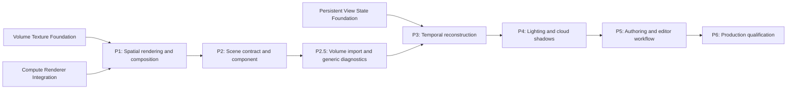

# Volumetric Cloud Rendering Roadmap

Summary: Deliver one production-qualified global volumetric-cloud layer through bounded spatial rendering, scene authoring, temporal reconstruction, lighting, and editor-workflow plans.

Last reviewed: 2026-08-23

Status: Active
Completed:

## Current Status

The backend-neutral volume-texture and persistent-view-state foundations are
complete. Public RHI and Vulkan can create, upload, sample, write, copy, and
release 3D textures; `DVolumeTexture` supplies cookable package-backed volume
assets; and Renderer owns transactional previous-view metadata with a private
strongly typed history-extension point.

[Compute Renderer Integration](../Plans/Archive/2026-08/ComputeRendererIntegration.md) and the
required [Compute Shader Pipeline](Archive/2026-08/ComputeShaderPipeline.md) roadmap completed
on 2026-08-21. Their lasting compute, synchronization, fallback, recovery, and
diagnostic contracts now satisfy the remaining P1 dependency.

[Volumetric Cloud Spatial Rendering](../Plans/Archive/2026-08/VolumetricCloudSpatialRendering.md)
completed P1 on 2026-08-21. It froze and implemented the flat-slab coordinate
model, deterministic inputs, matched compute/fragment production routes,
scene-linear radiance/transmittance targets, exact composition, bounded
resource recovery, diagnostics, and the opaque/cloud/sorted-translucency split.
Focused contract and Vulkan integration coverage passes; lasting P1 contracts
are published under Runtime rendering. The unavailable GTX 1060 identity was
explicitly replaced by the user with RTX 3090 / Vulkan 1.4.325 while retaining
all numeric gates; both named-gate executor reruns passed.

[Volumetric Cloud Scene Contract](../Plans/Archive/2026-08/VolumetricCloudSceneContract.md)
completed P2 on 2026-08-21. The user then prioritized asset ingestion and
generic diagnostics ahead of P3/P4. [Volume Texture Import and Cloud
Diagnostics](../Plans/VolumeTextureImportAndCloudDiagnostics.md) completed
P2.5 on 2026-08-21, revised on 2026-08-22: the texture import workflow imports
one row-major PNG atlas directly as R8 or RGBA8,
retains dependency-aware provenance for transactional reimport/repair, and
exposes the shared cloud eligibility result in generic Details. Focused,
aggregate, Vulkan, full-build, documentation, and Editor-smoke gates pass.

[Volumetric Cloud Temporal Reconstruction](../Plans/Archive/2026-08/VolumetricCloudTemporalReconstruction.md)
completed P3 on 2026-08-23. `High` now renders at half linear resolution,
reconstructs through bounded transactional per-view history and a depth-aware
four-tap composite, and preserves a full-resolution `Reference` tier. The
frozen RTX 3090 / Vulkan 1.4.325 4K gate passes inline and threaded executors;
the accepted observed threaded run measures `High` 62.9% below `Reference`
median cost while passing image, memory, p95, recovery, and invalidation gates.
The lasting contract is published under Runtime rendering, satisfying P4's
entry dependency.

[Volumetric Cloud Lighting and Shadows](../Plans/Archive/2026-08/VolumetricCloudLightingAndShadows.md)
completed P4 on 2026-08-23. Clouds now use the selected prepared directional
light for fixed bounded phase, full-density self-transmittance, and ambient
radiance; a Renderer-owned full-resolution `R8_UNORM` visibility target
multiplies only surface directional lighting. Both named executors pass the 4K
image, timing, memory, fallback, recovery, and release gates.

[Volumetric Cloud Authoring Workflow](../Plans/Archive/2026-08/VolumetricCloudAuthoringWorkflow.md)
completed P5 on 2026-08-23. Exact volume slices, role-oriented cloud Details,
per-view quality/debug controls, and copied nonblocking cloud statistics now
form the production editor workflow. Focused, Vulkan, qualification, aggregate,
full-build, documentation, and Editor-smoke gates pass. P6 is now eligible as
the next required milestone but remains proposed until its cross-feature matrix
is frozen in an active child plan.

## Outcome

Durin can render one authored global volumetric-cloud layer into lit scene
views with deterministic depth-aware composition, stable low-resolution
temporal reconstruction, directional-light scattering and cloud shadows,
bounded quality and recovery policies, and an editor workflow for selecting
assets, tuning properties, inspecting diagnostics, and validating output.

The first production outcome favors one complete and measurable vertical slice
over a general participating-media framework. It leaves a deliberate path to
fog, local volumes, multiple cloud layers, and broader atmospheric integration
without representing those features as already supported.

## Scope

- One active global height-bounded cloud layer per renderer scene, selected by
  stable identity rather than component registration order.
- Renderer-owned density evaluation, ray marching, lighting, intermediate
  targets, composition, temporal history, fallback, and diagnostics.
- `DVolumeTexture` inputs for base and detail density data plus an optional
  two-dimensional weather/control texture through existing texture references.
- Scene-depth-aware cloud integration between opaque scene lighting and sorted
  scene translucency, before display mapping and editor assistance.
- One directional-light source, bounded self-shadow/transmittance evaluation,
  ambient contribution, and a later cloud-shadow receiver path.
- Engine-owned actor/component authoring, immutable scene proxy publication,
  serialization, duplication, world replacement, and render-state mutation.
- Low-resolution rendering, temporal reconstruction, quality tiers, memory and
  timing budgets, resource invalidation, shader reload, and explicit fallbacks.
- Focused editor property, asset-selection, preview/debug, and diagnostic
  workflows after the runtime contract is stable.

## Non-Goals

- A general volumetric fog, smoke, fire, particle, fluid-simulation, or
  participating-media framework in the required roadmap.
- Multiple interacting cloud layers, arbitrary local volume primitives, portal
  volumes, or order-independent volumetric/translucent composition.
- A material-system volume domain or generic volume material parameters.
- Sparse, virtual, bricked, streamed, or runtime-compressed volume textures.
- Asynchronous compute, indirect dispatch, or a render graph as prerequisites.
- Coupled sky-atmosphere LUT generation, aerial perspective, sun-disc or moon
  rendering, weather simulation, or physically complete multiple scattering.
- A general VDB/DDS/KTX importer in the core rendering plans. An authoring plan
  may select the smallest source adapter justified by the first production
  assets without changing the runtime volume-texture contract.

## Program Decisions and Invariants

### Product boundary

- The required outcome owns one global cloud layer. P1 Stage 0 selects and
  freezes flat, spherical-shell, or another explicit height-domain geometry
  from target scene scale, camera altitude, and precision evidence; later
  plans consume that decision rather than supporting multiple models at once.
- P1 also freezes qualification scenes, image tolerance, target adapter,
  viewport sizes, and GPU/memory budgets before route timing is observed.
- Every required plan preserves a complete disabled/no-cloud path. Missing or
  invalid optional cloud data produces a documented fallback or no cloud; it
  must not make an otherwise renderable view fail.

### Ownership and dependency direction

- RHI and VulkanRHI remain cloud-agnostic. Cloud policy, shaders, transient
  targets, histories, and composition live in Renderer.
- Engine owns reflected authored objects, stable scene data, scene proxies, and
  texture references. Components never retain render targets, pipelines,
  histories, raw RHI textures, or Vulkan handles.
- `DVolumeTexture` and TextureBuild remain generic volume-data owners. Cloud
  meanings such as erosion, coverage, weather, and wind do not enter their
  payload or build contracts.
- Editor modules consume Engine reflection and Renderer diagnostics. They do
  not become a required runtime dependency or perform rendering ownership.

### Frame and composition order

- The selected scene order is sky/environment bootstrap, opaque and masked
  lighting, volumetric-cloud render/composite, sorted scene translucency,
  post-process/display mapping, then editor assistance and presentation.
- Cloud ray length is clipped against reconstructed opaque depth. Transparent
  surfaces render after clouds so they observe clouds as part of their scene
  background rather than being overwritten by a late cloud composite.
- P1 owns the minimum explicit split of the current combined retained-forward
  scene phase needed to establish this ordering. It must preserve Lit/Unlit,
  Solid/Wireframe, forward fallback, hybrid deferred, offscreen, and Present
  behavior and must not introduce a generic pass framework without a second
  concrete consumer.
- Cloud outputs use an explicit scene-linear radiance plus transmittance
  contract. Composition follows `Scene = CloudRadiance + Transmittance * Scene`
  or an exactly documented algebraically equivalent representation.

### Compute, history, and failure policy

- The production spatial route uses public synchronous-compute contracts when
  P1 evidence admits it. A reduced fragment or disabled route remains explicit
  if target capabilities, resource creation, shader compilation, or dispatch
  limits reject compute.
- Dispatch never occurs inside a graphics render pass. Graphics/compute
  handoffs use public RHI transitions and never depend on device-idle waits.
- Temporal history is private, strongly typed state in `FSceneViewState`, keyed
  by `FSceneViewStateId`. Scene, projection, viewport, output, depth convention,
  camera-cut, inactivity, manual invalidation, and device invalidation follow
  the existing discontinuity contract.
- A failed view attempt aborts pending cloud history and retains the last
  committed history. A successful view commits metadata and cloud history as
  one outer-view transaction.
- Every renderer resource publication is complete-or-null or last-known-good.
  Reload and device recovery cannot expose partially rebuilt targets, pipelines,
  texture bindings, or history.

### Authoring and rollout

- Renderer constants may drive deterministic P1 fixtures, but public authored
  behavior begins only in P2 through an Engine scene contract and component.
- The component publishes physical/authoring intent; quality tiers own sample
  counts, target scale, temporal pattern, and platform policy. Serialized
  content does not freeze implementation-specific dispatch dimensions.
- General Details-panel reflection is sufficient for the initial P2 workflow.
  P2.5 adds the smallest source-backed volume adapter and one read-only cloud
  eligibility status before P3. Purpose-built previews, debug views, presets,
  procedural generation, and the standalone authoring experience remain P5.

## Current Foundations and Gaps

| Area | Existing foundation | Roadmap gap |
| --- | --- | --- |
| Volume data | [Volume Texture Foundation](../Plans/Archive/2026-08/VolumeTextureFoundation.md) provides `DVolumeTexture`, deterministic mips, package/cook/DDC behavior, Texture3D sampling/storage, and lifecycle recovery. | Assign cloud meanings to generic volume inputs and qualify real density sampling without leaking cloud policy into the asset. |
| Compute | Public synchronous compute, explicit transitions, sampled/storage images, and graphics handoff are implemented; the first Renderer consumer is completing qualification. | Add a measured cloud workload, route/fallback policy, low-resolution outputs, and scene-color consumption. |
| Temporal state | [Persistent View State Foundation](../Plans/Archive/2026-08/PersistentViewStateFoundation.md) provides identity, previous matrices, discontinuities, and transactional feature-history extension. | Add cloud-specific history resources, reprojection, rejection, reconstruction, and commit/abort behavior. |
| Scene rendering | Renderer has sky bootstrap, GBuffer/deferred lighting, retained forward geometry, sorted translucency, post-process, editor assistance, and resource coordination. | Split opaque/cloud/translucent execution at the narrowest boundary and establish depth-aware cloud composition in every supported view route. |
| Lighting | Directional-light scene proxies, deferred lighting, cascaded shadows, environment lighting, GTAO, and contact visibility exist. | Define cloud lighting inputs, self-transmittance, ambient approximation, and a bounded cloud-shadow path without changing light-component ownership. |
| Authoring | The reflected cloud actor/component, stable scene selection, generic Details editing, `DVolumeTexture`, TextureBuild, AssetImportCore, AssetForge image decoding, and Content Browser import infrastructure exist. | Add the smallest source-backed volume importer and actionable generic status in P2.5; retain previews, presets, generation, and specialized UI for P5. |

## Milestone Map

| Milestone | Requirement | Proposed child plan | Entry gate | Exit gate |
| --- | --- | --- | --- | --- |
| P0: Generic foundations | Required; completed 2026-08-21 | [Volume Texture Foundation](../Plans/Archive/2026-08/VolumeTextureFoundation.md) and [Persistent View State Foundation](../Plans/Archive/2026-08/PersistentViewStateFoundation.md) | Existing texture, compute, renderer-scene, and view-lifetime contracts were audited. | Cooked sampled 3D data and transactional view identity/history extension pass focused, aggregate, and runtime qualification. |
| P1: Spatial rendering and composition | Required; completed 2026-08-21 | [Volumetric Cloud Spatial Rendering](../Plans/Archive/2026-08/VolumetricCloudSpatialRendering.md) | The user-approved RTX 3090 / Vulkan 1.4.325 rebaseline retained every numeric gate; inline/threaded named qualification passed three-extent structure, half/final-image parity, 49,766,400-byte peak retention, enabled offscreen/Present resize routes, invalid-input identity, lifecycle, aggregates, build, and runtime smoke. | A deterministic fixed-input cloud renders through public RHI, clips against opaque depth, composites between opaque and translucency in forward/hybrid/offscreen/Present routes, preserves no-cloud behavior, and passes predeclared pixel/timing/memory gates. |
| P2: Scene contract and component | Required; completed 2026-08-21 | [Volumetric Cloud Scene Contract](../Plans/Archive/2026-08/VolumetricCloudSceneContract.md) | P1 froze the spatial parameter block, coordinate model, resource inputs, and fallback behavior. | Met: one reflected component/actor serializes, duplicates, mutates, registers, replaces, and removes one stable active cloud snapshot without exposing reflected objects to the render thread or owning Renderer resources; generic Details, both Vulkan executors, aggregates, full build, and Editor smoke pass. |
| P2.5: Volume import and generic diagnostics | Required; completed 2026-08-21 | [Volume Texture Import and Cloud Diagnostics](../Plans/Archive/2026-08/VolumeTextureImportAndCloudDiagnostics.md) | P0 supplies the volume build/cook/runtime asset; P2 supplies assignable Base/Detail properties and reasoned eligibility can remain Engine-owned. | Met: users import and reimport deterministic R8/RGBA8 PNG-slice volumes through the normal Content Browser, assign them to a cloud, and see an exact generic Details status; package/cook/runtime and real rendered-output gates pass without a specialized editor. |
| P3: Temporal reconstruction and quality | Required; completed 2026-08-23 | [Volumetric Cloud Temporal Reconstruction](../Plans/Archive/2026-08/VolumetricCloudTemporalReconstruction.md) | Met: P1 spatial reference images pass; P2 publishes immutable parameters; P2.5 supplies real imported density fixtures and actionable input diagnostics; the P3 plan froze representative camera motion, cut, resize, and 4K performance targets before timing. | Met: half-linear-resolution production rendering reconstructs stable full-view output, rejects and commits/aborts history transactionally, exposes four bounded tiers, and passes inline/threaded 4K image, timing, memory, recovery, and runtime gates with a measured `High` median benefit over `Reference`. |
| P4: Lighting and cloud shadows | Required; completed 2026-08-23 | [Volumetric Cloud Lighting and Shadows](../Plans/Archive/2026-08/VolumetricCloudLightingAndShadows.md) | Met: P3 output and quality policy are stable; the frozen Stage 0 contract selected the phase model, receiver representation, fixtures, and numeric gates before implementation. | Met: directional scattering, full-density self-transmittance, ambient contribution, and full-resolution bounded receiver visibility respond deterministically to light/cloud changes, preserve existing lighting ownership, and pass explicit fallback, recovery, inline/threaded 4K, and memory gates. |
| P5: Authoring and editor workflow | Required; completed 2026-08-23 | [Volumetric Cloud Authoring Workflow](../Plans/Archive/2026-08/VolumetricCloudAuthoringWorkflow.md) | Met: P2-P4 froze authored properties, asset roles, debug outputs, quality tiers, and diagnostics; P2.5 supplies the first import/provenance path, and no production-source evidence currently justifies generation or another adapter. | Met: exact volume inspection, specialized reflected Details, production-backed quality/debug controls, copied diagnostics, persistence/recovery, aggregates, full build, documentation, and Editor smoke pass. |
| P6: Production qualification and contract publication | Required; eligible | `VolumetricCloudProductionQualification` | Met: P1-P5, including P2.5, pass their acceptance gates. Activate P6 only after freezing its remaining cross-feature qualification matrix. | Required adapters, executors, view routes, camera regimes, reload/recovery cases, memory/timing budgets, cook/package behavior, editor smoke, aggregate tests, and full build pass; lasting contracts are published and the roadmap can close. |

P0-P5 are complete. P6 is the next eligible milestone; its child plan remains
proposed until the cross-feature matrix is frozen and work is ready to start.

## Child Plan Boundaries

### [Volumetric Cloud Spatial Rendering](../Plans/Archive/2026-08/VolumetricCloudSpatialRendering.md)

Owns the first-version coordinate model, deterministic density fixture, base
and detail volume sampling, optional weather input, spatial ray march, initial
single-directional-light approximation, depth clipping, cloud output formats,
composition algebra, minimal opaque/cloud/translucency phase split, public-RHI
transitions, resource ownership, explicit route/fallback, pixel baselines, and
frozen spatial timing/memory evidence.

It does not add reflected cloud components, temporal history, production cloud
shadows, specialized editor UI, a general volumetric framework, or async
compute. The minimal light approximation proves visible form only; P4 owns the
production lighting response.

### [Volumetric Cloud Scene Contract](../Plans/Archive/2026-08/VolumetricCloudSceneContract.md)

Owns Engine-side cloud scene data, stable identity and selection, Proxy/SceneInfo
lifetime, component/actor reflection, asset references, serialization,
duplication, registration, mutation, visibility, world replacement, scene
release, render-thread snapshots, and generic Details editing.

It translates authored settings into the already-frozen P1 renderer input. It
does not own GPU resources, introduce texture import policy, expose sample-count
implementation details as content, or redesign SkyBox/light ownership.

### [Volume Texture Import and Cloud Diagnostics](../Plans/Archive/2026-08/VolumeTextureImportAndCloudDiagnostics.md)

Owns the first source-backed `DVolumeTexture` adapter: one direct row-major PNG
atlas, AssetImportCore/AssetForge import and reimport, provenance,
source dependency repair/relocation, transactional candidate exchange, and
package/cook/runtime qualification. It also owns the shared Engine cloud
eligibility reasons and one transient read-only status in generic Details.

It does not add a dedicated editor, volume/cloud previews, procedural noise,
presets, debug views, temporal reconstruction, production lighting, broader
volume formats, or cloud semantics to the generic texture asset.

### [Volumetric Cloud Temporal Reconstruction](../Plans/Archive/2026-08/VolumetricCloudTemporalReconstruction.md)

Owns low-resolution target sizing, sample pattern and jitter, cloud depth or
other reprojection metadata, motion reconstruction, history rejection and
clamping, spatial upsampling, typed `FSceneViewState` cloud history,
transactional replacement, inactive/disabled policy, quality tiers, timing,
memory, camera-motion image sequences, and temporal debug diagnostics.

It does not add TAA for scene geometry, a generic history cache, dynamic
resolution for the whole renderer, or async-compute scheduling.

### [Volumetric Cloud Lighting and Shadows](../Plans/Archive/2026-08/VolumetricCloudLightingAndShadows.md)

Owns the selected directional-light snapshot consumed by clouds, phase and
extinction conventions, self-shadow/transmittance sampling, ambient/sky
approximation, cloud-shadow target and update policy, receiver integration,
light/cloud mutation, fallback, diagnostic modes, and lighting/shadow image and
performance evidence.

It does not implement a sky-atmosphere system, multiple scattering, local-light
volumetrics, new light-component ownership, or replace existing geometric
directional shadows.

### [Volumetric Cloud Authoring Workflow](../Plans/Archive/2026-08/VolumetricCloudAuthoringWorkflow.md)

Owns exact volume slice inspection, cloud asset-role presentation, component
Details layout, per-view quality presets, production-backed cloud debug-view
controls, nonblocking performance/route presentation, and persistent
specialized-editor workflow validation. It builds on P2.5 import provenance and
eligibility diagnostics rather than replacing them. No current production
evidence justifies procedural generation or a richer source adapter.

It must reuse `DVolumeTexture`, TextureBuild, reflected component properties,
Renderer diagnostics, and existing preview infrastructure. It does not invent
an editor-private runtime representation or make editor modules runtime
dependencies.

### `VolumetricCloudProductionQualification`

Owns only cross-plan closure that cannot be attributed to one feature owner:
the final runtime/cook/editor matrix, long-duration and multi-view behavior,
combined invalidation and reload sequences, production budgets, compatibility
evidence, lasting Runtime/Editor documentation, and roadmap completion. It may
fix qualification defects but does not introduce a new cloud algorithm or
authoring feature after the matrix is frozen.

## Program Validation Matrix

| Boundary | Required plans | Evidence |
| --- | --- | --- |
| Authored volume -> cloud density | P1, P2, P2.5, P5 | Valid imported, cooked, and uncooked assets publish stable texture references; invalid, missing, replaced, and corrupt inputs follow explicit diagnostics/fallback without partial rendering state. |
| Scene -> render thread | P2 | Add/update/remove, selection, visibility, duplication, world replacement, queued mutation, and shutdown expose only immutable snapshots and release every retained reference. |
| Opaque depth/color -> cloud -> translucency | P1, P6 | Forward fallback, hybrid deferred, Lit/Unlit, Solid/Wireframe, fitted viewports, offscreen, Present, and editor assistance preserve the selected ordering and depth convention. |
| Compute write -> cloud composite | P1 | Both command executors transition low-resolution outputs through public RHI, perform no hidden copy or global idle wait, and reproduce deterministic reference pixels. |
| Current view -> temporal history | P3, P6 | Static and moving cameras, first use, cuts, resize, projection/depth changes, scene changes, inactive gaps, failed frames, duplicate use, manual/device invalidation, and release obey transactional history rules. |
| Directional light -> cloud/receiver | P4 | Light rotation/intensity/color, cloud motion/density, self-shadow, ambient term, receiver shadow, disabled features, and unavailable resources produce bounded deterministic output. |
| Resource lifecycle -> recovery | P1-P6 | Shader reload, texture replacement, failed rebuild, target/PSO creation failure, retry, device invalidation, render backlog, multi-view use, scene release, and shutdown retain last-known-good or explicit null fallbacks. |
| Quality -> performance | P1, P3, P4, P6 | Predeclared adapter/extent/view fixtures report GPU time, dispatch/draw/sample structure, target/history bytes, cache ceilings, history acceptance, and final image quality for every shipped tier. |
| Editor -> package/cook/runtime | P2, P2.5, P5, P6 | Import/reimport, create/edit/save/reload/reopen, asset selection/mutation/deletion diagnostics, cook without authoring-only data, runtime load, later previews/debug modes, and orderly editor shutdown pass. |

Each child plan selects focused native and rendering tests using the root
[testing workflow](../Agents/Testing.md) and validates runtime-visible changes
through the root [build and run workflow](../Agents/BuildAndRun.md). P6 owns the
final aggregate and full-build handoff, not a waiver for validation required by
earlier plan gates.

## Risks and Control Gates

| Risk | Control gate |
| --- | --- |
| Component/UI design freezes parameters before the algorithm stabilizes. | P1 uses deterministic renderer-owned inputs; P2 begins only after P1 freezes the spatial parameter block and asset roles. |
| Clouds composite after translucency and overwrite transparent geometry. | P1 must split the current retained-forward execution and validate opaque/cloud/translucency ordering in both forward and hybrid paths. |
| A cloud feature leaks backend or cloud semantics into generic texture code. | RHI/Vulkan remain dimension-neutral and `DVolumeTexture` remains meaning-neutral; cloud shaders and policy stay in Renderer. |
| Temporal work hides an incorrect spatial result. | P1 reference images pass at full spatial evaluation before P3 introduces jitter, accumulation, or reconstruction. |
| History is keyed by target size or shared across views. | P3 stores typed history only in `FSceneViewState` and validates main, preview, fitted, resized, cut, released, and stateless views independently. |
| Quality settings become serialized dispatch internals. | P2 exposes physical intent; P3 maps named tiers to implementation policy and diagnostics. |
| Cloud lighting silently diverges from scene light selection. | P4 consumes the established prepared directional-light contract and validates deterministic active-light mutation and fallback. |
| Cloud shadows expand into an atmosphere or lighting rewrite. | P4 freezes one receiver representation and budget; atmosphere LUTs, aerial perspective, local lights, and multiple scattering remain excluded. |
| Editor work grows a general volume-content platform. | P2.5 freezes one direct R8/RGBA8 row-major PNG-atlas format and one generic status row; P5 adds bounded slice previews and admits richer adapters or generation only when justified by named production assets. |
| Compute/Renderer work overlaps the active integration plan. | P1 cannot activate until Compute Renderer Integration completes and publishes its lasting contracts. |
| Manual pass/resource management becomes materially unsafe as cloud phases grow. | Each plan records transitions and lifetime explicitly; a Render Graph plan activates only from concrete transition/aliasing defects or measured transient-memory pressure, not pass count alone. |

## Completion Criteria

The roadmap is complete when:

- P1 through P6 are completed with their acceptance evidence and linked from
  the milestone table.
- One authored global cloud layer renders with the selected spatial, temporal,
  lighting, shadow, quality, fallback, and editor contracts through public
  runtime interfaces.
- Forward/hybrid, offscreen/Present, main/auxiliary, both executors, supported
  depth conventions, package/cook, reload/recovery, and shutdown gates pass.
- Predeclared visual, GPU-time, memory, cache, and history-stability budgets are
  met on the qualification adapter, or the shipped tier/fallback policy is
  revised and recorded before closure.
- Lasting asset, scene, rendering, temporal, quality, lighting, diagnostic, and
  editor behavior is published under its owning `Documentation/Runtime/` or
  `Documentation/Editor/` domain.
- Fog, local volumes, multiple layers, atmosphere integration, broader import,
  async compute, Render Graph, and other conditional extensions are explicitly
  completed, transferred to separate roadmaps/plans, or deferred with their
  absent entry evidence recorded.

## Related Documentation

- [Volume textures](../Runtime/Assets/VolumeTextures.md)
- [Persistent view state](../Runtime/Rendering/PersistentViewState.md)
- [Synchronous compute pipelines](../Runtime/Rendering/SynchronousComputePipelines.md)
- [RHI resource transitions](../Runtime/Rendering/RHIResourceTransitions.md)
- [Minimal GBuffer contract](../Runtime/Rendering/GBuffer.md)
- [Deferred directional lighting](../Runtime/Rendering/DeferredDirectionalLighting.md)
- [Volumetric cloud authoring](../Editor/Architecture/VolumetricCloudAuthoring.md)
- [Volumetric cloud authoring guide](../Editor/Guides/VolumetricCloudAuthoring.md)
- [Viewport rendering](../Runtime/Rendering/ViewportRendering.md)
- [Render resource lifecycle](../Runtime/Rendering/RenderResourceLifecycle.md)
- [Renderer resource recovery](../Runtime/Rendering/RendererResourceRecovery.md)
- [Implementation plan rules](../Plans/AGENTS.md)
- [Build and run workflow](../Agents/BuildAndRun.md)
- [Testing workflow](../Agents/Testing.md)

## Related Code

- `Engine/Source/Runtime/Engine/Public/Texture/VolumeTexture.h`
- `Engine/Source/Runtime/Engine/Public/IScene.h`
- `Engine/Source/Runtime/Engine/Public/Components/SkyBoxComponent.h`
- `Engine/Source/Runtime/Engine/Public/Engine/SkyBoxSceneProxy.h`
- `Engine/Source/Runtime/RenderCore/Public/SceneView.h`
- `Engine/Source/Runtime/RenderCore/Public/SceneViewState.h`
- `Engine/Source/Runtime/Renderer/Public/Scene.h`
- `Engine/Source/Runtime/Renderer/Private/Renderers/PreparedSceneView.h`
- `Engine/Source/Runtime/Renderer/Private/Renderers/SceneRenderer.h`
- `Engine/Source/Runtime/Renderer/Private/Renderers/SceneRenderer.cpp`
- `Engine/Source/Runtime/Renderer/Private/Renderers/SceneViewState.h`
- `Engine/Source/Runtime/Renderer/Private/Renderers/SceneViewState.cpp`
- `Engine/Source/Runtime/Renderer/Private/Resources/RendererResourceCoordinator.h`
- `Engine/Shaders/Slang/`
